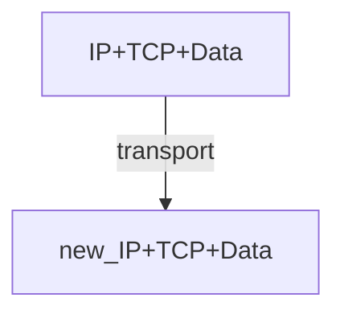
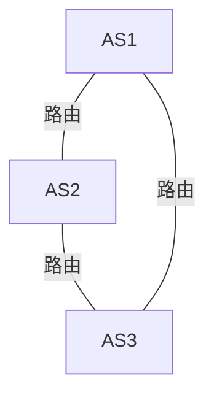

# 网络层 Network Layer
分数据平面和控制平面介绍。

# 数据平面 Data Plane
- Network Layer Functions 
- IP Protocol Basic 
- IP Protocol Suit 
- Routing Fundamentals
- Internet Routing Protocols
- IP Multicasting
网络层：transport segment from sending to receiving host
- network layer protocols in every host, router 

有两个主要的网络层方法(network layer function)
- 
路由 Switch/router 

	- Routing determines the forwarding table
- 
 Forwarding （Move packets）

	- Queuing and scheduling
	- Host to Switch
	- Switch to Host 
	- Switch to Switch 

**Network v.s. transport layer connection**：
- *network*: between 2 hosts (end to end)
- *transport*: between 2 processes

## Router 工作原理
### input port function
Longest prefix matching rule(最长前缀匹配)

使用一个**路由树** 可以达到大概 $O(\log n)$ 的查找速度

在传输过程中， 

IP header 传输过程发生变化，但是 TCP header 和 data 保持不变。（做过 exp2 的你应该会对此理解更深刻）

### output port functions

we will classify an IP packet based on a **number of fields in the packet header**, e.g.,
- Source/destination IP address(32 bits)
- Source/destination TCP port number(16 bits) ：`0~65535`
- Type of service (TOS) bytes （8 bits）
- Type of protocol (8 bits)
	- ICMP? 

### Connecting inputs to ouputs
- Transfer packet from input to output
- Three types of switching
- 
	- 共享内存：不支持并发访问。一个内存一次只能处理一个路由
	- 总线（bus）：不支持并发访问。因为一次只有一个分组能跨越总线
	- 纵横总线：可以并发访问。
### Implement Protocols

Datagram： IP 协议。用性能消耗，获得拓展性。
Virtual Circuit：需要专用的资源，牺牲了用户来换取性能。
## Datagram（IP）
本节课我们主要学习 IP
## Virtual Circuit（虚电路）
和 IP 层是两种不同的实现方式。但是现在用的人已经很少了。
## IP (Internet Protocols)
### 需要支持的功能
- Routing 
- Datagram lifetime
- Fragmentation and re-assembly
- Error control
- Flow control

### Routing
Host and routers maintain *routing tables*
- indicate next router to which datagram should be sent 
### Datagram Lifetime **数据报生命周期**

mark datagram with *lifetime*, so it won' t live forever.
Once lifetime expires, datagram is discarded instead of forwarded
给每个 datagram 一个 TTL (Time To Live), 转发时候减少，**超时则删除**。

### Fragmentation and Re-assembly
（切片和组装）
Length of a packet exceeds the coming network’s **MTU (maximum transmission unit**
one segment in its transmit **may fragment and re-assemble.**
Ques:
- WHEN to fragment?
	- Host – determine min of MTUs along the path 
	- Router – fragment if the next MTU is exceeded
- WHEN to re-assemble
	- Host – Packets getting smaller as data traverses internet 
	- Router – infeasible since fragments may take different routers
如果出错了(重组失败，因为一些部分(fragment)丢失)——>增加 timeout 机制
### Error Control
- Not **guaranteed delivery** 
- Router should attempt to inform source if packet discarded 
	- e.g. for **checksum failure, TTL expiring** 
	- Datagram identification needed 
- ICMP used to **send error message**
- Source may inform higher layer protocol

###  Flow Control
允许路由器(routers)来限制涌入数据的量
- Limited control functions in connectionless system
- New mechanisms coming soon
Router discards incoming packets when **buffer is full**
- using ICMP
### IP Packet Structure
#### IP Header
#必考

IP 头动态部分
- **TTL：time to live 会更新。**
- checksum：由于 TTL 更新，重新计算 checksum
-  Total Length：ip 包头和 ip 内容的总长度（**不包括以太头**）
- Time to Live：包的生存时间
- Protocol： ipv4? ipv6?
- 关于 Fragment 机制
	- 涉及到 `Identification, Flags, Fragment Offset`

##### Fragment 机制和组装
- 
- ID 
	- 拆分出的值一样
	- 关于  Identification 字段。该字段占 16 bit，IP 软件在存储器中维持一个计数器，每产生一个数据报，计数器就加1，并将此值赋给标识字段。但这个“标识”并不是序号，因为 IP 是无连接服务，因此数据报不存在按序接收的问题。那么该字段究竟有什么用？当一个数据报长度过长，超过网络 MTU 而需要分片时，则把标识字段的值复制到所有分片数据报中，最后在目的设备才能依据标志字段而正确的重组数据报，因此该字段可以唯一标识某个 IP 报文。
-    **Flags: 有 3bits**
-     reserve bit: 未用
-  DF (*D*on't Frag) bit = 0 代表可以做 fragmentation，DF bit = 1 代表不能做 fragmentation。
-  MF (*M*ore Frag) bit= 0 代表该数据包是整个数据流里面最后一个包，MF bit = 1 代表还有**更多**被 fragment 的数据包
-  Fragment Offset：该片偏移原始数据包开始处的位置。**偏移的字节数是该值乘以8。**
	- 非尾部分片 datagram 的 `payload_len` 数据量都应该是 8 的整数倍。
- [[2020-re-network-exam#五|例题：关于偏移量]]

### IP Addressing

- IP address
	- 32 bit global internet address for each interface (32 bit ，4 bytes)
		- 采取 `点分十进制记法` (dotted-decemal notation )
		- 即每个字节用十进制书写
	- Network part(high order bits )
	- Host part (low order bits)
- **Physical network**
	- Can reach each other without intervening router（无路由器参与的最大连通分支）

用前缀标志类型 ABCDE

#### Class A
A类地址： 首位为0； 支持27-2=126个网段； 每个网段支持主机数为224-2 =16777214（全0和全1的地址要扣除， 全0是网络号，全1是广播号

- Range 1.x.x.x to 126.x.x.x
**ALL ALLOCATED**（全部分配完了）
#### Class B
首位为 10
Range 128.0.x.x to 191.255.x.x

**ALL ALLOCATED**（全部分配完了）
#### Class C
Start with 110
Range 192.0.0.x to 223.255.255.x
- 221 = 2,097,152 networks 
- Up to 254 (=28-2) host
- 
**NEARLY ALL ALLOCATED**

#### Inter-Networks with Addresses

#### 子网掩码(subnet mask)
用来标记是否在一个子网中。
子网掩码 (subnet mask)又叫网络掩码、地址掩码、子网络遮罩，它**用来指明一个 IP地址的哪些位标识的是主机所在的子网，以及哪些位标识的是主机的位掩码**。子网掩码不能单独存在，它必须结合IP地址一起使用。**子网掩码是一个32位地址**，用于屏蔽IP地址的一部分以区别网络标识和主机标识，并说明该IP地址是在局域网上，还是在广域网上。

#### IP 的获取（DHCP）
#必考 
DHCP（Dynamic Host Configuration Protocol, DHCP）动态主机配置协议。
- **DHCP 允许主机自动获取（被分配）一个 IP 地址**
- 即插即用能力（plug-and-play protocol）

连接过程：DHCP 是一个 4 步骤的过程。
- DHCP 发现（discover）
	- client 在 UDP 分组向端口 67 发送该发现报文。
	- src: `0.0.0.0` dst: `255.255.255.255` (广播地址)
- DHCP 提供 (offer)
	- 使用 DHCP offer message 做出响应。向该子网的所有节点广播（广播地址 `255.255.255.255`）
- DHCP 请求 (request)
	- 新到达的客户从一个或多个服务器中选择一个，并向选中的服务器提供用 DHCP 请求报文 (DHCP requset message) 进行响应，回显配置的参数。
- DHCP ACK
	- DHCP ACK 报文（DHCP ACK message）对 DHCP 请求报文进行响应，证实所要求的参数。
	- 服务器应当检查 option 字段，如果不是自己该回复就回复 NAK

### IPv6
#### header structure
- Version (4 bits): 6 
 - Traffic Class (8 bits) 
	 - Classes or priorities of packet, identify QoS 
- Flow Label (20 bits) 
	- Identify datagrams in the same “flow” 
 - Payload length (16 bits)
	- Includes all extension headers plus user data
 - Next Header (8 bits) 
	 - Identifies type of the next header 
	 - Extension or next layer up 
 Source / Destination Address (128 bits)

#### Transition from IPv4 to IPv6
有两种推荐的方法：
- Dual Stack – some routers with dual stack (IPv6, IPv4) can translate between formats 
	- **双重协议栈**
- Tunneling – IPv6 carried as payload in IPv4 datagram among IPv4 routers（以现有的 IPv4 设施传输 IPv6 数据报）IPv6隧道是通过将IPv6数据报封装在IPv4数据报中，利用现有的IPv4基础设施来传输IPv6流量。这种机制被称为**隧道封装**，IPv4网络在这种场景中只是作为传输介质，而**不是直接的链路层协议。**

### 网关

### Network Address Translation（NAT）
#必考 
- NAT（网络地址转换，许多同学的 ip 映射为一个统一的 nju 出去的 ip）
	- Enables different sets of IP addresses for internal and external traffic 
三种 NAT
- Static NAT
	- 静态 NAT：一个内部 IP 绑定一个对应的外部地址
- Dynamic NAT 
	- 动态 NAT：动态分配外部 IP 给内部设备（用一个 IP 池），谁用就分配给谁
- Single-Address
	- 只有一个外部ip，所有内部ip对外通讯时**都**会被进行替换

NAT 也起到了一个 **防火墙** 的作用。外界的攻击很难直接攻击虚拟 ip

- 给内部网络和外部网络分配不同的IP集（不同内部网络可以使用**相同**的ip）
- 来解决地址不够使用的问题
- 三个网段：10、172、192

#### 优点

- 安全：**隐藏内部ip地址（一个外部地址代表了许多不同的内部地址）**
- 使得一个组织有多个不同ip地址（来分配给不同的设备）
- 便于切换isp（只需要重新配置网关），不需要修改内部设备的配置

#### 其他特点
- 结合**四层次端口**，用一个ip传输不同信息（实现对输入的信息发送给特定的设备）
- 路由器维护一个nat转发表，将外部端口与内部ip绑定，当外部ip向路由器发送信息时，会根据使用的端口向特定的内部设备转发消息
- 
    
- 

#### 如果能抓包，如何确认 NAT 后的主机数量

是一道很有意思的习题[[未命名文件夹/redkoldnote/docs/计算机网络/homework/HW4_231275036_朱晗#P19|显示NAT主机数量]]
- 根本上来说，拿 BASIC NAT 举例，是因为 NAT 实现 NAT 系统中某个 IP 到对外的 IP 的转换是顺序进行的，所以其标识号（比如对外的端口）是顺序变化的。所以我们对于抓包找到最小的和最大的标识号就可以了。（或者找到所有按顺序排的，放到一个集合，数一数有多少个。）

## 子网 subnet
- 一个子网（们）的例子
- 
### 为什么需要子网？
子网解决的是**“网络地址不满足问题”（network inadequacy）**

- Host portion of address partitioned into **subnet** number and host number
	- 子网掩码 (subnet mask)  indicates which bits are ==subnet number==, and which are host number
	- Each LAN assigned a subnet number, more flexibility
	- Local routers route within subnetted network
- 在对外界通信时，一个子网系统可视作一个单独的网络 (代表)（Subnets looks to rest of internet like a single network）
	- Insulate overall Internet from growth of network numbers and routing complexity

可见，一个子网系统中的网络以同一个单独的 `141.14.0.0` 向外沟通。
同理 `the rest of the internet` 来了 datagram，也通过子网系统做路由

### CIDR Notation（子网地址）
#必考 
- CIDR ( Classless Inter Domain Routing)
- 一个 IP address 可以表达为 `A.B.C.D/n` 的形式，where `n` 被叫做 IP (network） prefix
- 一个例子：`192.168.0.1/24`
	`n` 为 24，e.g.，则表示 IP 的前 24 位是网络地址，剩余 8 位是主机地址。（子网中的标记）
	

为了更熟悉 `CIDR` 表示以及如何分配，可以看这个题[[未命名文件夹/redkoldnote/docs/计算机网络/homework/HW4_231275036_朱晗#P15（子网分配问题）|子网分配问题p15]]
- 同时图中可以读出[[#子网掩码(subnet mask)]] 前 `20 bit` 是 1，所以 `n=20`

# 控制平面 Control Plane
## Rounting 路由
这部分是典型的**图问题**：网络中有很多节点，网络连接有代价，即权值。这自然涉及到最优化网络通信代价——如何设计通信路径即设计路由的方法。
Dijkstra 算法和 B-F 最短路径算法广泛应用

- AS（自治系统）
	- **AS** 是 **Autonomous System**（自治系统）的缩写，在计算机网络中，指的是在一个单一管理实体（如 ISP、企业或大学）下的一组路由器和 IP 网络，它们使用相同的路由策略对外表现为一个单一的网络实体。
- 我们分 AS 内部和 AS 之间讨论。
	- AS 内部：IGP 
		- Interior Gateway Protocol
		- e.g. RIP, OSFP
	- AS 之间：EGP
		- 

### IGP
**IGP**（Interior Gateway Protocol）：用于**自治系统内部的路由信息交换**，例如 OSPF、RIP 等。
- IGP
	- **RIP**（Routing Information Protocol）1 st Generation _动态路由协议_
		- 信息使用：**Distance Vector** (DV) 距离向量
		- 路径算法：B-F（Bellman-Ford）
	- **OSPF**（Open Shortest Path First）
		- 信息：**LS（Link state）**（**链路状态**）
		- 算法：Dijkstra
		- OSPF正是使用SPF算法(即 Dijkstra)来计算最短路径树。它使用“Cost”作为路由度量。使用链路状态数据库 **（LSDB）** 用来保存当前网络拓扑结构，路由器上属于同一区域的链路状态数据库是相同的（属于多个区域的路由器会为每个区域维护一份链路状态数据库）。
		- 
#### RIP vs OSPF
- RIP
	- 配置简单，适用于小型网络（小于 15 跳）
	- 可分布式实现

	- **收敛速度慢**
	- **网络是一个平面，不适合大规模网络**
- OSPF
	- 收敛速度快，无跳数限制
	- 支持不同服务类型选路
	- 支持身份认证
	- 支持层次式网络

	- **集中式算法**
	- **每个节点需要维护全局拓扑**
	- **配置复杂**

### 距离向量算法详细介绍
#### 工作原理

1. **初始化**：  
    每个节点将自身到其他节点的距离初始化。如果是直接连接的邻居，距离为链路权值；否则距离为无穷大。
    
2. **信息交换**：  
    节点周期性地向所有直接邻居发送自己的距离向量。x
    
3. **更新规则**（Bellman-Ford公式）：  
    节点根据接收到的邻居的距离向量，计算到达目标节点的新的最短路径：
    
$$
    D_x(y) = \min_{v \in N(x)} \{ C(x, v) + D_v(y) \}
$$
    
- $D_{x}(y)$：节点 $x$ 到目标节点 $y$ 的距离估计。
- $C(x,y)$：节点 $x$ 到邻居 $y$ 的链路权重。    
- $D_{v}(y)$：邻居 $v$ 到目标节点 $y$ 的距离估计。
    如果发现更短路径，节点更新距离向量表，并向邻居广播更新。
    
4. **收敛**：  
    通过不断的迭代和更新，所有节点最终收敛到一致的最短路径。

#### Count to infinity (无穷计数)
距离向量中可能出现 **路径毒化**，也就是：距离向量出现了 `count to inf` 的问题，这篇文章说的很好
[路由毒化以及毒性逆转方法](https://blog.csdn.net/tianlongtc/article/details/80261581)

简单来说，
- 当链路费用增加（甚至断开，即到 inf）时候，考虑 Y 的更新：
	- 在 `y-x` 更新从 4 到 60 时，`Z` 的距离向量是 `d(X)=5,d(Y)=1, d(Z)=0`,
	- 于是 Y 在更新向量的时候，发现 `Z` 到 `X` 距离只有 5，所以更新了 `Y-X=6`  显然逻辑错误，因为这条为 5 的路径经过了 Y，而 Y-X 的权值已经增大，` Y ` 将错误的更新报文发给 ` Z `
	- `Z` 收到更新报文，发现经过 Y 的路径距离是 `1+6` =7, 比直接到 `X` 小，更新向量，再推送给 `Y`
- 以上构成了一个循环，`Y` 和 `Z` 每次将 `Z-X` 和 `Y-X` 慢慢更新往上爬，直到爬到 Y 确定最短路径是 51 的正确结果。
#### 毒性逆转（The Reverse-Poison）
**基本思想**：如果 `Z` 的到 `X` 的最短路径要经过 `Y`，那么 `Z` 将告诉 `Y` 自己到目标节点 `X` 的距离是 $\infty$（善意的谎言），即 $\text{set} D_{Z}(X)=\infty$ 推送给 `Y`，来避免 `Y` 再走自己到 `X`，即 _Y won't route to X via Z_ ，所谓毒化，就是把一个路径定位 inf，相当于给这条路 **下毒** 😂

（这不会彻底解决 `count to infinity` 问题，三个节点以上的环的问题仍然存在）

这里要注意：路径毒化不会一直持续，且，**是针对到达某一个点的路径的特殊通告** 。（即不影响其他情形，比如如果是到别的点而不是 `X`）如果路径恢复，就会更新实际的跳数。收到邻居推送的合适的数值，也会更新。

对于毒化逆转的深入理解，可以看这道题 
[[HW6_231275036_朱晗]]

### EGP
EGP 是**Exterior Gateway Protocol** 的缩写，指的是一种用于自治系统（AS）之间路由信息交换的协议。它属于互联网路由协议的一种，主要用于在不同的自治系统之间传递路由信息。

BGP 是 EGP 的一种协议
#### BGP (Border Gateway Protocol)
网络中边缘的网络节点来对话的问题。
- Not Picking shortest-path routes
- Selects the best route based on policy, not shortest distance (i.e., least-cost)

关键思想—— **ADVERTISE the entire path**

##### BGP如何解决环路？
- **Loop avoidance is straightforward** (simply discard paths with loops
具体而言：通过携带 **AS 路由信息**，解决路由循环问题。
BGP（边界网关协议）通过一种机制称为**AS路径属性（AS Path Attribute）**，有效地解决了路由循环问题。这种机制依赖于每个自治系统（AS）的独特标识符和路径信息。以下是它的工作原理：

---

###### **AS路径属性的核心概念**

1. **AS路径记录**：
    
    - BGP在路由传播时，使用**AS路径属性**记录经过的所有自治系统的编号（AS号）。
        
    - 每当一个路由进入一个新的AS时，该AS号会被添加到路径中，形成一条从源AS到目标AS的完整路径。
        
2. **循环检测**：
    
    - 当一个BGP路由器接收到某条路由信息时，它会检查该路由的AS路径属性。
        
    - 如果**AS路径中包含本地AS的编号，就意味着发生了路由循环**，因为这表明该路由已经从本地AS传播出去，又回到了本地AS。
        

---

###### **BGP防止路由循环的机制**

- **丢弃循环路径**：  
    如果BGP路由器检测到AS路径中存在自己的AS号，它会直接丢弃这条路由，避免形成循环。
    
- **路径选择优先级**：  
    BGP根据多个属性（如AS路径长度、路由器本地优先级等）选择最佳路径。较短的AS路径通常会被优先选择，这也间接减少了发生循环的可能性。
    

---

###### **示例：AS路径循环检测**

假设以下拓扑：

1. **路径传播**：
    
    - AS1 广播路由 1.1.1.0/24\text{1.1.1.0/24}，AS路径为 `[AS1]`。
        
    - AS2 收到后，添加自己的AS号，形成 `[AS1, AS2]`，并向AS3广播。
        
    - AS3 收到后，添加自己的AS号，形成 `[AS1, AS2, AS3]`，并尝试向AS1广播。
        
2. **循环检测**：
    
    - 当AS1接收到路径 `[AS1, AS2, AS3]` 时，发现路径中已经包含自己的AS号（AS1），因此直接丢弃该路由。
        

---

###### **AS路径的其他作用**

1. **防止循环**：  
    AS路径是BGP协议中最基本的防循环机制。只要AS路径信息是准确的，就能有效防止循环问题。
    
2. **路径选择**：
    
    - 路径长度（AS路径中AS号的数量）是BGP路径选择的一个重要标准，短路径更优。
        
    - 在多路径可用的情况下，AS路径信息帮助路由器选择更优的路径。
        
3. **路径策略**：  
    网络运营商可以根据AS路径信息设置路由策略，比如避免某些AS或优先选择某些AS路径。
    

---
##### BGPs
- eBGP: 
	- BGP sessions between **border routers in different ASes** 
	-  Learn routes to external destinations 
- iBGP:
	- BGP sessions between **border routers and other routers** within the same AS 
	- Distribute **externally learned routes internally**
对于[[vault/redkoldnote/docs/本科课程/计算机网络/homework/HW5_231275036_朱晗#P14|题目：路由选择协议：从哪学到？]]，
- IGP: “Interior Gateway Protocol” = Intradomain routing protocol 
- Provide internal reachability
-  E.g., `OSPF, RIP`