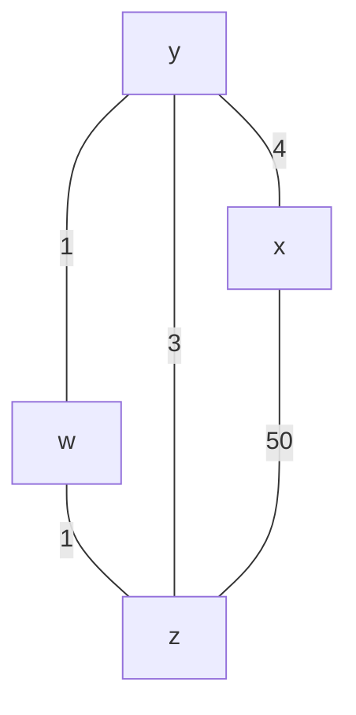
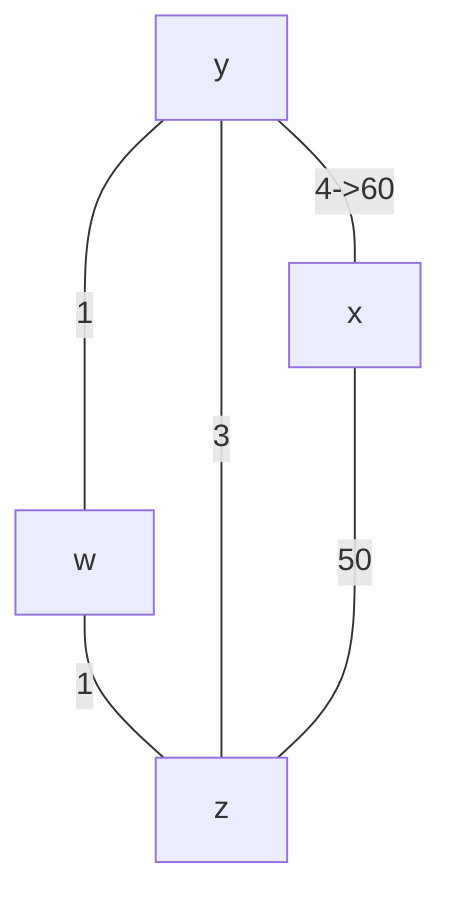
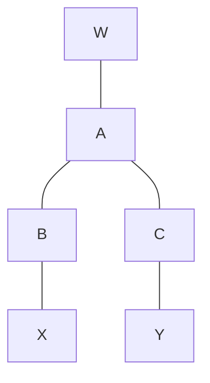

# 题目集合 R4 ,R6,R10,P2,P3,P4,P5,P7,  P11,P12,P13,P14,P17,P18

# 题目
## R4
### 比较和对照链路状态和距离矢量这两种路由选择算法

在距离矢量算法中，每个节点仅仅和他的直接相邻的邻居交谈，但它为邻居提供自己到网络其他节点的最低开销估计。而链路状态算法需要全局信息。

|       | 链路状态路由选择算法 | 距离矢量路由选择算法 |
| ----- | ---------- | ---------- |
| 报文复杂性 | 相对较高       | 相对较低       |
| 收敛速度  | 相对较快       | 相对较慢       |
| 健壮性   | 相对较强       | 较弱         |

## R6
### 每个自治系统使用相同的AS内部路由选择算法是必要的吗? 说明其原因.

有必要。因为因特网是 ISP 的网络，每个 ISP 都有自己的路由器网络并希望按照自己的意愿运行路由器，以获得更好的效果。

## R10
### 定义和对比下术语: 子网, 前缀和BGP路由.
- 子网：在一定范围内由多个 `end` 系统组成的网络，他们的网络地址有相同的前缀，并通过子网掩码来标识哪些前缀标识子网
- 前缀：IP 地址前面的部分
- BGP 路由：当路由器通过 BGP 链接通告前缀时，他在前缀中包括一些 BGP 属性，前缀及其属性称为**路由**

## P2
列举从 x 到 z，z 到 u，以及 z 到 w 的不包含任何环路的路径 ![[csnet-c5-p2-pic.png]]
- from x to z
	- first hop z
		- x - z
	- first hop y
		- x - y -z
	- first hop v
		- x-v-y-z
		- x-v-t-y-z
		- x-v-u-t-y-z
		- x-v-w-u-t-y-z
	- first hop w
		- x-w-v-y-z
		- x-w-v-t-y-z
		- x-w-v-u-t-y-z
		- x-w-u-v-y-z
		- x-w-u-v-t-y-z
		- x-w-u-t-v-y-z
- from z to u
	- first hop x
		- z-x-y-t-u
		- z-x-y-t-v-u
		- z-x-y-v-u
		- z-x-y-v-t-u
		- z-x-y-v-w-u
		- z-x-v-u
		- z-x-v-t-u
		- z-x-v-w-u
	- first hop y
		- z-y-t-u
		- z-y-t-v-u
		- z-y-v-u
		- z-y-v-t-u
		- z-y-v-w-u
		- z-y-x-v-u
		- z-y-x-v-t-u
		- z-y-x-v-w-u
- from z to w
	- first hop x
		- z-x-w
		- z-x-y-v-w
		- z-x-y-v-u-w
		- z-x-y-v-t-u-w
		- z-x-y-t-v-w
		- z-x-y-t-v-u-w
		- z-x-y-t-u-w
		- z-x-v-w
		- z-x-v-u-w
		- z-x-v-t-u-w
	- first hop y
		- z-y-v-w
		- z-y-v-u-w
		- z-y-v-t-u-w
		- z-y-t-v-w
		- z-y-t-v-u-w
		- z-y-t-u-w
		- z-y-x-v-w
		- z-y-x-w
		- z-y-x-v-u-w
		- z-y-x-v-t-u-w

## P4
考虑上面的网络，使用 Dijkstra 算法说明你做的工作
a. 计算从 t 到所有网络节点的最短路径
![[csnet-c5-p2-pic.png]]
### 解答
#### 1st
- disTo

| x   | y   | z   | u   | v   | w   |
| --- | --- | --- | --- | --- | --- |
| inf | 7   | inf | 2   | 4   | inf |

 edgeTo

| x   | y   | z   | u   | v   | w   |
| --- | --- | --- | --- | --- | --- |
|     | t-y |     | t-u | t-v | inf |

#### 2nd
- disTo

| x   | y   | z   | u   | v   | w   |
| --- | --- | --- | --- | --- | --- |
| 7   | 7   | 19  | 2   | 4   | 5   |
- edges

| x     | y   | z     | u   | v   | w     |
| ----- | --- | ----- | --- | --- | ----- |
| t-v-x | t-y | t-y-z | t-u | t-v | t-u-w |

#### 3rd
- disTo

| x   | y   | z   | u   | v   | w   |
| --- | --- | --- | --- | --- | --- |
| 7   | 7   | 15  | 2   | 4   | 5   |
- edges

| x     | y   | z       | u   | v   | w     |
| ----- | --- | ------- | --- | --- | ----- |
| t-v-x | t-y | t-v-x-z | t-u | t-v | t-u-w |
完成。
其他完全类似，略去
## P5
### 考虑下图的网络，假设每个节点初始知道它每个邻居的开销。考虑距离向量算法，给出节点 $z$ 处的距离表表项
![[csnet-c5-p5-pic.png]]
### 1st
- z

|     | u   | v   | x   | y   | z   |
| --- | --- | --- | --- | --- | --- |
| v   |     |     |     |     |     |
| x   |     |     |     |     |     |
| z   |     | 6   | 2   |     | 0   |
- v

|     | u   | v   | x   | y   | z   |
| --- | --- | --- | --- | --- | --- |
| u   |     |     |     |     |     |
| v   | 1   | 0   | 3   |     | 6   |
| x   |     |     |     |     |     |
| z   |     |     |     |     |     |
- x

|     | u   | v   | x   | y   | z   |
| --- | --- | --- | --- | --- | --- |
| v   |     |     |     |     |     |
| x   |     | 3   | 0   | 3   | 2   |
| z   |     |     |     |     |     |
| y   |     |     |     |     |     |
- y

|     | u   | v   | x   | y   | z   |
| --- | --- | --- | --- | --- | --- |
| x   |     |     |     |     |     |
| u   |     |     |     |     |     |
| y   | 2   |     | 3   | 0   |     |
- u

|     | u   | v   | x   | y   | z   |
| --- | --- | --- | --- | --- | --- |
| x   |     |     |     |     |     |
| y   |     |     |     |     |     |
| u   | 0   | 1   |     | 2   |     |

### 2nd
- z

z 更新，advertise v, x

|     | u   | v   | x   | y   | z   |
| --- | --- | --- | --- | --- | --- |
| v   | 1   | 0   | 3   |     | 6   |
| x   |     | 3   | 0   | 3   | 2   |
| z   | 7   | 5   | 2   | 5   | 0   |
- v

|     | u   | v   | x   | y   | z   |
| --- | --- | --- | --- | --- | --- |
| u   | 0   | 1   |     | 2   |     |
| v   | 1   | 0   | 3   | _3_ | _5_ |
| x   |     | 3   | 0   | 3   | 2   |
| z   |     | 6   | 2   |     | 0   |
- x

|     | u   | v   | x   | y   | z   |
| --- | --- | --- | --- | --- | --- |
| v   | 1   | 0   | 3   |     | 6   |
| x   | _4_ | 3   | 0   | 3   | 2   |
| z   |     | 6   | 2   |     | 0   |
| y   | 2   |     |     | 3   | 0   |
- y

|     | u   | v   | x   | y   | z   |
| --- | --- | --- | --- | --- | --- |
| x   |     | 3   | 0   | 3   | 2   |
| u   | 0   | 1   |     | 2   |     |
| y   | 2   | 3   | 3   | 0   | 5   |
- u

|     | u   | v   | x   | y   | z   |
| --- | --- | --- | --- | --- | --- |
| x   | 1   | 0   | 3   |     | 6   |
| y   | 2   |     | 3   | 0   |     |
| u   | 0   | 1   | 5   | 2   | 7   |

### 3rd
- z

|     | u   | v   | x   | y   | z   |
| --- | --- | --- | --- | --- | --- |
| v   | 1   | 0   | 3   | 3   | 5   |
| x   | 4   | 3   | 0   | 3   | 2   |
| z   | 6   | 5   | 2   | 5   | 0   |
- v

|     | u   | v   | x   | y   | z   |
| --- | --- | --- | --- | --- | --- |
| u   | 0   | 1   | 5   | 2   | 7   |
| v   | 1   | 0   | 3   | 3   | 5   |
| x   | 4   | 3   | 0   | 3   | 2   |
| z   | 7   | 5   | 2   | 5   | 0   |
- x

|     | u   | v   | x   | y   | z   |
| --- | --- | --- | --- | --- | --- |
| v   | 1   | 0   | 3   | 3   | 5   |
| x   | 4   | 3   | 0   | 3   | 2   |
| z   | 7   | 5   | 2   | 5   | 0   |
| y   | 2   | 3   | 3   | 0   | 5   |
- y

|     | u   | v   | x   | y   | z   |
| --- | --- | --- | --- | --- | --- |
| x   | 4   | 3   | 0   | 3   | 2   |
| u   | 0   | 1   | 5   | 2   | 7   |
| y   | 2   | 3   | 3   | 0   | 5   |
- u
更新，advertise to v, y

|     | u   | v   | x   | y   | z   |
| --- | --- | --- | --- | --- | --- |
| x   | 1   | 0   | 3   | 3   | 5   |
| y   | 2   | 3   | 3   | 0   | 5   |
| u   | 0   | 1   | _4_ | 2   | _6_ |

## P7
### 考虑下图所示的网络段。x 只有两个相连邻居 w 与 y。w 有一条通向目的地 u (没有显示)的最低费用路径，其值为 5；y 有一条通向目的地 u 的最低费用路径，其值为 6。从 w 与 y 到 u (以及 w 与 y 之间)的完整路径没有显示出来。网络中所有链路费用皆为正整数。
![[Pasted image 20250506144340.png]]

#### a. 给出 x 对目的地 w, y 和 u 的距离向量
$D_{x}(w)=2,D_{x}(y)=4,D_{x}(u)=7$
#### b. 给出对 c(x, w) 或 c(x, y) 的链路费用的变化，使得执行了距离向量算法后，x 将通知其邻居有一条通向 u 的新最低费用路径。
现在最低开销路径为：`x - w - u`
	将 $c(x,y)$ 减少，最多可以减少到 $c(x,w)=1$，但此时 $w(x-y-u)=7$，不会改变。
		考虑增大 $c(x,w)$，当增大到 $c(x,w)=7$ 就可以改变，此时通知最新路径为 $x-y-u$
#### c. 给出对 c(x, w) 或 c(x, y) 的链路费用的变化，使得执行了距离向量算法后，x 将不通知其邻居有一条通向 u 的新最低费用路径。

根据 b 中考虑，降低 $c(x,w)$，增大 $c(x,w)$ 但是不超过 6，无论怎样变化 $c(x,y)$，都不会通知。

## P11

### a

路由选择稳定之后，推送应该是
- for x

|     | x   | y   | z   | w   |
| --- | --- | --- | --- | --- |
| x   | 0   | 4   | 6   | 5   |
| y   | 4   | 0   | 2   | 1   |
| z   | 6   | 2   | 0   | 1   |
- for y

|     | x   | y   | z   | w   |
| --- | --- | --- | --- | --- |
| x   | 0   | 4   | 6   | 5   |
| y   | 4   | 0   | 2   | 1   |
| w   | 5   | 1   | 1   | 0   |
| z   | 6   | 2   | 0   | 1   |
- for w

|     | x   | y   | z   | w   |
| --- | --- | --- | --- | --- |
| y   | 4   | 0   | 2   | 1   |
| z   | 6   | 2   | 0   | 1   |
| w   | 5   | 1   | 1   | 0   |
- for z

|     | x   | y   | z   | w   |
| --- | --- | --- | --- | --- |
| x   | 0   | 4   | 6   | 5   |
| y   | 4   | 0   | 2   | 1   |
| z   | 6   | 2   | 0   | 1   |
| w   | 5   | 1   | 1   | 0   |
### b 现在假设 $x$ 和 $y$ 之间的链路成本增加到 60。即使使用了毒性逆转，将会存在无穷计数的问题吗？为什么？如果存在无穷计数的问题，距离向量路由选择需要迭代多少次才能再次达到稳定状态？评估你的答案。

假设 $x$ 和 $y$ 链路成本增加，即

由于存在三个节点的环，所以仍然存在无穷计数问题

具体运行轨迹如下：

1. y 知道 z 可以 6 到达 x，所以自己通过 z 可以 3+6 =9 到达 x，但是 z 在从 y 到 x 的路上，故其毒化 `z-> y`，通告邻居 w，z
2. w 收到 y 通告，知道 y 可以 `1+9=10` 到达 x，因此从 w 到 x 的路上，下一跳是 y，并毒化 `y->w` (也就是避免 y 再走自己)
3. z 收到 w 的通告，知道 z 可以通过 `1+10=11` 到达 x，因此从 z 到 x 的路上，下一跳是 w，并毒化 `w -> z`，通告邻居
4. y 收到 z 的通告，知道 z 可以 `3+11=14` 到达 x，... 毒化 `z->y` 
5. w 收到 y...
稳定状态来说，y 到 x 需要 52, z 到 x 需要 50，w 导 x 需要 51，根据增长规律，

以上构成一个周期为 3 （y w z）的循环，每个周期来看，y 通过 z 到 x 的路径增长 5（从 9 增长到 14）
`（52-9）/5=8`，所以当第 `(8+1)*3+1=28` 轮次：
28. y 知道从 z 可以 53 到 x，由于之前 y -> w 已经毒化，所以 y 会走 z，毒化 `z -> y` ，通告邻居。w 收到 z 的通告，选择 y 作为下一跳，毒化 y->w
29. w 知道 y 可以 53+1 到达，也知道通过z 可以 `50+1` 到达，所以选择 z 作为 next hop，毒化 `z -> w`。通告邻居，z 不发生改变（不涉及改变）。
30. y 收到 w 的通告，知道 w 可以通过 z 51到达 x，所以选择 w 作为下一跳。通告 w 和 z；z 收到 w 的通告，z 不发生改变。w 不发生改变（**在这里，w 的通告内容是最优，没有毒化 y->w，所以可以走）**
31. 稳定
所以 31 次迭代

### c 如果 c(y, x) 从 4 变化到 60，怎样修改 c(y, z) 使得不存在无穷计数问题
直接切断。减少环。

## P12
描述在 `BGP` 中是如何检测路径中的环路的

在 BGP 中，通过 AS 前缀通告的方式来检测环路。
- **机制**：BGP 中，每个路由通告都会包含 AS-Path 属性，它记录了数据包所经过的自治系统（AS）的列表。
    
- **作用**：当一个 AS 收到路由通告时，会检查自己的列表，如果自己的 AS 编号已经存在于路径中，则拒绝该路由，从而避免环路。

## P13

### BGP 路由器将总是选择具有最短 AS 路径长度的无环路由吗？评估你的答案
并不是。BGP 路由器不一定追求路径最短，它会根据用户的要求灵活调整。

## P14
a. 3c 从 eBGP
b. 3a 从 iBGP
c. 1c 从 eBGP
d. 1d 从 iBGP

## P17
W 看到的：

## P18
比如 Bittorrent 的对等方 1,2,3 分别位于桩网络 W, X, Y，那么首先位于 X 的对等方从 W 处获取块，之后位于 Y 处的对等方又从 X 处获取了块，这样数据分组相当于就是向朝向 X，再朝向 Y。
