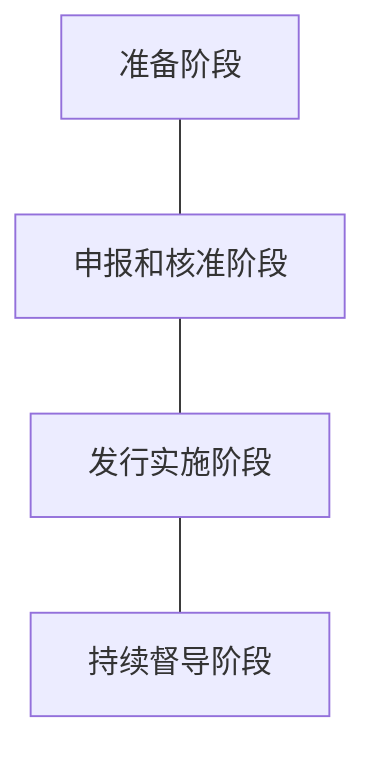
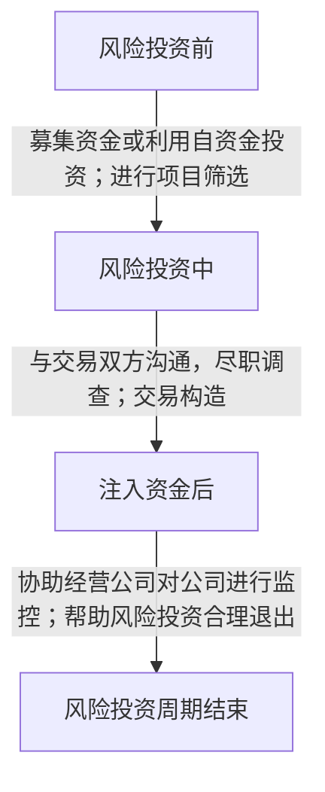

# Lecture 9
## 每周分享
- 应对关税：中国版平准基金
	- 以中央汇金公司为核心载体，结合央行流动性支持及多部门协同，通过**逆向操作**稳定股市的政策工具。
	- 本质是政府主导的市场干预机制。

- 美债危机 2025

- A 股 8 家股份制银行发布年报
	- 利息收入承受压力
	- 投资收入成突破口，带动非利息收入占比显著提升

- 两家国有大行四行资管规模突破 3 万亿元
	- 最具价值挖掘潜力的客群：高净值客户
		- 涉及到一个指标 `AUM`：分层指标。
	- 14 家上市银行：工商银行、农业银行、中国银行、建设银行、平安银行、交通银行、中信银行——万亿俱乐部（私行资管规模）
		- 私行：私人银行客户。

	- 进一步：中国 AMC (Assets Management Company)发展历程
		- 1999 年，财政部出资 400 亿元设立四家公司，剥离四家国有大行的不良资产。中国的资产管理公司。
		- 除了管理，还有投资：金融资产投资公司（Assets Investment Company, AIC）
		- 以工银投资为例
		- 工银金融资产投资有限公司：全国首批试点银行*债转股* 实施机构。
			- 债权转化为股权
			- 银行法固定：商业银行只能投资金融产业，为了绕过这部分，所以商业银行成立了 **金融资产投资公司** 

- 四部门发文强化体育金融服务
	- 中国人民银行、体育总局、金融监管总局、中国证监会等四部门联合印发《关于金融支持体育产业高质量发展的指导意见》
	- **分析角度**： KYC (Know Your Customer)

## 怎样通过财务数据分析金融运作？
- 发起并持有——银行
- 发起并销售——金融中介

### 商业银行资产负债表结构

| 资产       | 负债        |
| -------- | --------- |
| 现金       | 存款性负债     |
| 信贷资产     | 非存款性负债    |
| 投资资产（同业） | **所有者权益** |
| 其他资产     |           |
- 左边：关注资产的收益率（不同资产的收益率不一样）
- 右边：关注资产的来源

### 利润核心指标

- 净利差 (Net Interest Spread)
	- `净利差=生息资产的平均利率-计息负债的平均利率`
- 净息差（Net Interest Margin）
	- `净息差=利息净收入/生息资产平均余额`
	- `NIM = NIS + 计息负债的平均利率*(1-计息负债/生息资产)=生息资产的平均利率-计息负债的平均利率*计息负债/生息资产`

#### ROE 和 ROA
ROE：
$$
\begin{align}
\text{ROE}=\frac{{银行纳税后净收益}}{银行普通股票面值} \\
\text{ROA}=\frac{{银行纳税后净收益}}{银行总资产} \\
\text{EM}=\frac{银行总资产}{银行普通股票面值}
\end{align}
$$
So
$$
\text{ROE}=\text{ROA}\times\text{EM}
$$ 

# Lecture 10
## ECL 预期损失

进行风险评估->有成本
但是可能取得预期的收益。

一个权衡

## PD
`probability of Default` 银行评估的一个重要指标，违约率

## RAROC
**RAROC：风险调整资本回报率**
银行经营中的风险暴露是滞后的，如果在评价一个金融机构时，单纯的考量当前报告期的利润创造能力并不严谨，用将未来的预期损失对目前的收益进行调整后，才能真实的反应银行目前的价值创造，这就是RAROC的本质：将预期的损失计入本期成本从而调整收益获得较为严谨的资本收益率。

$$
RAROC=\frac{{风险调整收益}}{经济资本}=\frac{{收入-经营成本-预期损失}}{经济资本}
$$

# Lecture 11
## 风险的类型（来自《白银帝国》作业的思考）
- 信用风险
	-  交易对方不履行到期债务的风险
- 市场风险
- 操作风险
	- 人、流程、系统、IT 导致的外部冲击
## ESG
当前的金融机构，越来越关注 ESG（关于票号“义”经营的启发）

## 商业银行渠道管理
- 各类渠道的设计
	- 物理网点？
	- 电子渠道
	- 客户经理
- 渠道的整合和冲突管理
	- 网点/支行竞争
	- 网点与电子渠道竞争
	- O2O (online to offline)
	- 客户经理管理

### 电子渠道（电子银行）
丰富数字化渠道、优化客户体验、保障信息安全

## 商业银行流程再造的基本要素——流程
运用 $6\sigma$ 原则。落地
- 设定一个目标，然后优化流程
- DMAIC
	- Define purpose
	- Measure
	- Analyse
	- Improve
	- Control
## 金融机构组织架构设计原理
各部分/支行职能
- 前台：专注营销（饭店：揽客）
- 中台：专注管理（饭店：点单）
- 后台：支撑保障（饭店：炒菜）

以客户为中心设计组织架构

## 商业银行工作核心
对贸易： **发起并持有**
# Lecture 12
证券公司是如何工作的？
对贸易：**发起并销售**
## 保荐与承销业务 ：
- 准备阶段
	- 尽职调查
	- 制定和实施重组方案
	- 上市辅导
- 申请和核准阶段
	- 编制募股文件和申请发行
	- 路演
	- 确定发行价格
	- **组建承销团和确定承销报酬**
	- **发行上市**
	- 稳定价格
- 持续督导
流程：

要做好信息披露

## 证券经纪业务
是指证券公司通过其设立的证券营业部，接受客户委托，按照客户要求，代理客户买卖证券的业务。

## 证券自营业务

### 定义
证券公司用**自有资金和依法筹集的资金**，以自己名义开设的**证券账户买卖有价证券，以获取盈利的行为**

### 流程
- 研究开发项目阶段
- 决策选项目阶段
- 投资方案和资金安排阶段
- 项目操作实施阶段
- 项目结算总结阶段
具体而言，证券公司会养许多分析师，对证券进行 `adjust`
- **分析师常常是过度乐观的 (over-confident)，why？和业务有关**
	- **证券咨询业务**
	- 荐股，评级，定价
	- 在**交易时候**
		- 买方分析师：可能意见更正确，但是养他们要成本
		- 卖方分析师：
		- 作为消费者，我应该听谁的意见？——都是利益相关者。
		- 从华泰证券来看...

### 如何评估公司价值？
- **绝对价值评估：** 未来现金流的折现
- **相对价值评估：**
	- 用类似企业的市场价来评估
- 盈余预测的主体
	- 管理层（最了解公司）
	- 分析师（第三方）
	- **谁的预测**会更准？
## 风险投资业务
### 定义
指投资人将风险资本投资新兴的、具有高速成长潜力的、蕴藏着巨大收益的、未上市的高科技高风险企业，并通过 **退出机制** 获得收益的一种投资行为。

## 证券组织架构
- 事业部组织架构
- 职能组织架构
# Lecture 13
## 每周分享
1. AIC 扩容
	1. 本周，监管层宣布将 **AIC试点范围扩大至全国性商业银行**，兴业银行、招商银行、中信银行随即豪掷350亿元入局，打破国有大行垄断格局。经过多年发展，AIC从最初的债转股工具，逐步转型为股权投资市场的重要力量，五大 AIC六年净利润增长超15倍。然而，随着股权投资力度的不断加大，如何增强投研能力，将成为AIC未来发展的重要命题。
2. 关于做好 2025 年小微企业金融服务工作的通知
	1. 相比起来，更聚焦于
	**见保即贷**：见到保险/担保，就放贷
	**见贷即保**：银行放贷款了，我就给你担保。
	- **见贷即保**
	    - 含义：担保机构在借款人通过银行的贷款审批后，才为该笔贷款提供担保。
	        - 流程：银行先对借款人进行资质审核，确定可以放贷后，通知担保机构提供担保，然后放款。	     
	    - 特点：担保机构承担的风险相对较低，因为贷款已经通过银行的严格审核，风险初筛已完成。	      
	    - 适用场景：通常用于担保机构较为谨慎的情况，需要银行先行确认贷款安全性。
	- **见保即贷**
		- 含义：银行在担保机构同意提供担保后，才向借款人发放贷款。	       
	    - 流程：借款人先向担保机构申请担保，担保机构进行尽职调查并出具担保函，银行在收到担保函后发放贷款。	        
	    - 特点：银行的风险由担保机构先行分担，银行更依赖担保机构的风控能力。	        
	    - 适用场景：通常用于银行更重视担保机构的信用和风险控制能力的情况。
	1. 一个有趣的问题：**担保贷款**的资产质量如何
		- 直观来考虑，**似乎质量会更高**，因为有担保公司和银行的双重风控。
		- 但是由于 **见保即贷** 的存在，大家会搭便车，期待对方做风控，**结果在现实中反而担保贷款质量更差**

## 保险公司的经营
### 主要功能
- 经济补偿和风险保障
- **储蓄投资**
- 防灾防损

### 分类
- 根据保险公司的 **风险转移层次** ，可以将保险公司分为
	- （原）保险公司
	- 再保险公司
- 根据 **业务类型**，分为
	- 财产损失保险、责任保险、信用保险和保证保险

### 承保
![[Pasted image 20250519161034.png]]

### 保全
- 保全是寿险公司为履行保险给付责任或者保持保险合同的准确性和有效性，根据合同条款约定及客户的要求而提供的一系列服务。

### 理赔
- 保险理赔，是指在保险标的发生保险事故而使被保险人财产受到损失或人身生命受到损害时，或保单约定的其它保险事故出现而需要给付保险金时，保险公司根据合同规定，履行赔偿或给付责任的行为，是直接体现保险职能和履行保险责任的工作

### 再保险

# Lecture 14
## 每周分享
- 低空经济：
	- 2025 年以来，**银行等金融机构参与低空经济产业逐步加深**，从单纯的信贷支持到股权融资、金融租赁，再到建立合作伙伴关系共建产业生态圈，银行等金融机构赋能低空经济愈发多元化。
	- 考虑如何围绕低空经济如何设计金融服务？
		- **低空经济**产业发展的特点：属于 **科技型** 的企业。
		- 可以去套低空经济的
## 金融监管
### 中国监管体制演进
- **国家金融监督管理总局** 2023 年 5 月揭牌
	- “恪尽职守，敢于监管，精于监管，严格问责”的监管精神
### 金融监管的基本原理
#### 概念
- 一国金融监管当局为实现宏观经济和金融目标，依据法律法规对全国银行和其他金融机构及其金融活动实施监督管理的总称。
#### 目标
- 政府提供的一种纠正 **市场失灵** 现象的金融制度安排，目的是 **最大限度地提升金融体系的效率和稳定性**
#### 决定因素
- 一国的金融监管体制由根本上是由本国的政治经济体制和金融发展状况所决定的

### 金融监管体系的目标

- 目标：**克服市场失灵** （Market Failure）
	- *公用地悲剧*
	- 每个人的最优化不是真正的最优化

### 政府干预手段
- 第一，**采取直接行动**。
	- 政府自己直接生产某些金融产品或者金融服务提供给需求者。
	- 政府向私人金融部门购买某些金融产品或者服务，然后卖给需求者。

### 主要监管手段
- **窗口指导**
- **诫勉谈话**
- **金融监管报告**
- **监管通报**

