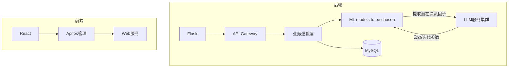

```mermaid
graph TD
	subgraph 后端
	  A[Flask]-->api[API Gateway]
	
	  api-->work[业务逻辑层]
	
	  work-->ml[ML models to be chosen]
	
	  work-->data[(MySQL)]
	
	  ml-->|提取潜在决策因子|llm[LLM服务集群]
	
	  llm-->|动态迭代参数|ml
	end
	
	subgraph 前端
	ra[React]-->fox[Apifox管理]-->Web服务
	end
```

### 3.1.1 用户信息维护

### 3.1.1 用户信息维护