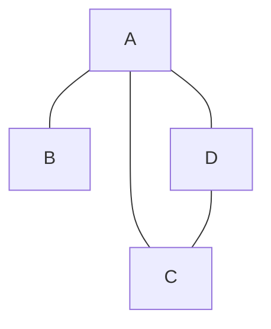

# 作业名录 ：任选20题- 8.1, 8.3, 8.5, 8.7, 8.8, 8.9, 8.10, 8.11, 8.14, 8.15, 8.18, 8.19, 8.20, 8.22, 8.24, 8.28 - 9.1, 9.2, 9.3, 9.4, 9.5, 9.8, 9.10

### 8.1
#### 对于有向图的 DFS，考虑遍历边 `uv` 并刚刚访问到点 `v` 的时候，点 `v` 的颜色和边 `uv` 类型的关系
solution：-
首先，有向图的边的类型有
- tree edge
- back edge
- forward edge
- cross edge
如果是 tree edge，v 一定是 white 的，因为其是在此次访问才被加入到 tree 中的
如果是 back edge，v 一定是 gray的。因为 back edge 是指向了 `u` 的祖先节点，其已经开始做 dfs，但是其孩子 `u` 还没有做完，所以其仍没有变成 black
如果是 forward edge，v 一定是 black 的。因为 forward edge 是指向了子孙后代节点（非直接相连的），其已经做完了 dfs，此时 u 才有可能再发生对 v 的访问。（否则 v 就不算是 forward edge，而是 tree edge）
如果是 cross edge，v 一定是 black 的。因为出现 cross edge 是已经指向了完全做完 DFS 的子树，其一定已经全部完成 DFS，是 black 的

### 8.3（活动区间）
#### 请证明活动区间等价地刻画了深度优先遍历的过程 （定理 8.1）

证明 1
	如果 w 是 v 在 DFS 中的后继节点，那么可以知道，w 的 `discoverTime` 一定晚于 v，且 w 一定是在 v 的递归访问树中，并在 w 结束之后，v 才有可能结束。且当 $w\neq v$ 时，二者结束都会将 `finishTime` +1，所以集合不会取等。所以有 $active(w)\subseteq active(v)$
证明 2
	假设 `w` 和 `v` 没有祖先后继关系，那么说明当 `w` 或 `v` 完全结束遍历时，`v` 或 `w` 都没有出现在 `w` （或 v）的遍历树中。而 `w` （或 `v`）从开始遍历到结束遍历，就是其 active interval, 都没有 `v`（或 `w`）的出现，这就说明生命周期无交叉
证明 3
1. 回想：CE 一定是指向了一个已经遍历完的子图，vw 是 CE，说明 `w` 已经在 v 开始遍历之前而遍历结束，也就是 `active(w)` 在 `active v` 前面
2. `vw` 是 DE，一方面 `w` 必须是 `v` 的后继，另一方面又一定不是紧跟着的后继，即一定在别的路径中已经遍历过的，`v` 看去是灰色的。所以 `w` 一定也是一些 `x` 节点的后继，并且第一次是被他们所遍历，且 `x` 也是 `v` 的后继。根据证明 1 中内容知道：$active(w)\subset active(x)\subset active(v)$
3. 和 DE 同理。只是这次不能再出现第三个点夹在中间，也就是紧接着就遍历到 w。这可以解释为在更新 `finishTime` 计时时候我们是结束一个点就+1，所以如果中间不存在别的点，一定是紧接着就遍历到的。是 TE
4. BE：指向了父节点的祖先, 也就是 v 是 w 的后继，根据 1 有：$active(v)\subset active(w)$
5. 

### 8.5
#### 求证 ：点 v 为割点，当且仅当存在点对 `w` 和 `x` 满足点 `v` 出现在 `w` 到 `x` 的所有路径上

证明：
割点的经典定义：对于一个连通的无向图 G，如果去掉 v 不再连通，则称这个点为割点。

这样证明：
首先证明：如果点 v 是割点，则存在点对 `w` 和 `x` ，`v` 出现在 `w` 到 `x` 的所有路径上
由于 v 是割点，所以去掉 v 后不再连通。记不连通的两个部分为 `G1，G2`，知一定存在 $w\in G_{1}$, $x \in G_{2}$, 满足有一系列路径，为 $wv_{1}v_{2}\dots v\dots v_{n}\dots x$ ，容易知道所有沟通 $w$ 和 $x$ 的路径上都有 v（因为如果有其他不经过 v 的路径，则去掉 v 后仍然连通，矛盾。），因而得证存在点对 `w` 和 `x` ，`v` 出现在 `w` 到 `x` 的所有路径上

然后证明：如果 `v` 出现在 `w` 到 `x` 所有路径上，则 v 是割点。
容易推导出，去掉 `v` 之后，不存在任何路径连通 `w` 和 `x`，所以图是非连通图，所以 `v` 是割点。

综上所述得证。

### 8.7
#### 请证明 ：一个有向图的收缩图是无环的
**反证法**：假设有向图的收缩图存在环。不妨设这个环通过点 $v_{1}$ 和 $v_{2}$ 连接了连通子图 $G_{1}$ 和 $G_{2}$ 中。根据强连通定义，$G_{1}$ 和 $G_{2}$ 均满足内部点双向互相可达。则存在这个环后，$G_{1}$ 中的所有点都和 $v_{1}$ 双向可达，从而和 $v_{2}$ 双向可达，从而和 $G_{2}$ 中所有点双向可达，从而得到 $G_{1}$ $G_{2}$ 同属于一个连通 component，这和收缩图定义是违背的。所以矛盾
一个有向图的收缩图是无环的


### 8.8
#### 强连通片算法中的两次深度优先遍历，分别是否可以替换为广度优先遍历？请说明原因

答：
	第一次不可以替换，第二次可以替换。
	因为我们需要通过 DFS 得到一个 `reverse topo order` ，再从第二步按照结束时间从晚到早的顺序开始做遍历。由于两个强连通分支 $G_{1}$ 和 $G_{2}$ 之间如果有一条边 $vw$, $v\in G_{1},w\in G2$，则 $finishTime(G_{1})>finishTime(G_{2})$。所以结束时间最晚的点所在的强连通分枝向外看一定都是**出边**，做转置都是入边，所以在完成拓扑序（或说结束时间）构造后（需要 DFS），再做 BFS、DFS 都可以得到连通分枝。


### 8.9

#### 对于无向连通图的深度优先遍历树的根节点 `v`，请找出点 `v` 是割点的充要条件，并证明
Solution： 
`v` 是割点的充要条件是：该无向连通图无环
证明：先证明无环->是割点
	假如：由于 `v` 是深度优先遍历树的根节点，所以其存在到图中所有点的路径。且对于任意 `w`，`x` 属于图中，其路径一定有 `w...v...x` 形式。证明是割点，只需要证明除了这个形式外，没有其他路径。而新增条件：该无向连通图无环，而如果存在其他形式的路径，取路径上一个点 $y$ 则会构成 $w\dots y\dots x\dots v\dots w$ 的环，矛盾。所以该无向连通图无环->v 是割点
再证明：是割点->无环
如果是割点，则不存在额外的路径。即所有路径都经过根节点 $v$。假设存在环，则会构造出 $w\dots y\dots x\dots v\dots w$ 这样的路径，则删除 `v`，仍连通，和割点定义矛盾。故没有割点。

### 8.10
#### 对于寻找割点算法，如果 $back$ 被初始化为 $+\infty$ （或者 $2(n+1)$）而不是 $v.discoverTime$ 时，算法是否仍正确？

%% 不正确。当算法遍历 $w$ 结束，从 $w$ 回退到 $v$ 时候，我们使用 $v.back=\min (v.back,w.back)$ 来更新，但是在 $back$ 被初始化为 $+\infty$ 的情况下，我们无法正确的进行更新。这就导致寻找割点时候出现问题。

例如最简单的图
A---B---C
显然 B 是割点。但是从 A 出发 DFS 算法：初始值 `back` 都为 $\infty$，然后回退取最小也都是 $\infty$，显然无法识别出 B 是割点。$2(n+1)$ 也是同一道理。
 %%
	 批改：**正确**。只要 $back$ 初始化充分大（大于等于 $v.discoverTime$）即可。因为 back 单调减少，我们只要分辨出这大小关系就可以了

### 8.11
#### 请证明桥的基于 DFS 的定义的正确性和 `BRIDGE-DFS` 算法的正确性

证明：
桥是树边是显而易见的，因为去掉它会导致不连通，所以其一定不是 BE（无向图中不存在），DE（也不影响连通）或 CE（存在 CE 的无向图本身就是不连通的，这里不讨论）
证明另一条：There is no subtree rooted at v to any proper ancestor of v (including u)

证明：
假设有一个子树以 `v` 为根，且里面有节点 $x$ 指向了 v 的严格祖先（包括 `u`），不妨设这个祖先是 `w`，那么去掉边 `uv` 后，`u` 和 `v` 仍然可以靠  `u...w...x...v` 相连，这与桥的定义矛盾。
另一个方向比较显然，略去。


### 8.14

#### 给定无向图 $G=(V,E)$, 请设计一个线性时间的算法，判定是否可以为 $G$ 中的边添加方向，使得图中每一个顶点的入度至少为 1，如果可以需要给出每条边的方向。


思路：做一次 DFS，在遍历从 $v$ 到 $w$ 优先令 $v$ 指向 $w$。

```python
Def dfsIndegree(V,E,v):
	v.color=gray
	adjList=E[v]
	for w in adjList:
		w.ind+=1 # 优先增加入度，只要有边
		vw.drc= +1 # +1表示v->w,-1表示w->v
		if(w is white):
			dfsIndegree(w)
	v.color = black

Def IndgreeCheck(V,E,v):
	dfsIndgree(v);
	# 做完之后，只需要检查root是否入度至少为1
	if(v.in_degree>=1)
		return;
	# 否则，需要检查是否有别的边可以归属。
	for vw in E[v]:
	# 有未分配的vw，或者w的入度超过了1可以“腾出”连接v
		if vw not directed or w.in_degree >=2:
			vw.drc=-1
	return;
	
```

%% 批改新内容 %%
这个实际上是找 back 边，有环则有解。
### 8.15 （10）
####  给定一个无向连通图 $G$，其顶点数为 $n$，边数为 $m$。定义图 $G$ 的“SCC 定向”如下：如果能对 G 的每条边确定一个方向，使得定向后的有向图是强连通的，则称无向图 $G$ 存在一个 SCC 定向。下面的问题引导你证明：$G$ 存在 SCC 定向的充分必要条件是 $G$ 中没有桥
##### 1. 请证明如果 G 中有桥，则 G 不存在 SCC 定向
##### 2. 请证明如果 G 中没有桥，则 G 存在一个 SCC 定向。为此，你需要设计一个 $O(n+m)$ 的算法给出一种定向

1. 
假设 G 中存在桥，不妨设这个桥边为 `uv`，则去掉 `uv` 后图将不连通，设删除后产生两个连通分支 $G_{1}$，$G_{2}$ 。不妨定向 `uv，u->v`，则有 $x \in G_{1},y \in G_{2}$ 且有一个路径沟通他们 $x\dots u\dots v\dots y$，则逆方向 $y\dots v\dots u\dots x$ 是不可达的，则 $G$ 不存在 SCC 定向。由于无论怎么分配 `uv` 的定向，都存在不互相可达的点，因而对所有定向都不存在 SCC 定向，G 不存在 SCC 定向

2. 构造性证明：只需要找出算法，并证明正确
思路：无向图 `DFS spanning tree` 只存在 `TE`, `BE`，只需要按照 DFS 做一次，按照 `v` 发现 `w` 定向 `v->w` 即可

```python
Def sccDFS(V[],adjList[],v):
	adj_v=adjList[v]
	v.color=gray
	
	for w in adj_v:
		if w is white: # tree edge
			vw.drc=+1 #从v指向w
			sccDFS(V,adjList,w)
		if w is gray: # back edge
			vw.drc=+1
	v.color = black
		
```
正确性证明：

由于没有桥，则根据桥的 DFS 定义（已证明等价），知道在图中不存在这样一个点 $x$：所有以 $x$ 为 root 的 `subtree` 都不能 back 到 $x$ 的祖先。也就是图中所有点的子孙中都至少有一个子孙节点，其可以 `back` 到这个点的祖先。那么根据我们的定向，对于图中任意两个点 $v，w$（不妨设 $w$ 是 $v$ 之后被发现的）


- $v\to w$：由于原图连通，且存在 DFS tree，一定有一条从 $v$ 到 $w$ 的路径，这条路径就是在 DFS tree 中 $v$ 发现 $w$ 的路径
- $w\to v$：根据上面的说明，$w$ 一定可以 back 到 $v$ 的某个祖先 $x$，且该 back 边已经被我们定向为 $w\to x$, 由上面的说明容易知道存在 $x\to v$ 的路径，则有 $w\to x\to v$ 的路径，则 $w和v$ 是**双连通的**
由于任意两个点都成立，所以是 SCC 定向。

### 8.18
#### 给定一个无向图 G 和它的一条边 e。请设计一个算法，在线性时间内判断 G 中是否有包含 e 的环
1. 假设 $e$ 是 $uv$，从 $u$ 出发做 `DFSback` 并赋予 back 值
2. 再从 $v$ 出发做 `DFS` 遍历，查询遍历到的点的 back 值。
	1. 如果遍历过程中，发现有 $back(w)\leq discoverTime(u)$，则 `return true`
	（说明有环，且有 uv 构成）
3. 结束遍历仍没有，`return false`
一共做了两次 DFS，每次都是线性时间内，所以算法整体仍在线性时间内。
%% 另外一个方法 %%
删去 $e$，从 $v$ 出发做 DFS,若仍能到达 $u$，则是有环。

### 8.19
#### 在一个有向无环图 $G$ 中进行拓扑排序的另一种方法是：重复地寻找一个入度为 0 的节点，将该节点输出，并将该节点及其所关联的出边从图中删除。请解释如何实现这一想法，并保证它的运行时间为线性时间。如果 $G$ 中包含回路的话，这一算法会在运行中发生什么？

解：
先在线性时间 $O(E)$ 内遍历所有边，将 $uv$ 中的 $v$ 的入度 `+1`
然后利用一个 hash 表，将各个点的入度存储起来。
之后利用一个 `queue`，存储入度为 0 的点。并删除边对相应的入度做更新
```python
def topological_sort(graph):
    in_degree = {u: 0 for u in graph}  # 初始化所有节点的入度为 0
    
    # 计算入度
    for u in graph:
        for v in graph[u]:
            in_degree[v] += 1
    
    # 初始化队列
    queue = [u for u in graph if in_degree[u] == 0]
    topo_order = []
    
    while queue:
        node = queue.pop(0)  # 从队列中取出一个节点
        topo_order.append(node)  # 输出到拓扑排序结果
        
        for neighbor in graph[node]:
            in_degree[neighbor] -= 1  # 将出边的目标节点入度减 1
            if in_degree[neighbor] == 0:  # 入度为 0 的节点入队
                queue.append(neighbor)
    
    # 检查是否有回路
    if len(topo_order) == len(graph):
        return topo_order  # 成功找到拓扑排序
    else:
        raise ValueError("Graph has a cycle!")

```

由于每条边只会被处理一次（删除后就不管了）
每个点也只会入队一次
所以总体的时间复杂度是 $O(V+E)$


如果包含回路：则会出现入度为 0 点不存在的情况，则算法终止时，仍有点没有被加入队列。这可以通过 `len(topo_order) == len(graph)` 判断

### 8.20（顶点间的“one-to-all”可达性问题）
#### 给定一个有向图 $G$，它有 $n$ 个节点，$m$ 条边。
#####  请设计一个 $O(m+n)$ 的算法来判断一个给定的节点 $s$ 是否能到达图中其他所有节点
##### 请设计一个 $O(m+n)$ 的算法来判断图 $G$ 中是否存在一个节点，它可以到达图中其他所有节点

Solution:
1.
以节点 $s$ 出发做 `DFS`，将遍历过的点加入队列 `visited_vertices`，最后在 $s$ 变 ` black ` 后终止算法，检测是否 `visited_vertices` 中包含所有点。
```python
def sToAll(V,adjList[],s):
	visited_vertices[]
	sToAllDFS(V,adjList,s)
	return (len(visted_verties)==len(V))

def sToAllDFS(V,adjList[],v):
	v.color=gray
	adjV=adjList[v]
	for w in adjV:
		if w.color is while:
			visited_vertices.append(w)
			sToAllDFS(V,adjList,w)
	
	v.color=black;
```

做了一次 DFS，显然复杂度为 $O(m+n)$
2.
先做一次 `DFS`，然后从最晚结束的点 $s$ 开始做一次第一问的 `sToAll` 算法即可。
基于这样一个引理：
如果有在有向图中，能到达所有点的点，则其在 `DFS` 算法中必然是最晚结束的。因为如果它结束了，则它的 neighbors 都被访问了，则所有点必然都被遍历过

### 8.22（影响力）
#### 给定一个有向图 $G$，我们定义一个节点 $v$ 的影响力值 $impact(v)$ 为图中从 $v$ 可达的顶点个数（不包含 $v$ 自身）
##### 设计算法找出影响力值最小的点

- 首先进行压缩
    - 使用 Kosaraju 算法找出 SCC 连通压缩图
    - 每个强连通分量被压缩成一个超级节点，构成压缩图 $G'$，容易知道其是 DAG
- 计算影响力
    - 初始化每个超级节点 $v$ 的影响力为 `v所在连通团的节点个数`
        
    - 对 $G'$ 进行一次反向拓扑排序（通过 DFS），从拓扑序更靠后的开始**反向更新影响力**，这样能保证**更新过影响力的节点不会再被更新。** 具体说明可以根据逆拓扑排序的原理
	- 更新公式如下
$$
impact(v)=|\text{SCC}(v)|+\sum_{u\in out-neighbors}impact(u)
$$
其中 $|\text{SCC}|$ 表示的是 $v$ 所在压缩节点的节点个数
- 找最小值
    - 遍历每个原图中的节点，通过其所属的超级节点影响力找到最小的值。
##### 设计算法找出影响力值最大的点
类似，区别是从拓扑序靠前的开始更新影响力。从根节点开始。
每次考虑其“入边邻居”(`in-neighbors`)，更新。这样能保证不重不漏。
$$
reverse\_impact(v)=|\text{SCC}(v)|+\sum_{u\in in-neighbors(v)}reverse\_impact(u)
$$
做完之后再遍历所有点就可以找到了。

%% 批改 %%
- 缩点
- 出度为 0 的强连通片比较点的个数，找最小
- 入度为 0 的强连通片

### 9.1 
#### 证明无向图的广度优先遍历中，不存在 `BE` 和 `DE`
证明：
广度优先遍历会“逐层的”遍历，所以不存在“回看”的情况，即不存在 `BE`。具体而言，可以用反证法：
- 如果存在 `BE` $uv$ ，则知道 $u$ 是 `gray`，由于是无向图，则 $vu$ 方向也通，则 `uv` 应该是 `TE`，而不是 `BE`，矛盾
对于 `DE` 的情况，类似：如果存在 `DE` $uv$，则一定有边 $uv$，则广度优先在做 $u$  neighbor 时一定把 $v$ 压入队列，而不会形成 $DE$。

### 9.2
#### 白路径定理对于 BFS 是否成立？请证明之或举反例

不成立。反例如图

按序号做 BFS，所以 BCD依次被发现, 但是发现 C 时候，C 已经不是 white 了，而 C 是 D 的后代，所以发现 D 的时候，不存在到 C 的 white path。

### 9.3
#### 给定无向图 $G$ ，能否使用 `DFS` 判断其是否为二分图？如果可以的话，你如何看待深度优先遍历和广度优先遍历（在不同情况下）的优劣关系

可以使用染色法。具体而言，是在做 DFS 时交替染色，如果存在无法染色的节点就返回 false

结束之后，检测每一个点，是否有没染色的。如果有就返回 false，否则返回 true

```python
def isBipartite(graph):
    def dfs(node, c):
        color[node] = c
        for neighbor in graph[node]:
            if color[neighbor] == -1:  # 未染色
                if not dfs(neighbor, 1 - c):  # 染成相反颜色
                    return False
            elif color[neighbor] == c:  # 冲突
                return False
        return True

    n = len(graph)
    color = [-1] * n
    for i in range(n):  # 遍历每个连通分量
        if color[i] == -1:
            if not dfs(i, 0):
                return False
    return True

```

DFS 和 BFS 有不同的使用范围。对于逐层拓展类的问题（比如广度搜索），BFS 更适合。而对于需要自然的递归、父子节点传递的情形更适合 DFS.

### 9.4
#### 请分别使用 DFS 和 BFS 两类图遍历框架，解决有向图和无向图上是否存在环的问题
##### DFS （directed or undirected, same）
```python
def hasCircle(V,adjList[],v):
	def circleCheckDFS(V,adjList[],v):
		v.color = grey
		for w in adjList[V]:
			if w.color is white:
				circleCheckDFS(V,adjList[],w)
			if w.color is grey:
				return true #有环
		v.color = black
		
	for i in range(len(V)):
		if not v.color = while:
			if circleCheckDFS(V,adjList[],v):
				return true
	return false;
```

##### BFS

- undirected

	1. *Initialize a visited array* of size `n` (number of nodes) to `false`.
	2. ***Iterate through all nodes*** from `0` to `n-1`. If a node is not visited, start BFS.
	3. ***Push the node into the queue*** with its parent set to `-1`.
	4. ***Perform BFS***:
	    - Pop a node from the queue.
	    - Traverse all its adjacent nodes.
	    - If an adjacent node is visited and ***is not the parent***, return `true` (cycle detected).
	    - Otherwise, if the adjacent node is not visited, mark it as visited and push it into the queue with the current node as its parent.

- directed
	- use bfs to take down every node's in-degree
	- then, push all in-degree 0 nodes into queue, `indegree of neighbors-=1`, updated
	- if ended, some nodes not visited, circle detected
```python
def hasCycleBFS(graph):
    # 计算入度
    in_degree = [0] * len(graph)
    for node in range(len(graph)):
        for neighbor in graph[node]:
            in_degree[neighbor] += 1

    # 初始化队列，将入度为 0 的节点加入队列
    queue = deque([node for node in range(len(graph)) if in_degree[node] == 0])

    # 记录已访问节点数
    visited_count = 0

    while queue:
        node = queue.popleft()
        visited_count += 1
        for neighbor in graph[node]:
            in_degree[neighbor] -= 1  # 入度减 1
            if in_degree[neighbor] == 0:
                queue.append(neighbor)

    # 如果访问的节点数小于总节点数，说明有环
    return visited_count < len(graph)

```


### 9.5
#### 请为如下问题设计一个线性时间算法。输入：一个连通的无向图 $G$。问题：是否可以从 $G$ 移除一条边，使 $G$ 仍保持连通？

这个问题等价于 $G$ 是树，即 $G$ 不存在环，则用 DFS 查环的算法立可得线性时间。
更甚之：
```python
if(len(V)==len(E)+1):
	return false
else:
	return true
```
### 9.8
给定一个连通的无向图
#### 1.假设图中的边权值均为 1，请设计一个线性时间算法，计算 $G$ 的最小生成树

weight is all $1$, so what we have to do is find the minimum edge amt **connected** subtree containing all **vertices**——即找到任意一颗树。由于是连通的无向图，直接做 DFS，DFS tree 即为所求。


#### 2.假设 $m=n+10$，请设计一个线性时间算法，计算 $G$ 的最小生成树

%%m 和 n 是啥意思，边数和点数吗%%

由于边数比点数多常数（10）个，所以我们可以先做一次 DFS 制作一个 `spannning tree` 作为基底。
容易知道 `DFS tree` 中有 `n-1` 条边，将多余的 `11` 条尝试换入 `tree` 中，如果其权值比原图中更小，就换入。迭代直到待换入边集合为空. 

整体做了一次 `DFS`，cost $O(n+m)$ 做了常数次换边, 总体也是 $O(n+m)$

#### 3.假设图中的每条边的权值均为 $1$ 或 $2$，请设计一个线性时间的算法，计算 $G$ 的最小生成树

1. 将边分为 $E_{1}=\{ edge|\text{weight of which is }1 \}$, $E_{2}=\{ edge|\text{weight of which is 2} \}$
2. 先做一次 `DFS(V,E_1)` 构造生成树基底
3. 查询是否连通
	1. 如果连通，直接返回
	2. 不连通，需要从 $E_{2}$ 中换边，参考
	3. 重复查询
4. return 结果


