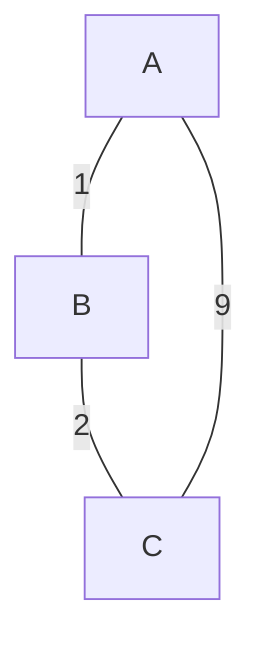

## 作业集合（选 20）
- 10.3, 10.6, 10.7，10.9，10.10, 10.13, 10.14, 10.15, 10.16, 10.21, 10.23, 10.25，10.26，10.27，10.31，10.33，10.34，10.36，10.38
- 11.1，11.3
- 12.1，12.2，12.4，12.7

## 作业

### 10.3
#### 给定一个无向连通图 $G$，每条边的权值各不相同。假设权值最小、第 2 小、第 3 小的边分别为 $e_{1}$, $e_{2}$ 和 $e_{3}$

1. $e_{1}$ 是否一定在 G 的某一个最小生成树中？
	回答：一定。根据 `kruskal` 算法，$e_{1}$ 一定被选中
2. $e_{2}$ ？
	回答：一定。根据 `kruskal` 算法，$e_{2}$ 加入一定不会成环，所以也会选中。
	从 MCE 角度考虑，由于 MST 中一定有 $e_{1}$，所以 $e_{2}(uv)$ 一定可以划分出使得 $e_{1}$ 的两个端点属于同一个切。这样 $e_{2}$ 就是 MCE。
3. $e_{3}$？
	回答：不一定。因为可能 $e_{3}$ 加入会成环，这样从 MCE 角度无法构造切，根据 `kruskal` 算法也不会加入。

### 10.6
#### 请比较 Prim 算法和 Kruskal 算法的好坏。为此需要对优先队列、并查集的不同实现和图的稠密程度进行详细讨论。

回答：
	列一张表。

| Priority Queue | Union-Find   | 图稠密度         | Prim 复杂度         | Kruskal 复杂度  | 优劣            |
| -------------- | ------------ | ------------ | ---------------- | ------------ | ------------- |
| 二叉堆            | 矩阵           | $m=O(n)$     | $O((n+m)\log n)$ | $O(mn)$      | Prim 优        |
| 二叉树            | 矩阵           | $m=O(n^{2})$ | $O((n+m)\log n)$ | $O(mn)$      | Prim 优        |
| 二叉堆            | cFind+wUnion | $m=O(n)$     | $O((n+m)\log n)$ | $O(m\log m)$ | Kruskal 略优，同阶 |
| 二叉堆            | cFind+wUnion | $m=O(n^{2})$ | $O(n+m)\log n$   | $O(m\log m)$ | 差不多           |
| 数组             | 矩阵           | $m=O(n)$     | $O(n^{2}+m)$     | $O(mn)$      | 接近            |
| 数组             | 矩阵           | $m=O(n^{2})$ | $O(n^{2}+m)$     | $O(mn)$      | Prim 优        |
| 数组             | cFind+wUnion | $m=O(n)$     | $O(n^{2}+m)$     | $O(m\log m)$ | Kruskal 优     |
| 数组             | cFind+wUnion | $m=O(n^{2})$ | $O(n^{2}+m)$     | $O(m\log m)$ | Kruskal 优     |
|                |              |              |                  |              |               |
Prim 算法更适合稠密图，Kruskal 算法更适合稀疏图/
### 10.7
#### 最大权重 MST
1. 设计算法，找出有权图的最大（权重）生成树
只需要在 Prim 算法的基础上做一点修改就可以了。

```cpp
void primMST(G,n)

    Initialize the priority queue pq as empty;用大根堆

    //Select vertex s to start the tree;
    //Set its candidate edge to (-1,s,0);

    insert(pq,s,0)
    while(pq is not empty){
    	MST.add(pq.getMax)
    	pq.deleteMax
    	将所有candidate edge加入pq;
    	updateFringe
    }

void updateFringe(pq,G,v)
	// 加入新点 v，所以加入新的Fringe
    for all vertices w adjcent to v //2m loops

        newWgt=w(v,w);//新的权重

        if w.status is unseen then

            Set its candidate edge to (v,w,newWgt);

            insert(pq,w,newWgt)

        else
        	// 这里改为大于
            if newWgt > getPriorty(pq,w)
                Revise its candidate edge to (v,w,newWgt);
                decreaseKey(pq,w,newWgt)
    return
```

#### feedback edge set $F$
容易推出，我们应该找且只应该找所有在环中的边作为 $F$ 的边，因为所有在环中的边都 $\in F$，其他不在环中的边只会增加权重。
在 `Kruskal` 算法上做一点修改
```cpp
void kruskalFeedback(G,n,F)//outline
	int count;
	<Bulid a minimizing priority queue, pq, of edges of G, priorized by weight>
	<Initialize a Union Find structure, sets, in which each vertex of G is in its own set.>
	
	F=A Empty Set
	while(isEmpty(pq) == false):
		vwEdge = getMin(pq);
		deleteMin(pq);
		int vSet = find(sets, vwEdge.from);
		int wSet = find(sets,vwEdge.to);
		// if (vSet != wSet) 
		if(vSet == wSet) // 会导致成环的最小权边，加入F
			Add vwEdge to F
			union(sets,vSet,wSet)
	return;
```

### 10.9
#### 假设某个图 $G$ 中有一棵已经被计算出来的最小生成树。如果一个新的节点及其相关联的边被加入到了 $G$ 中，该最小生成树最快可以在多少时间内被更新？

可以这样做：
- 先把所有新的相关联的边，记作 $xv$ 加入 MST
- 然后在子图 $V=\{v|v\in \text{edge }xv \}$ （即原来最小生成树基础上加新的 E 边集，和一个新的点 $v$）做一个魔改版的 `kruskal` 算法，具体来说参照 [[#10.7|feedback edge]], 也就是我们把**导致成环的最大权重边**都删除。
根据最小生成树性质的思想，我们相当于把所有能换到权重更小的权重都换掉了（这就是删除操作的意义）


假设加入的边个数为 $m$，则在 $O(m\log m)$ 内可以被更新（根据 kruskal 算法）

### 10.10
#### 给定一个具有正边权重的图 $G=(V,E)$, 以及与之对应的一个最小生成树 $T=(V,E')$，都用邻接表给出。此时若将某条边 $e\in E$ 的权重由 $w(e)$ 改为 $\hat{w}(e)$。在不重新计算整个最小生成树的前提下，通过更新 $T$ 得到新的最小生成树。针对以下 4 种情况，分别给出线性时间的更新算法：
1. $e\not\in E'$ 且 $\hat{w}(e)>w(e)$
MST 外的一条边权重增加，不会改变 MST 的最优性质。即 MST 找不到另一条边可换入 MST 使得总权重变少。不需要更新
2. $e\not\in E'$ 且 $\hat{w}(e)<w(e)$
将 $e$ 加入 MST，根据树的性质会成一个唯一的环。通过 `DFS` 找到这个环，通过回溯的方式找到环中的所有边。删除其中最大权重的一条边即可。
```python
def find_cycle_edges(tree, new_edge):
    u, v = new_edge
    parent = {}  # 用来追踪节点的父节点
    path = []  # 保存环中的边
    visited = set()

    # DFS 遍历找到环
    def dfs(node):
        visited.add(node)
        for neighbor, edge in tree[node]:
            if neighbor == parent.get(node):  # 忽略父边
                continue
            if neighbor in visited:
                # 找到环，开始回溯
                path.append((node, neighbor, edge))
                return True
            parent[neighbor] = node
            if dfs(neighbor):
                path.append((node, neighbor, edge))
                return True
        return False

    parent[v] = u
    dfs(v)

    # 返回环中的边
    return path + [(u, v, weight_of(new_edge))]

```

3. $e\in E'$ 且 $\hat{w}(e)<w(e)$
	仍然是 MST，只需要更新权重。
4. $e\in E'$ 且 $\hat{w}(e)>w(e)$
	1. 假设 $e=uv$，先切断 uv，对 $u$ 和 $v$ 分别出发在 $MST$ 上做 $DFS$，做并查集，得到顶点集划分 $V_{1}$ 和 $V_{2}$
	2. 然后，遍历所有边，检查
		1. 两个顶点是否分别在 $V_{1}$ $V_{2}$ 中**且** 是否权重小于  $\hat{w}(e)$ 
		2. 如果是，则换入。
	3. 如果没有换入，则把 uv 放回去。换入了，就是答案。
	4. 这种做法本质是利用 MCE 的思想，即 $uv$ 应该是 `MCE`，则我们做划分检查其是否还是 MCE，如果不是就找个别的边来代替它。而显而易见别的 MST 中的边仍然是 MCE，所以不需要管。


### 10.13
以 kruskal 算法为基础来做。具体而言，将 kruskal 算法的 $F^{(0)}$ 设置为 $F^{(0)}=S$
然后重复做 `kruskal` 算法即可。

### 10.14
分析：假设 $e$ 在 $G$ 的某个最小生成树中，则必然可以找到一个 cut，使得 $e$ 是 $MCE$
要使得 $e$ 是 MCE，就必然要做到其他比 $e$ 权值更小的边和 $e$ 在 $G$ 中不会构成一个回路
判断回路可以用 `DFS`，从 $e$ 的一个顶点 $u$ 出发，向 $v$ 遍历并通过回溯记录环路中的边。如果回溯查看到了指向 $u$ 的边，就出现了包含 $e=uv$ 的环路，也就是可能导致 $e$ 不是 MCE 的回路。

- 然后依次检查回路中的 **每一条边** 是否权值比 $e$ 更小。
	- 如果更小，$e$ 就不是 MCE
	- 如果更大，则继续 DFS，检查下一个回路。
- 检查结束，返回 $e$ 是 MCE
整体做了一个 DFS，故在 $O(m+n)$ 内完成


### 10.15
#### 判断叙述对错。对则证明，错误则给返利。假设 $G=(V,E)$ 是一个无向图。如果未做特殊说明，则权值可能相同。
 1. 若 G 有超过 $n-1$ 条边，且有唯一一条最重边，这这条边必不属于 $G$ 的任意最小生成树
	不正确。$G$ 有超过 $n-1$ 条边，则存在环。但可以设计反例使得最重边不在环上，则无法换掉最重边（否则不连通）（**割边**）
2. 在 1 基础上，加上 $G$ 上存在一个环且上面有唯一最重边 $e$，$\forall MST,e\not\in MST$
	正确。
	**反证法**：假设 $\exists MST,e\in MST$, 由于存在一个环 $C\subset G，e\in C$, 则必然有权重更小的一条边 $e'$，换成 $e'$ 总权重更低，和 MST 性质矛盾

3. 设 $e$ 是 $G$ 中一条权重最小的边，则 $e$ 必然属于某个最小生成树
	不一定。由于权重可重复，可能存在多条这样的边。
	**构造反例**：如果他们成了一个环，那其实选择某一条都可以。不一定必然属于。

4. 如果图中最小权重的边唯一，则该边必然属于某一个 MST
	正确。
	根据 Kruskal 算法，该边必然被加入 MST。
5. 若 $G$ 中存在一个环，且该环中的最轻边 $e$ 唯一，则 $e$ 必然属于每个最小生成树
	%% 正确
	**反证法**：假如存在某个 MST $T$，$e\not\in T$, $T$ 中必然存在一条 $e$ 所在环 $C$ 的边 $e'$ 但我们知道存在一个环，环中有一个 $e$ 权重更低，将 $e'$ 替换为 $e$ 会降低总权重，矛盾。 %%
	批改：
		错误。如四面体，三条边权值很大（则其中的一个最轻边），另外三条边权值很小。
		![[Pasted image 20250529112823.png]]
		则 100 这个环中的最轻边不一定属于 MST
		
6. 两个节点中的最短路径必然是某个最小生成树的一部分。
	错误。
	三条边：权值 2 2 3
7. 当存在负权重的边时，Prim 算法仍然有效
	正确。
	**证明**：从MCE 角度考虑，权重的正负并不影响MCE 的判定，因而Prim 算法仍然正确。
### 10.16
#### 给定无向连通图 $G=(V,E)$，每条边的权重都是正数且各不相同。构建一个图 $G'$，节点和边与 $G$ 相同，边权重是 $G$ 中对应边权重的平方。判断正误并证明：$T$ 是 $G$ 的最小生成树当且仅当 $T$ 是 $G'$ 的最小生成树

证明：
充分性：
	如果 $T$ 是 $G$ 的 MST，则 $T$ 中的每一条边都是 MCE，则我们取构成 MCE 的某个切，对应到 $G'$ 中，由于 $y=x^{2}$ 是严格单调递增的，所以映射到 $G'$ 中仍然满足大小对应关系。所以 $T'$ 中的每一条边都是 MCE
必要性：
	完全类似。只是考虑 $y=\sqrt{ x }$ 是严格递增的

### 10.21
不正确
考虑这样一个子图。

若选择的时候划分集合为 $\{ \{ A,C \},\{ B \} \}$，则 $ac$ 权重为 9 的边根据算法会被选中，但是这个图的 $MST$ 显然不包括 `9` 这条边。所以划分子问题可能遇到递归基础不正确的情形。

### 10.23
1. 假如你只能选择 1 个房子打 1 口井（其他房子必须依靠管道供水）
	这是一个单源最短路径的问题，区别只是要考虑上每个房子的代价。
	所以，基于 dijkstra 算法，计算每个点的单源最短路径总代价+挖井代价，求最大即可
	```python
	def wellPlan1(V,E,digWellCosts[]):
		best_cost=inf
		best_plan_edges=[]
		for each v in V:
			dig_well_cost, plan_edges = dijktraWell(v,V,E) + digWellCost[v]
			if(dig_well_cost<best_cost):
				best_cost=dig_well_cost
				best_plan_edges=plan_edges
				
		return best_cost,best_plan_edges
		
	def dijkstraWell(s,V,E):
		Initialize all vertices as UNSEEN
		s.dis=0
		for each neighbor w of s:
			w.pathEdge = sw;
			queNode.insert(w,sw.weight)
		
		while(queNode!=empty):
			x= queNode.getMin;
			x.dis=x.priority; # 更新到x的距离
			# 加入plan_edges
			plan_edges.append(x.pathEdge)#这个pathEdge维护一个映射来做
			updateFringe(x,queNode);
					
		def	updateFringe(v,queNode):
			for each neighbor w of v:
				newPriority = v.priority+vw.weight
				if(w is UNSEEN):
					w.pathEdge=vw
					nodeQue.insert(w,newPriority)
					
				else:
					if(newPriority <w.priority){
						w.pathEdge=vw
						nodeQue.decreaseKey(w,newPriority);
					}
	```

2. 可以任意打井，铺设管道，则我们的思路是：找到总和 $C_{ij}$ 最小的铺设方案即最小生成树。
	1. 对于一个图，我们有时候要对一个切 $(V_{1},V_{2})$ 做出抉择：是找一条 MCE 连通划算，还是干脆挖两个井划算。由于任意两个房子之间都可以挖水管，所以我们只需要抉择
$$
	\min\left\{ \text{挖MCE水管cost } C_{ij} ,剩余点V中最小的挖井代价W_{i}\right\} 
$$
	2. 考虑用 Prim 算法改造来做

```c
void primDigWell(G,n)

    Initialize the priority queue pq as empty;
    //Select vertex s to start the tree;
    //Set its candidate edge to (-1,s,0);即初始点没有candidate edge
    insert(pq,s,0);

    while (pq is not empty)
        v=getMin(pq); deleteMin(pq);
        # 这里加入一个判断：挖管道还是不挖管道？取决于剩余点的最小代价是否小于挖管道的代价
        # 可以看作一个DP问题
        if(Cost of pathEdge v < min dig well cost of 剩余的点)
    		MST=MST `union` candidate edge of v //加入连接边
    	else:
    		PrimDigWell(G-{已经选好的点},n)
    			
        updateFringe(pq,G,v);
    return
    
void updateFringe(pq,G,v)
	// 加入新点 v，所以加入新的Fringe
    for all vertices w adjcent to v //2m loops
        newWgt=w(v,w);//新的权重
        if w.status is unseen then
            Set its candidate edge to (v,w,newWgt);
            insert(pq,w,newWgt)
        else
            if newWgt<getPriorty(pq,w)
            	// 更新candidate边权重
                Revise its candidate edge to (v,w,newWgt);
                decreaseKey(pq,w,newWgt)
    return
```

最后能找到方案。

%% 批改 %%

可以通过归约的思想。
- 构造一个 **超级节点**，连通所有的房子，边权就是所链接房子的 **挖井代价**。
- 在这个新图上做 MST 即可。

### 10.25
#### `Dijkstra` 算法在边权重有负数的时候可能是错的，找一个反例
反例如图。![[Pasted image 20250517152857.png]]
算法运算过程
1. S 更新A 和D
	1. dist (A)=2, dist (D)=4
2. 加入新的fringe
	1. B 会寻找离源点最近的 dist，再计算权重
	2. 加入B，dist (B)=min{dist...}+w.. b=dist (A)+3=5
	3. 但是由于负权重的存在，实际上 S-D-B 是一条更短的路径。
出现了 **错误**

### 10.26
#### Dijkstra 得到的最短路径树是否必然是一棵最小生成树，请证明你的结论。
不必然。最简单的情况：前面有习题 [[#10.15]] 证明了负权重存在Prim 算法仍然有效，但是Dijkstra 无法得到正确的最短路径树。所以不必然是最小生成树。

更深一步考虑，假设Dijkstra 得到了最短路径树，也不一定是最小生成树。如图所示
![[Pasted image 20250517154807.png]]

**更具体思考**，这是因为 `Dijkstra` 只关心从 `S` 到某个点的路径，而不关心这条路径具体的边。所以当 `AC` 能以 2 到达 `C` 时候，它不会再思考另一条相同代价的 `AB-BC` 是更好的 MST 这一点。

### 10.27
#### 假设图 $G$ 中只有一条边的权值为负，其余边的权值均为正，并且图中没有负权的环。指定任意源点 $s$，请计算从 $s$ 到达其他所有节点的最短路径长度。你的算法应该和 `Dijkstra` 算法有着同样的时间复杂度

可以给每一条边一个偏移量 $\Delta x$，使得每一条的权值都变正。具体来说遍历所有边找到负权边 $e$，$e$ 的权重为 $w$，则设定 $\Delta x=-w+1$。
然后正常做 dijkstra 即可。
只多了一次遍历，所以时间复杂度一致。

### 10.31
#### 考虑无向图 $G=(V,E)$，其边的权重非负。假设已有 $G$ 的一个最小生成树，以及由某个节点 $s \in V$ 到所有其他节点的最短路径。现将所有边的权重加 1.
1. 最小生成树会发生变化吗？
	不会发生变化。考虑任意一条边 $e\in MST$，则其必然能找到一个切 $(V_{1},V_{2})$，使得 $e$ 是 $MCE$。那么所有边的权重都加 1，$e$ 仍然是跨越切的 **最小权** 的边，无影响。
2. 最短路径会发生变化吗？
	会发生变化。
	![[Pasted image 20250517154807.png]] 考虑这个图（虽然是上题的，但是也符合）
	例如，在加权之前，到 C 的最短路径有 AB，BC 或 AC 两种，但是加权之后，则 AC `w=3`，AB-AC `w=4`，发生了变化。

### 10.33（推广的最短路径问题）
#### 假定一个图除它的边存在权重 $\{ l: e\in E \}$ 之外，顶点也具有权重 $\{ c_{v}:v\in V \}$ 。现在定义一条路径的权重为其上所有边的权重加上其上所有节点（包含路径的端点）的权重。请设计一个针对以下问题的高效算法
- input：有向图 $G=(V,E)$, 边权重 $l_{e}>0$，顶点权重 $c_v >0$，起始顶点 $s \in V$
- output: 一个数组 $Cost[1\dots n]$，针对每个顶点 $u$，$Cost[u]$ 是从 $s$ 到 $u$ 的最短路径，注：$Cost[s]=c_{s}$
解：
可以在 `dijkstra` 算法基础上修改。
我们从单源出发，由于是有向图，所以每条边能走的方向是固定的，假设 $e$ 从 $u$ 指向 $v$，则可以更新边的权重为 $l_{e}+c_{u}$
初始化 $Cost[s]=c$，然后在更新权重后的图上做 `Dijkstra` 算法即得到答案。

### 10.34
#### 考虑一个这样的有向图：其所有负权边都是从 $s$ 发出的边，从此之外的其他边的权值都为正。以顶点 $s$ 作为起始点，Dijkstra 算法能否正确对这样的图计算 $s$ 到其他所有点的最短路径? 请证明你的结论。
能够正确计算。
其关键在于，负权边是否会导致贪心策略的不正确性。
	对于 $s$ 的邻居集合 `neighbors`, $\forall v\in neighbors$, 可以算出 $dist[v]=w(sv)$，第一步贪心选择是正确的，确实获得了子问题 $s+neighbors$ 图上的最短路径解。（显而易见）
	然后，`updateFringe`。对于新的 `Fringe` 集合，他们的权值都是正的，由于 dijkstra 算法是正确的，即对他们的最短路径，一定满足是在 $dist[neighbors]+w(newPathEdge)$ 中做选择，贪心策略没有失效。所以可以正常做。

### 10.38
#### 给定一组城市，它们之间以高速公路相连，以无向图 $G=(V,E)$ 表示，每条高速公路 $e \in E$ 连接两个城市，公路的长度为 $l_{e}$。你想要从城市 $s$ 到城市 $t$，但是你的汽车容量有限，在加满的情况下只能行驶 $L$ 公里。每个城市都有加油站，但是高速公路没有。即选择路径的边满足 $l_{e}\leq L$
1. 给定油箱限制，线性时间判断是否存在一条 $s$ 到 $t$ 的可行路径
用 $DFS$ 来做
```python
def hasPath(V,s,t,L):
	initialize all nodes as WHITE
	ans=false;#默认不存在
	return hasPathDFS(V,E,s,t,L) # 如果找到了将返回true，否则返回false
	
		

def hasPathDFS(V,E,v,t,L):
	v.color = gray
	for each neigbor w of v:
		# 只有一些边可以连通。
		if w is white AND weight(vw)<= L:
			if(w==t): # 已经能到达
				return true;
				# 否则 继续找
			hasPathDFS(V,E,w,t,L)
	v.color=black		
```

2. 你打算买一个新车，需要知道从 $s$ 旅行到 $t$ 的油箱最小容量。给出一个时间复杂度为 $O((n+m)\log n)$ 的算法，计算从 $s$ 旅行到 $t$ 所需的油箱最小容量。
**由第一问**，我们已经获得了线性时间算法的判断能否通的算法。结合额外的一个 $\log n$ 想到可以用二分查找的方法。
将所有边的权重从小到大排序，存入 $wgt[]$ 数组。
```python
def minCap(s,t,left,right):
	mid=(left+right)/2
	int L=wgt[mid]
	if(left >= right):
		# 查找到最合适的
		return L
	if(hasPath(V,s,t,L)):
		# 能跑通，油箱多余，减小L
		return minCap(s,t,left,mid)#细节，mid可能就是答案，所以不能传入mid-1
	else:
		# 不能跑通，增大L
		return minCap(s,t,mid+1,right)
	
```
排序代价为 $m\log m=m\log n$, `hasPath` 代价为 $O(m+n)$
$T(m)=hasPath+T\left( \dfrac{m}{2} \right)$，总体代价为 $O((m+n)\log m)$, $m\in O(n^{2})$，所以总体仍然是 $O((n+m)\log n)$。

%% 批改 %%
也可以用 Dijkstra 做。
我们需要找：一个路径，其满足之中的**最大公路长度** 最**小**，这其实就直观的是为了我们的油箱可以尽量小。

那么只需要构建一个新的 Dijkstra 权值更新即可。
$cap(v)=\max (cap(u),l_{uv} )$
这样，就找到了 $t$ 的最大公路长度最小的情况。


### 11.1
#### 对于任意正整数 $c\geq 2$ ，假设一组硬币的面值为 $D_{n}=\{ 1,c,c^{2},c^{3},\dots ,c^{n-1} \}$，要换 $S$ 的钱。设计贪心算法，计算最少需要多少硬币，并证明正确性。

解：设计贪心算法：优先大面值
```python
def coinExchange(Dn[],S):
	int coins_cnt=0
	int total_amt=0
	int i=n
	while(total_amt<S ):
		if(total+amt+Dn[i]==S):
			coins_cnt++; # 可以加
			return;
		if(total+amt+Dn[i]>S):超了，只能加更小面额的
			i--;
		if(total+amt+Dn[i]<S):
			coins_cnt++; # 可以加
	
```
证明：
假设有一种非贪婪算法的最优找零方案 $S_{1} = m_{0}c_{0} + m_{1}c_{1} + … + m_{k}c_{k}$


贪婪算法的找零方案 $S_{2}=n_{0}c_{0}+n_{1}c_{1}+\dots n_{k}c_{k}$
假设从k开始，到 $x$ ($x \leq k$)对应的面值的硬币时，$$m_{x}\neq n_{x}$$ 算法每次都贪心选择最大的，所以对于最早出现的（面值从大到小来说）不一样的面值，一定有 $m_{x}<n_{x}$
我们不妨假设相差最小 $n_{x}-m_{x}=1$，
我们知道，$\forall m_{i},i<k$ 都有 $m_{i}<c$（因为一旦 $\geq c$，就可以换成更高面值的）
$S_{1}$ 在 $c_{0}$ 到 $c_{k-1}$ 面值的金额总和：
$$
\sum_{i=0}^{k-1}m_{i}c_{i}\leq \sum_{i=0}^{k-1}(c-1)c_{i}<c^{k}
$$
所以 $S_{1}$ 剩余的钱总和一定小于差出来的 $c^{k}$，需要补充硬币。而补充硬币后，说明其不是最优解，矛盾。故
贪婪算法就是最优找零方案。


### 11.3
#### 沿着一条笔直的公路稀疏地分散着一些房子，用 $x_i$ 表示这些房子的位置，沿着公路设置一些基站，使得每个房子距离其中一个基站距离不超过t，设计 $O(n)$ 算法解决
贪心策略：每个基站放在 $y$ 可以覆盖 $[y-t,y+t]$ 的范围, 我们尽量放在最靠右的位置。

```python
def min_stations(house_positions, t):
    n = len(house_positions)
    count = 0
    i = 0
    while i < n:
        count += 1
        # 找到当前未覆盖的第一个房子
        start = house_positions[i]
        # 基站位置尽可能设置在 start + t
        while i < n and house_positions[i] <= start + t:
            i += 1
        	# 基站覆盖范围为 (start + t - t, start + t + t)
        	center = house_positions[i - 1]
        # 更新已覆盖的房子
        while i < n and house_positions[i] <= center + t:
            i += 1
    
    return count

```
正确性证明：
设贪心算法找到的解不是最优解，存在另一个解使用了更少的基站。假设两个解第一个不同的选择出现在第 $i$ 个房子, 贪心算法放在 $x_{i}+t$
1.  如果存在一个更优解，要求其第一个基站放置在不同位置
	-  若放在 $x'>x_{i}+t$，则该房子不被覆盖
    - 若基站放置在 $x'<x_{i}<t$，则覆盖范围变短，剩余未覆盖的房子只可能需要更多基站覆盖，导致解更差。
        
2. 因此，无论其他解如何选择第一个基站，都会导致基站总数不少于贪心算法。
    

因此，**贪心解是全局最优解。**


# 感悟

添加虚拟/**超级节点** 是常用的简化技巧。

### 例题 12.4
给定一个有向图（图中每条边的权重非负数）和两个不相交的点集 $S,T$，请设计一个算法找到从 $S$ 中的任意一个顶点到 $T$ 中任意一个顶点的最短路径。最坏情况时间复杂度为 $O(m\log n)$