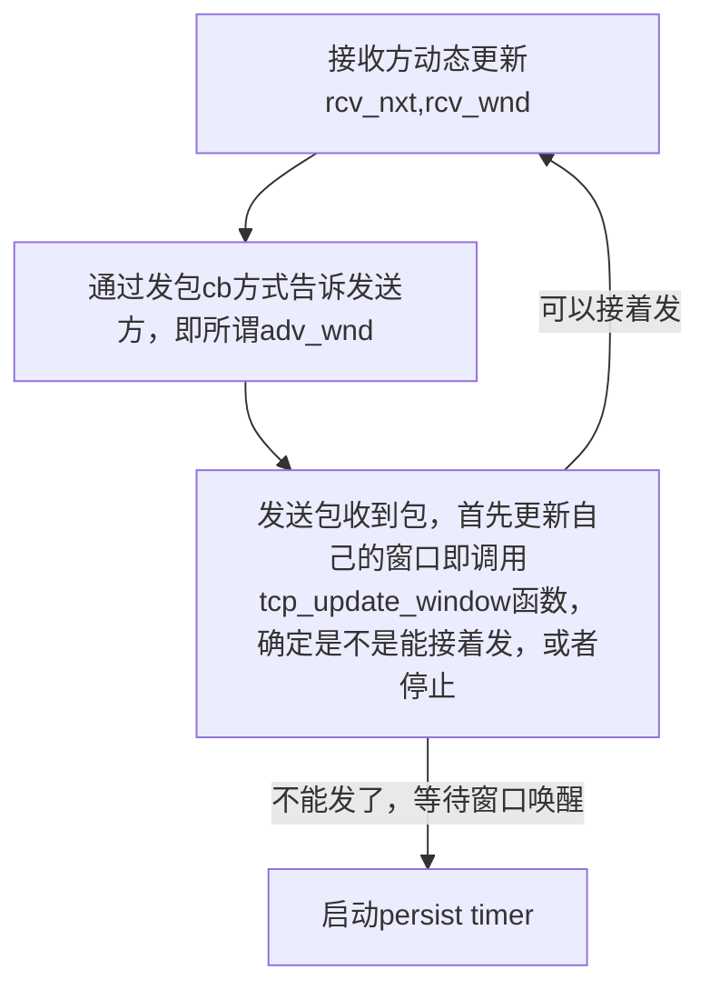

–# 实验目标
本次实验在[实验二](vault/redkoldnote/docs/计算机网络/exps/exp2/README.md) 的基础上，完成：
- 实现可靠传输机制
- 在有丢包的网络拓扑上实现文件传输

# 抓包调试
看这里 [[vault/redkoldnote/docs/计算机网络/exps/exp2/README#抓包|README]]

# 实验前的准备
## 代码文件准备
1. 需要添加仓库中的新文件：
```
exp3/ 
├─ bulk.py # 实现了文件传输功能的python脚本 
├─ tcp_topo_loss.py # 有丢包的mininet测试拓扑
├─ test.py # 测试脚本 
├─ pyarmor_runtime_000000 # 测试脚本依赖文件 
├─ ... 
├─ main.c # main.c 等实验二的文件
```
2. 
- 在实验目录和scripts子目录下执行`chmod +x *.sh`。为所有.sh脚本赋予执行权限
- `./create_randfile.sh` 执行脚本，生成本次实验中用于传输的文件 `client-input.dat`
- 如果报错，可以看 exp2 中的解决方案。

```bash 
sed -i -e 's/\r$//' yourscriptname.sh
```

# 可靠传输
为了实现可靠传输，我们需要：
- 锁
- 滑动窗口

## 锁
为了保证并发安全性，需要进行上锁。越细粒度的锁性能高，但写起来也更容易出错。这里采用三个粗粒度的锁保护 `struct tcp_sock`，框架中没有，需要手动创建在结构体中。

### 需要的锁

- `pthread_mutex_t sk_lock;` 保护`snd_una`等核心参数
    - 收包时：在`tcp_process`调用之前上锁，之后解锁。这样整个收包过程对socket参数的更改都是安全的。
    - 发包时：在`tcp_send_packet`调用之前上锁，之后解锁。这里由于每个人实现不一样，加锁位置不一定一样，比如在调用`` `tcp_send_packet ``之前，用`tcp_tx_window_test`检查发送窗口，那么应该在`tcp_tx_window_test`之前上锁。
- `pthread_mutex_t rcv_buf_lock` 保护`struct ring_buffer *rcv_buf`
    - 每次访问`rcv_buf`时
- `pthread_mutex_t send_buf_lock;`保护`struct list_head send_buf;`
    - 每次访问 `send_buf` 时

**代码修改：** 我在实验二中已经做了一些锁，可以把他们写进结构体，这样会更方便一点，调用起来也更直接明白。
对锁的初始化放在 `alloc_tcp_sock` 中
### sleep_on 和锁

上锁还有另一个需要注意的问题：**在调用`sleep_on`之前，一定要释放占有的锁**。举一个发送报文的例子：

`pthread_mutex_lock(&tsk->sk_lock); while (!tcp_tx_window_test(tsk)) {     // 如果发送窗口不足，先释放锁，再等待wait_send信号激活     pthread_mutex_unlock(&tsk->sk_lock);     sleep_on(tsk->wait_send);     pthread_mutex_lock(&tsk->sk_lock); } tcp_send_packet(tsk, data_pkt, data_pkt_len); pthread_mutex_unlock(&tsk->sk_lock);`

## 滑动窗口
### 滑动窗口机制：


### 怎样分割窗口？
```C
Send Sequence Space

                 1         2          3          4
            ----------|----------|----------|----------
                   SND.UNA    SND.NXT    SND.UNA
                                        +SND.WND

      1 - old sequence numbers which have been acknowledged
      2 - sequence numbers of unacknowledged data
      3 - sequence numbers allowed for new data transmission
      4 - future sequence numbers which are not yet allowed

                        Send Sequence Space
```
`snd_una, snd.nxt, snd.una, snd.wnd` 都以字节为单位. （看看 wireshark 的 len 和 seq ack 增长的关系就理解了）

### 发送方(Sender)行为：
发送方通过计算某次发送包所处在的窗口来判断自己行为
- 已经被接收的字节：`seq < snd_una`
- 发送了，但为收到ACK的字节：`snd_una <= seq < snd_nxt`
- 未发送，且当前发送窗口剩余大小允许继续发送的字节：`snd_nxt <= seq < snd_una + snd_wnd`
- 发送窗口剩余大小不允许继续发送的字节：`seq >= snd_una + snd_wnd`
### 接收方(Receiver)行为
**接收方：**

接收方采用**累计确认机制**进行回复，按照课本的GBN机制，接收方是不维护窗口的。不过一般还是会维护乱序队列（Out-of-Order Queue），对应于`tcp_sock`中的`rcv_ofo_buf`，这是下一节要完成的内容，本节还是假设没有窗口。

累计确认机制下，
- 接收端发送的ACK报文的应答序号 `tcp->ack` 始终是自己希望收到的下一个字节 `tsk->rcv_nxt`
- 这一点与是否实现乱序队列无关，因而实验中发送ACK报文只需要调用 `tcp_send_control_packet(tsk, ACK)`，序号的设置会由函数自动进行。

在本节中，接收方收到一个报文，需要检查该报文的序号（范围 `[cb->seq, cb->seq_end)`）和自己期望收到的序号 `tsk->rcv_nxt` 的关系。
注意，比较序列号时最好使用 `tcp.h` 中提供的比较函数 `less_than_32b` 等，它们会自动处理整数的**溢出问题。**（此溢出问题在 exp2 中遇到过）
- `cb->seq_end <= tsk->rcv_nxt`：收到了之前确认过的报文，不需要处理报文中的数据，直接回复ACK。这种情况在无丢包时不应该出现，但可以添加这一处理，防止python侧发送这样的报文（例如KeepAlive报文）。
- `tsk->rcv_nxt == cb->seq`：刚好是自己希望收到的报文，将数据上送`rcv_buf`
- `tsk->rcv_nxt < cb->seq`：乱序报文，后面处理，这里直接回复ACK，数据丢弃。
- 其它情况不应出现


# 我该怎样做？
## 第一阶段-无丢包可靠传输（window）
### 完善锁机制
#### 锁谁的问题
锁的作用对象是线程，我们为了保护数据才设计锁。
本试验的线程有：
- 协议栈 `ustack_run` 协议栈收包功能，进行一系列调用最终调用到 `tcp_process`
- Timer (`tcp_timer_thread)` 
	- 运行在子线程，实现TCP协议中和时间相关的内容（超时等机制）
- 用户程序 ` (tcp_server OR tcp_client)`
	- 运行在子线程，实现TCP应用。它在调用`tcp_sock_write`时会进行协议栈发包操作。
	
	- p.s. 可以将tcp_sock_write理解为linux中的系统调用，调用tcp_sock_write函数发生在“用户态”，具体执行发生在“内核态”。仅仅方便理解，与后续实验关系不大。
#### 用几个锁
- `pthread_mutex_t sk_lock;` 保护`snd_una`等核心参数
    - 收包时：在`tcp_process`调用之前上锁，之后解锁。这样整个收包过程对socket参数的更改都是安全的。
    - 发包时：在`tcp_send_packet`调用之前上锁，之后解锁。这里由于每个人实现不一样，加锁位置不一定一样，比如在调用`` `tcp_send_packet ``之前，用`tcp_tx_window_test`检查发送窗口，那么应该在`tcp_tx_window_test`之前上锁。
- `pthread_mutex_t rcv_buf_lock` 保护`struct ring_buffer *rcv_buf`
    - 每次访问`rcv_buf`时
- `pthread_mutex_t send_buf_lock;`保护`struct list_head send_buf;`
    - 每次访问`send_buf`时

到这次实验为止还有一个锁，是保护 `timer_list` 的 `timer_list_lock`

我们可以把每个锁写成 sock 结构体的成员，这样调用起来很方便

### 完成更新窗口函数

#### 编写代码
要添加如下的代码：
```c
#define TCP_MSS (ETH_FRAME_LEN - ETHER_HDR_SIZE - IP_BASE_HDR_SIZE - TCP_BASE_HDR_SIZE)

// 使用 tsk->snd_una, tsk->snd_wnd, tsk->snd_nxt 计算剩余窗口大小，如果大于 TCP_MSS，则返回 1，否则返回 0
int tcp_tx_window_test (struct tcp_sock *tsk)
```

### 修改报文收发之后的逻辑

### 修改 tcp.app 功能
这里的功能：
- Client：实现发送信息，具体是脚本生成的 `client-input.dat` 文件
- Server：实现接受信息，并将文件写入。
值得注意的是：我们一次发送的信息，最多是一个 `TCP_MSS`，这是在实验文档中提到了的一个宏，需要在本次试验 **自行添加** 到源码中。(本质上是 IP 层发的包最多有多少能装数据，~~很有可能你的 AI 给你随便设了一个 2048 然后报错~~).

通过设置 `TCP_MSS` 之后，client 分批次发送这个文件，直到 snd_wnd 为 0. 如果不加处理，这里构成一个典型的死锁：

> 当接收方通知接收窗口归零时，发送主机无法再发送任何内容，直到收到新的ACK通告的窗口变为非零值。然而发送方不发送消息，接收方也不会发送ACK。此时，发送方和接收方都不再发送任何报文，发生死锁。

解决方案见下一部分

### 解决窗口归零问题-PersistTimer
有两种解决方案：
- Window Update Message
	- 接收方在接受窗口从 0 变为非 0 之后，主动发送一个 ACK
	- 问题：不可靠传输。如果 ACK 丢包，仍然是死锁
- Persist Timer:
	- 即使发送方被通知接收窗口归零，发送方仍然会隔一段时间发送一个 Probe 报文。包含一个字节的数据。用这个数据试探新的窗口。

为了做得更好，我们选择实现 Persist Timer

### 实现 Persist Timer
1. `tcp_set_persist_timer`：启用persist timer
    
```c
    /* 1. 如果已经启用，则直接退出 2. 创建定时器，设置各个成员变量，设置timeout为比如TCP_RETRANS_INTERVAL_INITIAL 3. 增加tsk的引用计数，将定时器加入timer_list末尾 */ 
    void tcp_set_persist_timer(struct tcp_sock *tsk);
```

    
2. `tcp_unset_persist_timer`：禁用persist timer
    
    ```c
	/* 
	1. 如果已经禁用，不做任何事 
    2. 调用free_tcp_sock减少tsk引用计数，并从链表中移除timer 
	*/ 
    void tcp_unset_persist_timer(struct tcp_sock *tsk);
```
2. `tcp_send_probe_packet`：发送Probe报文
    
```c
    /* 仿照tcp_send_packet函数，发送probe报文。几处改动： 1. 发送的序列号设置为一个已经ACK过的序列号（比如tsk->snd_una - 1） 2. 不需要更新snd_nxt 3. 不需要设置重传相关内容 4. TCP负载为一个任意的字节 */ 
    void tcp_send_probe_packet(struct tcp_sock *tsk);    ```

 
3. `tcp_scan_timer_list`中增加对Persist Timer超时的处理。如果TCP没有关闭，且发送窗口`snd_wnd`小于TCP_MSS，则发送一个Probe报文、重置时间，否则关闭该定时器。
    
4. 修改 `tcp_update_window` 函数。比较简单的修改方式是，只要新的 `snd_wnd` 小于TCP_MSS，就调用 `tcp_set_persist_timer`，否则调用 `tcp_unset_persist_timer`，这两个函数在已经启用或禁用时不会重复操作。当然也可以加些判断，只在归零和恢复的时候调用这两个函数。

### 是怎样触发的？
是这样的：



#### 细节问题
`Persist Timer` 是一个全新的计时器，建议把它写进 `tcp_sock` 的结构体，类似于 `timewait` 和 `retranstimer`
比如下面的宏，可能你也要照猫画虎一下
```
#define timewait_to_tcp_sock(t) \
(struct tcp_sock *)((char *)(t) - offsetof(struct tcp_sock, timewait))

#define retranstimer_to_tcp_sock(t) \
(struct tcp_sock *)((char *)(t) - offsetof(struct tcp_sock, retrans_timer)) 

#define persisttimer_to_tcp_sock(t) \
(struct tcp_sock *)((char *)(t) - offsetof(struct tcp_sock, persist_timer))
```
这样做之后应该可以正常发送 probe packet

---
## 第二阶段-丢包重传（GBN）

### 双方的关键结构
这部分的逻辑是实现最简单的丢包环境处理：
- 接收方：实现组织乱序数据的队列
	- `rcv_ofo_buffer`（out of order）
		- 将所有数据包放入其中，放到该放的位置
		- 不再关心数据的 `IP` , `TCP` 头，只关心 `payload` 和 `pl_len`
			- 所以结构体也是实现这两个
- 发送方：实现 `send_buf` 和重传计时器为重传做准备
	- 发送方在发送含有 `SYN` 或 `FIN` 的控制包，或者含有数据的报文时（在  `tcp_send_packet` 中检查，如果 `tcp_data_len>0`  ）就加入 `send_buf`
		- 本质是为重传做准备。
	- 根据 peer 传来的 `ACK` 包检查，将已经确定不需要重传的包，即 `ack of peer >= seq of packcet + pl_len` 移出去
	- 如果 `send_buf` 为空，则不需要再记录重传，执行 `tcp_unset_retrans_timer`

### 重要参数说明：
对于维护乱序队列 `rcv_ofo_buffer`：需要认识以下几点：
首先，只有有数据的包才需要放入乱序队列。
	这也是为什么 probe packet 要携带任意一字节数据，并设置为已经 ack 过的 seq，以根据以下的判断，忽视 probe packet 的字节，同时唤醒 `wait_recv` 更新窗口并告知 `peer` 可以继续发包。
-  `peer` 发来一个包，其有三种情况
	- `cb->seq_end <= tsk->rcv_nxt`，重复的包（由于有数据，所以 `tsk->rcv_nxt > cb->seq_end > cb->seq,`）
		- 直接忽视
	- `cb->seq== tsk->rcv_nxt`
		- 正是我需要的(顺序)。读取
	- `cb->seq > tsk->rcv_nxt`
		- 乱序包。放入队列等待。

# 实验 bug 动态记录

`2025-04-09`: 出现 tcp_stack: include/ring_buffer. H:79: write_ring_buffer: Assertion `size > 0 && ring_buffer_free(rbuf) >= size' failed.` 断言错误，猜测是 `ring_buffer` 没有被及时读掉，导致装的太多了. 
解决了

2025-4-14:
需要完善 client 发送到完毕之后的逻辑。即：你需要让 server 指导，client 已经发完了，进入关闭逻辑。
但是你的 read 又会阻塞等待。所以就死锁了
![[Pasted image 20250414175453.png]]
在更正这一点后，server 可以正常处理，且发现 `diff` 结果正确
![[diff-ans.png]]


##  第二阶段 bug
![[Pasted image 20250419103314.png]]
发送方 client没有正确删除 ack ，导致直接重发
经检查，本质是 server 的读函数有问题，导致 rcv_nxt 没有正确更新

进一步定位，是 `tcp_rcv_ofo_buffer_add_packet` 写的有问题。在空的时候，直接添加就可以了。这样 rcv_nxt 可以正确更新。然后又出现了死锁问题：`tcp_write` 函数试图写，但是卡住了，检查是在 `tcp_rcv_ofo_buffer_add_packe` 锁了不该锁的 `tsk->rcv_buf_lock`
> [!TIP]
> 不需要给 rcv_ofo_buffer 加锁！


1179664是特殊的数字吗?
- 现在程序传输到 seq=1179681 出现异常，是这个不应该存在的 ` 1179664 `（而 client 根本没有发送这样一个 seq 的包，应该是内存读取错误）干扰了。而这个 1799664 之前我也遇到过。
- ![[Pasted image 20250419115408.png]]


### Probe packet
这个 probe packet 应该被忽视，但是在这里被我写进去了。（1 byte）得改一下处理逻辑：如果已经被 ack 过，直接忽视

- 但是我改过逻辑后，仍然没有忽视。然后我把 `probe packet` 的 `seq` 改成 `1`，一个肯定被 ack 过的值，但是仍然没有用，`rcv_nxt` 甚至被篡改为 `1`
- 发现是这个细节没有改（实验二遗留问题）：
```c
if (cb->pl_len > 0 || (cb->flags & TCP_PSH)) {
// 含有数据，将数据上送recv_ofo_buffer（乱序队列）
tsk->rcv_nxt=cb->seq;
int total_moved = tcp_recv_ofo_buffer_add_packet(tsk, cb);
(...)
```
这里不能直接在不知道合不合法基础上篡改！

![[Pasted image 20250419134344.png]]
现在是能够正常完成大部分文件传输，但是经过 `code --diff` 查看，应该是丢包的部分都没有正常读过来


### 丢包行为
现在测试发现，其实没有丢包，但可能因为卡顿对方触发了重传，但我发的 ack 没有被正常接受


### 出现死锁：窗口问题
又是 read 函数释放窗口溢出来... 溢出后从 `60000多` 直接变成 `1295`
这次这么写：
`tsk->rcv_wnd=ring_buffer_free(tsk->rcv_buf);`
解决了窗口死锁

### 收到应该写的，但是却没写，导致 ack 失败
从重定向的输出看，`1179681` 压根没有被插入。（可以参考以前 `1178221` d 的行为，就被插入了）

![[Pasted image 20250419162409.png]]

抓包发现异常：

![[Pasted image 20250419170057.png]]
每次第一次出现重传都会失败。由于丢包环境（人为丢包），重传发生是正常的。但是这个 ack 是错误设置的 `16777216`
事实上，`16777216=2^24` 猜测可能是内存读取有错误了

经检查是 `tcp` 的大端序设置问题，这样就好了
```c
struct tcphdr *tcp = packet_to_tcp_hdr(packet);

//tcp->ack=tsk->rcv_nxt; // Update ACK number to the current receive next number
tcp->ack=htonl(tsk->rcv_nxt);
```

### 总是发太多文件，结果重传赶不上我发的超时
再仔细读文档，发现有这样一个说明：
```c
/*
1. 确认定时器是启用状态
2. 如果发送队列为空，则删除定时器，并且唤醒发送数据的进程。否则重置计时器，包括timeout和重传计数。

注意调用这个函数之前，需要完成对发送队列的更新。
*/
void tcp_update_retrans_timer(struct tcp_sock *tsk);
```
所以，重传发生（丢包了）时，应该专注于重传，别再发文件了。
尝试在 `tcp_send_data` 中修改。

这个卡顿还可能是你的乱序队列做的有问题，清理不及时，导致遍历越来越卡最后超越时限导致的。

### 注意队列初始化

所有队列都需要用 `init_list_head` 初始化。
现在解决了 `move_ofo_buffer` 的逻辑问题（出现奇怪的内存 bug，魔法数字和 0，0，0 啥的）

## Python 端行为 bug（PyTransC）
- 进行 PyTransC 测试，发现 FIN 不对。那么应该发个 ACK 告诉对面我没收到？
- 可能也未必
![[Pasted image 20250419200148.png]]

抓包发现：丢包后 Py 进行 Fast Retransmission 但是服务端还是 dup ack 没有真正收到。
![[Pasted image 20250420110022.png]] 然后突变 `rcv_nxt`
![[Pasted image 20250420113119.png]]
这里是绝对 ack（wireshark 显示相对 ack 27513）（对应 line 358）
在调试文件中我找到了这一行：你可以搜索 KOLD-FIND 来找
![[Pasted image 20250420113936.png]]
但看起来在收到快重传之后正确进行了处理啊
frame contains "test"

Server 好像读了好几次这个重传!！有好几个!
![[Pasted image 20250420114838.png]]
![[Pasted image 20250420114911.png]]
但是抓包过滤，发现只有这一个包有这个内容。所以一定是 server 读错了

最后发现是深拷贝和浅拷贝的问题：感谢 GPT
这个是深拷贝
```c
new_entry->payload = malloc(cb->pl_len);
memcpy(new_entry->payload, cb->payload, cb->pl_len);
```


原来的是浅拷贝：
```c
new_entry->payload = cb->payload
```
这样当 cb 指针上的值变化（这个是我所不了解的），我在 `rcv_ofo_buf` 队列中没有被及时清除去的，就会获得和重传数据一样的 `payload！`

```


# 编译测试
```bash
# 终端1 
sudo python3 tcp_topo.py 
dump
 h1 ./tcp_stack server 10001 
```
```shell
# 终端2 
export PID=xxxx # xxxx是dump查到的h2的pid 
sudo mnexec -a $PID ./tcp_stack client 10.0.0.1 10001
```


# 一些小 tip
## 不要手动删除 `.dat` 中的内容

1. **文件打开模式**：
    
    - 在服务器代码中，文件是以 `"wb"` 模式打开的：

        `FILE *file = fopen("server-output.dat", "wb");`
        
        - `"wb"` 模式会在打开文件时清空文件内容。如果文件不存在，会创建一个新文件。
        - 如果文件存在但手动清空内容，文件指针可能仍然指向文件的开头，但文件系统可能没有正确同步，导致写入失败。
2. **文件系统缓存**：
    
    - 手动清空文件内容可能没有正确刷新文件系统的缓存，导致程序在写入时遇到问题。
3. **权限问题**：
    
    - 如果手动清空文件内容时更改了文件的权限或属性，程序可能无法正常写入。
## `wnd test` 异常行为
你可能看到 `remaining window` 变成一个非常奇怪的值，或者很接近这个值： 
`4294967296`

实际上, `2^32=4294967296` 你可能发生了溢出！

为了避免发生这个情况，还是建议使用实现好的 `less_than_32b` 函数进行比较

## “喜闻乐见的”窗口更新异常

![[wireshark-wnd-error.png]]
如图所示，每次窗口减少一个 `MSS` 出现了溢出，导致 server 将窗口推送给 peer 的又是完整的大窗口，没有及时阻止继续发送。在全部改用 `less_than_32b` 后解决了

## Python 端 socket 细节
在编译测试后，发现 
`CTransC`  OK
`PyTransC` OK
`CTransPy`  bug

![[Pasted image 20250415175330.png]]
抓包发现，C server 面对什么消息都回复 ack 1，即没看到数据。这可能是因为 py 端含有不含 `PSH` 标记的数据？然后出现乱序就丢掉了？（out-of-order DEBUG log 触发了）具体阅读：

---

#### 3.4.1 Python 侧 socket 的细节行为

由于Python侧的socket是标准的linux协议栈，所以可能有一些细节行为我们上面没有提到。下面说明一些可能遇到的情况，如果遇到其它问题，可以通过抓包分析进行判断。

1. **FIN|PSH合并现象**：FIN flag会附加在发送的最后一个数据报文上，也即会出现一个flags为`FIN|PSH|ACK`的报文，因而在编写代码时，要注意FIN报文也可能携带数据。
2. **FIN报文的处理**：在状态机中，当接收方收到携带了FIN的消息时，应当发送ACK并进入`CLOSE_WAIT`状态。但考虑这样的场景：临近FIN报文的一个数据报文丢包了，此时在FIN之后，仍然还需要收发重传报文。实际上，状态机中所谓的接收到FIN实际上是接收到**非乱序的FIN**，因而可以采用这样的解决方案：如果收到了携带FIN的报文，而当前的`rcv_nxt`和这个报文不符，则直接丢弃它，不进行任何处理。这样做，直到所有数据都被接收，携带FIN的报文才会被真正ACK。
3. **不带PSH标志的数据报文**：数据报文不一定携带PSH标识，具体原因可以搜索PSH标识的含义。在本实验中意味着可能Python会发来一个只有ACK标识的、携带着数据的报文，应该用 `cb->pl_len` 判断报文是否携带数据。

重点是第 3

根据 python 端行为，修正了 server 阻塞 read 的细节，修正了接收到含有负载的判断语句（从 `if(cb->flags & TCP_PSH)` 改为 `if(cb->flags & TCP_PSH || cb->pay_load > 0)`）
至此，无丢包环境的文件传输完成

### 遗留 BUG：CSendPy
出现这样的 bug
```bash
root@iZuf6d880j0fyz9px7feiaZ:~/csnet/exp3/csnet-learn# sudo mnexec -a $PID ./tcp_stack  client 10.0.0.1 10001
DEBUG: find the following interfaces:  h2-eth0.
Routing table of 1 entries has been loaded.
ERROR: tcp_update_window_safe: cb->ack is not in the range of snd_una and snd_nxt.
```

观测发现：CSendPy 的测试有时候成功，有时候不成功。但是在 `ctrl+z` 结束进程并重新启动网络拓扑后的第二次测试，一定是不成功的。
结合助教提到的，

抓包发现，这是因为 python 内核没有正常退出，保留了下一次的 ack 结果。
:
![[Pasted image 20250416134102.png]]
但这可能并不是问题最关键所在——但这提示我们要正确完成 FIN 来解决。
![[FIN-error.png]]
这是一个在本地测试正确完成了 diff 检验，但是 FIN 却没有正常得到回应的包
- 尝试：最后发送 FIN+ACK
	- ![[Pasted image 20250416152340.png]] 现在 python 端可以正常关闭了
	- 

## Server 阻塞 read 细节
如图：检查是否 buf 为空要放在 `read_ring_buffer` 之前
Read 完会释放空间，为空并不能说明 client 发的是空数据包，client 要结束请求。但是如果你此时检查，就会返回 `0（EOF）`，然后 `tcp_apps.c` 的 `client` 就会认为一切结束了..!
![[Pasted image 20250416110918.png]]
删除冗余的检查 `EOF` 后，`PySendC` 通过
# 压缩命令脚本 zip. sh

由于我使用了 git 所以目录中有很多 git 文件，导致 zip 文件太大。为此我写了这个脚本
```bash 压缩脚本 zip.sh
#!/bin/bash

zip -r exp3 ./ -x=".git/*" -x=".vscode/*" -x="packetcaught/*" -x="server-output.dat" -x="client-input.dat" -x=".git/*/**" -x="*log" -x="ip_lookup"
```


# 终局之战——结束了
之前是因为发的太慢，现在已经治好了。