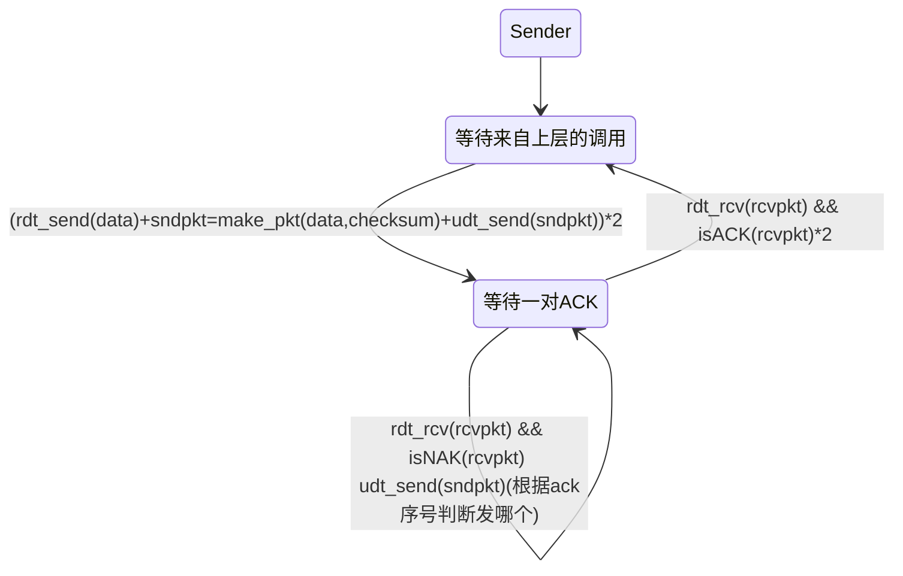
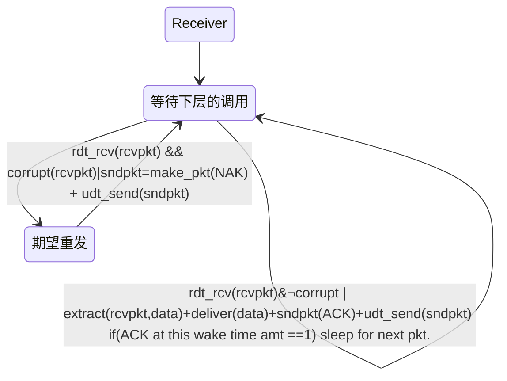
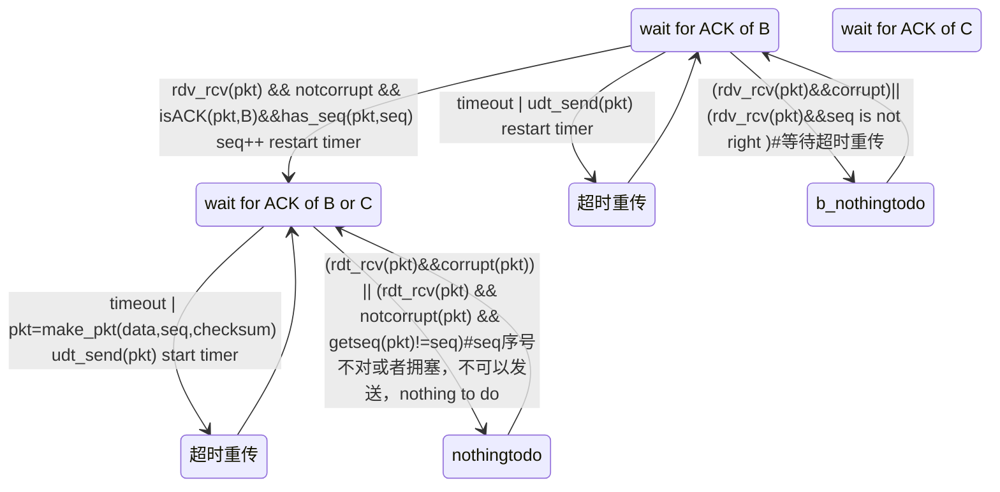
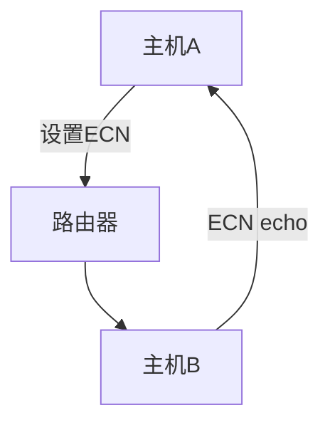

### R5
因为 TCP 维持报文的到达顺序，而 UDP 是乱序的，而图像和语音信息，如果乱序到达，会极大的影响通信的流畅体验感
TCP 保证数据正确性、不丢包、不重复、有序性

### R8
不是的，Web 服务器会为不同的 A，B，按照他们的四元组，分配不同的子 socket 来管理。这两个套接字的 dport 均为 80
### R10
检测丢包。定时器用来检测超过一定时间，发出的包没有收到对应 ack，则发生丢包
### R14（是非判断）
1. F(可以发送不含数据的 ack )
2. F
3. T (sender update snd_wnd by receiver' s rcv_wnd)
4. F(it depents the length of this data, following segments seq is m+len)
5. T
6. F(what?)
7. F(相对 ack？绝对 ack？)

### P1
基础知识：telnet 的默认端口为 23

| 题号  | 源端口号   | 目的端口号  |
| --- | ------ | ------ |
| a   | A 的端口号 | 23     |
| b   | B 的端口号 | 23     |
| c   | 23     | A 的端口号 |
| d   | 23     | B 的端口号 |

### P3 (反码计算 Checksum)
01010011
01100110
01110100
它们的 8bit 和为：
00101101
反码为
11010011
不适用其和，是因为这样检验检验和，只需要和 checksum 加在一起检测是否含有 0 比特位，对于计算机实现来说更快速。
1 位的不可能检测不出来，2 位的可能检测不出来。

### P6
假设发送方发来分组 0，接收方正确接收到该分组 0，并给发送方回传 ACK 作为确认，但该 ACK 抵达发送方前损坏，于是发送方重传分组 0，当接收方正确接收到该分组 0 时，接收方处于 wait 1 状态，于是给发送方回传 NAK。此时进入死锁，无论发送方是否正确接收到该 NAK，都会重传分组 0，无论接收方是否正确接收该分组 0，都会回传 NAK。
### P 14
//TODO：不太理解只用否定如何做到
如果只是偶尔发送数据，ack 会更好。因为这种情况下确认收到，发送 ack 的开销并不大（不需要频繁 ack），但是丢包发生的可能性仍然存在，用 nak 无法矫正丢包，且拥塞发生并不太可能，nak 失去其意义。

如果要发送大量的数据，且很少丢包，那么只用 NAK 会更好，因为不需要 ack 需要来避免丢包，分组 x 的丢失能被很快恢复。

### P18
假设我们要求一个 SR 协议，一次发出一对报文，并且只有在知道第一对报文中的两个报文都正确到达后才发送第二对报文。
假设该信道中可能丢失报文，但是不会发生损坏和失序，试为报文的单向可靠传输设计一个差错控制协议。画出发送方和接收方的 FSM 描述（有限状态机）

if packet loss happen, receiver will only reply one ack, then sender will receive less than 2 ack (because ack could be lost, too), then it will know the packet loss happen, and try to re-send. The receiver will wait for a while until it get 2 packet and reply 2 ack to sender.
### P19

wait_for ACK of C 与 B 完全类似，此处略去

### P20
//ToDO

### P22
考虑一个 GBN 协议，发送窗口为 4，序号范围为 1024。假设在时刻 t，接收方期待的下一个有序分组的序号是 k，假设媒介不会对报文重新排序：
a.t 时刻发送窗口内的报文序号
有两种情况：一种极端：之前的所有报文都被正确确认，所以窗口序号为 $[k,k+4-1]$
另一种极端：刚刚发送完，下一个发送 $k$
$[k-4,k-1]$
所以报文序号可能是 $[k-4,k+3]$,但是长度不超过 4
b.
$[k-4,k-1]$

### P23
![[p23.png]]
为了防止重传序号和正常发送序号的冲突问题(p147, 图 3-27)，分组序号应该 cover snd_wnd 和 rcv_wnd 的所有范围。也就是：
$$
\text{Range of seq number}\geq (k+N-1 -(k-N))=2N-1
$$
所以发送方窗口 $N$ 至少为 seq 长度的一半

### P26
a. TCP 序号字段为 4 字节，也就是 $2^{4\times 8}-1$ 大小，所以该文件最大为 $2^{32}-1$ bits
b. 
TCP 报文段个数：
`(2^32 - 1) / MSS(536) = 8012999`
因此，由于首部字段增加的总长度为 `8012999 x 66 = 528857934`
因此总共发送的字节长度为 `2^32 - 1 + 528857934 = 4823825229`
所以传输时延为 `T_trans = 4823825229 x 8 / (155 x 10^6) = 248 s`

 ### P27
  
a.
seq：207 sport: 302 dport:80
b. 
ack: 207 sport: 80 dport: 302
c.
ack:127 sport: 80 dport: 302
d.
![[Pasted image 20250407100925.png]]

### P32
a. 表示 `EstimateRTT`
$$
\begin{align}
\text{Estimate RTT}_{1} & =\text{SampleRT}_{T_{4}}\text{（之后称S4）}\\
\text{Estimate RTT}_{2} & =(1-\alpha)S_{4}+\alpha S_{3} \\   
\text{Estimate RTT}_{3} & =(1-\alpha)^{2}S_{4}+\alpha(1-\alpha)S_{3}+\alpha S_{2}\\ 
\text{Estimate RTT}_{4} & =(1-\alpha)^{3}S_{4}+\alpha(1-\alpha)^{2}S_{3}+\alpha(1-\alpha)S_{2}+\alpha S_{1}
\end{align}
$$

b.
$$
\text{Estimate RTT}_{n}=(1-\alpha)^{n-1}S_{n}+\alpha\sum_{i=1}^{n-1}(1-\alpha)^{i-1}S_{i}
$$
c.
令 n 趋于无穷
$$
\lim_{ n \to \infty } \text{Estimate RTT}_{n}=\alpha\sum_{i=1}^{n-1}(1-\alpha)^{i-1}S_{i}
$$
他由一个类似指数加和的形式构成，但是 $S_{i}$ 是移动的。

### P36
我认为这是很好的设计。如果收到一个就进行重传，会浪费大量的资源。因为很有可能只是因为传输速度等小问题对方没有及时收到，如果立刻重传就会导致信道拥堵。
而且，收到三个冗余 ack，说明丢包之后的至少有两个正常收到了，这时候再传输能提高效率：没有卡在重传很久。

### P37
比较 GBN、SR 和 TCP（无延时的 ACK）。假设对所有 3 个协议的超时值足够长，使得 5 个连续的数据报文段及其对应的 ACK 能够分别由接收主机（主机 B）和发送主机（主机 A）收到（如果在信道中无丢失）。假设主机 A 向主机 B 发送 5 个数据报文段，并且第二个报文段（从 A 发送）丢失。最后，所有 5 个数据报文段已经被主机 B 正确接收。

 a. 主机 A 总共发送了多少报文段和主机 B 总共发送了多少 ACK？它们的序号是什么？对所有 3 个协议回答这个问题。
b. 如果对所有 3 个协议超时值比 5 RTT 长得多，则哪个协议在最短的时间间隔中成功地交付所有 5 个数据报文段？

a.
- GBN
对于 GBN，其会重传异常之后的所有报文。
所以 A 发送 1+4+4=9 个 segments
B 正常接受 1，ack 1
回复 3, 4, 5, ack 3, 4, 5
重传的 2, 3, 4, 5，ack 2, 3, 4, 5
总共 9 segments ; 8 ack
- SR
第二个报文丢失后，接收方缓存 3, 4, 5，回传的 ACK 序号分别为 1 3 4 5，第一轮 4 个 ACK。
第二轮发送方重传 2，接收方回传的 ACK 为 2，第二轮 1 个 ACK

总共 6 segments 5 ack
- TCP
第二个 segment 丢失后，接收方缓存 3, 4, 5，ack: 2, 2, 2, 2
3 个冗余 ack，进入重传，发送方重传 2
接收方处理排序后，回复 ack6 表示已完成整理。
总共 6 segments  5 ack

b.
TCP 最快。因为 TCP 没有“傻傻”的等待 2 的正确传输，而是先缓存处理后面的，再冗余 ack 后快速进入重传。

### P40
a. 
TCP 慢启动的时间间隔
由于慢启动过程中，`cwnd` 指数增长，所以是 0-6, 23-26 
b. TCP 拥塞避免时拥塞窗口线性增长，因此 6-16、17-22

c. 冗余 ack. 因为窗口没有变为 1 

d. 超时. 因为窗口变为 1

e. 32。因为 cwnd 达到 32 之后开始线性增长

f.
在 18 个传输轮回中，发生轻微丢包（冗余 ack）ssthresh 的值被设置为拥塞窗口的一半，`ssthresh=42/2=21`

g.
在第 24 个传输轮回里，同理，`ssthresh=28/2=14`

h.
在第 7 个传输轮回中发送第 70 个报文。

i.
cwnd和 ssthresh 的值应当分别为：`cwnd = ssthresh + 3 x MSS = 7 MSS` `ssthresh = 8 / 2 = 4 MSS`

j.
TCP Tahoe 没有快速重传，因此接收到 3 个冗余 ACK 的做法也是 ssthresh 变为拥塞窗口的一半，即 21，拥塞窗口变为 1 MSS

k. 使用 TCP Tahoe 在 22th 传输轮回有一个超时事件，发送分组？

如果使用 TCP Tahoe，发生冗余 ack 就认为网络拥塞，所以设定 ssthresh 为 21，同时 cwnd 设置为 1，进入慢启动（指数增长）
所以
17-1
18-2
19-4
20-8 
21-16
22-21（不能超过阈值 ssthresh), 超过 ssthresh 将进入拥塞控制阶段
所以总计
`1+2+4+8+16+21=52` ，52 个报文 

### P 41
所得 AIAD 算法将不收敛于一个平等共享算法。

在这种情况下，如果某个路由器发生了拥塞，则拥塞信息会传达给 B，但是由于我们设计的是常量减小窗口，所以当 B 将 ECN 信息传达给 A 时，A 的窗口可能减小的很小(在 A 窗口很大的时候)，这时候，A 仍然可能会占用大量带宽，从而导致拥塞控制效率低下，对于 A 的 peer 而言是不公平的。

### P45
 Reno 和 Cubic 面对拥塞发生如何决策？`MSS` 在这里和 `W` 的关系是？
试着做：
下一个拥塞丢包阿生时候，发送速率下降为 0.75 W_max.
- 第一轮
	- 对于 TCP Reno: Reno 感受到发生拥塞，窗口变为 `0.5 W_max` 发送速率不超过窗口，也变为 `0.5 W_max`
	- 对于 TCP CUBIC:  发生拥塞，响应和 Reno 一样，窗口变为 `0.5 W_max` 发送速率不超过窗口，也变为 `0.5 W_max`
- 第二轮 
	- 对于 TCP Reno：Reno 加性增. 窗口变为 `W/2 +3MSS`, 如果没有超过最大传输速率 `0.75 W_max`，则避免了拥塞，以速率 `0.5W_max +MSS` 发送。如果超过了，就进一步试探.
	- 对于 TCP CUBIC：通过指数增长快速试探，窗口变为 `0.75W_max`,速率变为 `0.75 W_max`
### P46
- 第一轮
	- TCP Reno: 拥塞之后窗口变为 `0.5 W_max` 发送速率也是 `0.5 W_max`
	- 对于 TCP CUBIC:  发生拥塞，响应和 Reno 一样，窗口变为 `0.5 W_max` 发送速率不超过窗口，也变为 `0.5 W_max`
- 第二轮 
	- TCP Reno： Reno 加性增，窗口变为 `W/2 +3MSS`, 如果没有超过最大传输速率 `1.5 W_max`，则避免了拥塞，以速率 `0.5W_max +MSS` 发送。如果超过了，就进一步试探.
	- TCP CUBIC：快速试探，窗口变为 `1.5W_max` 发送速率变为 `1.5W_max`

### P50
...可以采取更激进的拥塞窗口增长算法。（不是很会做）
### P52
a.加性增：
1000ms 后，`C1` 增长了 `1000ms/50ms =20` `C2` 增长了 `1000ms/100ms=10`，拥塞窗口长度是 `30` 和 `20`. 
b.
不会。C1 会先增长超过带宽，然后链路发生丢包，C1 和 C2 会同时进入拥塞控制阶段。但是 C1 和 C2 得 RTT 不同，导致其单位 RTT 增长窗口速率相同情况下，C1 总会更快的增长窗口占有带宽，这并不公平。
### P54
考虑修改 TCP 的拥塞算法。使用乘性增。无论何时某TCP收到一个合法的ACK就将其窗口长度增加一个小正数 $\alpha$ 求出丢包率 L 和最大拥塞窗口 W 之间的函数关系。论证：对于这种修正的 TCP，无论平均吞吐量如何，一条 TCP 连接将其拥塞窗口长度从 $W/2$ 增加到 $W$ 所需要的时间相同

论证：
这个拥塞算法只靠 ack 来控制拥塞. 也就是发生丢包，实际上窗口保持不变，并等待可以继续发送。

单独考虑一次传输
$$
\text{cwnd}=\begin{cases}
\text{cwnd}+\alpha,\text{ if not packet loss} \\
 
\end{cases}
$$
所以任意一次发送操作，有 $1-L$ 概率使得窗口增加 $\alpha$  
所以发送 $n$ 个包，相当于进行 $n$ 次伯努利试验，服从伯努利分布.
窗口大小为
$$
W_{max}(\text{sending $n$ packet})=\alpha(1-L)n
$$

拥塞窗口只有在成功 ack 之后增加，平均吞吐量与其无关（平均吞吐量只量度数据传输的多少，其最多能传 $W_{max}$ 那么多，但是这与 ack 的个数无关。
$$
增加的时间=\frac{ W}{2\alpha}​
$$
所以总是需要相同的时间。