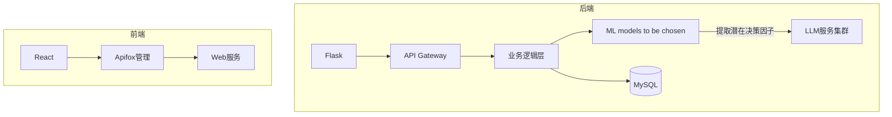

# 需求文档

## 目录
1. [文档概述]( #1-文档概述 )  
   - [目的和对象]( #11-目的和对象 )  
   - [组织结构](#12-组织结构)  
   - [术语定义](#13-术语定义)  
   - [参考文献](#14-参考文献)  

2. [软件系统的一般性描述](#2-软件系统的一般性描述)  
   - [软件系统概述](#21-软件系统概述)  
   - [软件系统的边界和范围](#22-软件系统的边界和范围)  
   - [软件系统的用户特征](#23-软件系统的用户特征)  
   - [假设和依赖](#24-假设和依赖)  

3. [需求分析](#3-需求分析)  
   - [功能性需求](#31-功能性需求)  
   - [软件质量要求](#32-软件质量要求)  
   - [设计约束](#33-设计约束)  
   - [影响分析](#34-影响分析)  

## 1 文档概述
### 1.1 目的和对象
#### **编写目的**
1. 定义智能投顾平台的核心需求，作为开发团队和用户之间的共识基础；
2. 提供系统功能、性能以及技术实现方案，指导开发和测试；
3. 作为项目验收和后续迭代的依据。

### 1.2 组织结构
涵盖智能投顾平台的数据处理流程、用户交互设计以及进阶的技术实现。

### 1.3 术语定义

| 术语/缩写                                          | 解释                                                                                                                                                                                                                                                                                                    |
| ---------------------------------------------- | ----------------------------------------------------------------------------------------------------------------------------------------------------------------------------------------------------------------------------------------------------------------------------------------------------- |
| LLM                                            | 大语言模型（Large Language Model）                                                                                                                                                                                                                                                                           |
| 多源异构数据                                         | <font style="color:rgb(17, 17, 17);">多源异构数据是指来自不同来源、格式和结构的数据。如多模态数据就属于异构数据。</font>                                                                                                                                                                                                                    |
| <font style="color:#000000;">大语言模型的提示学习</font> | <font style="color:rgb(77, 77, 77);">指的是通过设计或自动生成 prompt，以引导预训练的 LLM (如 GPT-4) 完成特定任务 (如分类、推理、生成)</font><br/>**<font style="color:#C75C00;">具体怎么应用在决策中？</font>**<font style="color:rgb(77, 77, 77);">   </font><font style="color:rgb(77, 77, 77);">——可以把决策问题转化为自然语言描述 (例如："基于用户风险偏好为中等，推荐资产配置方案: __")</font> |
| 符号化因子挖掘                                        | <font style="color:rgb(77, 77, 77);">从数据中提取可解释的符号化规则或关键因子 (如"市盈率<10"或"用户年龄>35")，以便于大模型分析   </font>**<font style="color:#C75C00;">具体怎么应用在决策中？</font>**<font style="color:rgb(77, 77, 77);">   </font><font style="color:rgb(77, 77, 77);">——从历史交易数据中挖掘影响收益的符号化规则</font>                                 |
| GBDT                                           | <font style="color:rgb(77, 77, 77);">Gradient Boosting Decision Tree，全名叫梯度提升决策树，是一种迭代的决策树算法。它通过构造一组弱的学习器（树），并把多棵决策树的结果累加起来作为最终的预测输出。</font>                                                                                                                                                           |
| 逻辑回归                                           | <font style="color:rgb(77, 77, 77);">逻辑回归是一种广义的线性回归分析模型，属于机器学习中的监督学习，主要是用来解决二分类（或多分类问题）。</font>                                                                                                                                                                                                       |
| LSTM 时序预测                                       | <font style="color:rgb(77, 77, 77);">全称为</font><font style="color:rgb(17, 17, 17);">Long Short-Term Memory，中文名为长短期记忆网络，是一种特殊的循环神经网络（RNN）, 非常适合于处理和预测时间序列中的间隔和延迟较长的重要事件。</font>                                                                                                                         |
|                                                |                                                                                                                                                                                                                                                                                                       |


### 1.4 参考文献
1. tiangang2024. (2024). 高频风险因子挖掘：当深度学习遇上量化交易——因子挖掘. CSDN 博客. https://blog.csdn.net/tiangang2024/article/details/145146442  
2. 知乎专栏. (2021). Toad：基于 Python 的标准化评分卡模型. 知乎. https://zhuanlan.zhihu.com/p/394994519  
3. 知乎专栏. (2021). 零基础一文读懂树模型：从决策树到 LightGBM. 知乎. https://zhuanlan.zhihu.com/p/399549773  
4. 搜狐. (2024). 量化交易相关文章. 搜狐网. https://www.sohu.com/a/847884896_121798711  


## 2 软件系统的一般性描述
###  2.1 软件系统概述
智能投顾系统（SIAP, Smart Investment Advisory Platform）是一款基于人工智能和大数据分析的智能投资顾问平台。系统旨在为用户提供个性化投资策略、风险评估、资产管理以及数据分析等服务，以提升投资决策的科学性和精准度。通过整合用户画像、金融市场数据、风险管理模型及可视化界面，系统能够提供实时投资建议和市场趋势分析。


### 2.2 软件系统的边界和范围
SIAP 系统的主要功能包括用户管理、投资策略优化、数据处理与分析、以及用户界面交互。系统涉及的数据来源包括用户输入的个人投资偏好、市场行情数据、历史交易记录等，并通过机器学习和大数据分析进行计算和优化。

系统主要适用于个人投资者、金融机构、财富管理顾问等用户群体，支持 Web 端。主要交互方式包括用户填写风险承受能力评估、查看投资组合建议、分析市场数据及调整资产配置。

### 2.3 软件系统的用户特征
1. **普通投资者**：无专业金融背景，希望获取基于个性化风险评估的投资建议。
2. **高级投资者**：具备一定的金融投资知识，希望通过系统辅助决策，优化投资组合。
3. **金融机构/财富管理顾问**：利用系统分析客户投资偏好，提供专业的投资建议。
4. **研究人员/开发者**：关注金融科技和智能投顾模型，希望研究系统的算法和数据分析方法。

### 2.4 假设和依赖
1. 假设用户能够正确输入个人信息和投资偏好，以提高个性化建议的准确性。
2. 依赖高质量的市场数据来源，如证券交易所、金融数据提供商，以确保投资分析的可靠性。
3. 假设用户能够接受系统提供的投资建议，并理解投资风险。
4. 系统依赖云计算和大数据处理技术，以提供实时投资分析与计算能力。


## 3 需求分析
---


功能性需求编号规则：
`SIAP-模块缩写-序号` (SIAP,**S**mart **I**nvestment **A**dvisory **P**latform, 智能投顾系统)（示例： SIAP-DT-001 ，DT 代表“数据处理模块”）。
本系统模块分为：

| 模块名称 | 缩写  |
| ---- | --- |
| 数据处理 | DT  |
| 界面交互 | UI  |
| 隐私处理 | PR  |
| 用户管理 | UM  |

系统架构和数据流

---


### 3.1 功能性需求
---
#### 模块 UM - 用户管理模块

| 功能性需求编号     | 需求说明   | 功能描述                                       |
| ----------- | ------ | ------------------------------------------ |
| SIAP-UM-001 | 用户信息维护 | 实现用户注册登录系统，即维护用户数据库的增、删、改、查。               |


#### 模块 PR - 数据隐私与处理模块

| 功能性需求编号     | 需求说明 | 功能描述                             |     |
| ----------- | ---- | -------------------------------- | --- |
| SIAP-PR-001 | 用户画像 | 设计并引导用户填写风险承受能力测试，评估投资偏好，划分风险等级。 |     |


#### 模块 DT - 数据处理

| 功能性需求编号     | 需求说明    | 功能描述                                            |
| ----------- | ------- | ----------------------------------------------- |
| SIAP-DT-001 | 一体化数据分析 | 基于大语言模型提示学习和符号化因子挖掘的智能决策研究，生成投资建议               |
| SIAP-DT-002 | 模型服务    | 基于异构数据学习的金融风控算法，生成适合大模型训练的数据。                   |
| SIAP-DT-003 | 个性化投资策略 | 大模型返回资产的组合管理与优化配置建议数据，本模块将其生成可读性良好的报告或具体的产品推送信息 |

#### 模块 UI - 用户界面

| 功能性需求编号     | 需求说明 | 功能描述                  |
| ----------- | ---- | --------------------- |
| SIAP-UI-001 | 主页设计 | 提供简洁、直观的主页界面，展示核心功能入口 |
| SIAP-UI-002 | 仪表盘  | 以图表方式展示用户投资情况、收益曲线等信息 |
| SIAP-UI-003 | 交互优化 | 采用响应式布局，提升用户体验        |

#### 3.1.1 用户信息维护
##### 用户注册
+ 用户填写用户名、邮箱/手机、密码。
+ 后端将用户注册信息保存至数据库。
+ 发送通知确认用户注册成功。

##### 用户登录
+ 用户输入用户名和密码。
+ 后端查询数据库，匹配用户名与密码。
+ 匹配成功，进入系统；匹配失败，提示用户名或密码错误。

##### 持久化存储
+ 采用数据库存储用户信息。
+ 保障数据安全性，支持数据备份与恢复。
+ 便于后续提供个性化投资建议和资产配置。


#### 3.1.2 用户画像
##### 风险评估
设计风险承受能力问卷，包含基本信息、投资目标、风险态度等。再根据问卷的作答情况，为每个用户划分风险承受等级：保守型（低风险）、稳健性（较低风险）、平衡型（中等风险）、成长型（较高风险）、进取型（高风险）。

##### 基本信息
+ 年龄范围（如 18-25, 26-35, 36-45, 46-60, 60+）
+ 年收入水平（如低于 10 万, 10-30 万, 30-50 万, 50 万以上）
+ 投资经验（如无经验, 1-3 年, 3-5 年, 5 年以上）

##### 投资目标
+ 短期收益（1 年内的高回报）
+ 长期增值（5 年以上的财富增长）
+ 资产保值（主要是抗通胀）
+ 退休规划

##### 风险态度
+ 用户在面临投资亏损时的决策
+ 愿意承受多大投资亏损
+ 计划投资时间


#### 3.1.3 投资策略
##### 3.1.3.1 相关功能列示
###### ① 个性化投资建议和资产配置：
+ 结合用户风险偏好及资产组合，利用机器学习等算法生成个性化投资建议。
+ 提供多种投资策略选项，满足不同用户需求。
+ 持续跟踪市场情况，优化投资建议。
+ **亮点：** 使用机器学习算法对异构数据进行清洗和预处理，使用大语言模型（如 `deepseek-V1, GPT-4`）进行处理，<font style="background-color:#FBDE28;">引入基于大语言模型提示学习和符号化因子挖掘的智能决策研究技术</font>，以生成个性化的投资建议和产品推广信息。

###### ② 资产组合管理：
+ 提供投资组合调整功能，用户可自行调整持仓。
+ 直观展示用户当前持仓情况。
+ 允许用户随时进行资产组合管理。

###### ③ 绩效评估：
对投资组合的表现进行分析和评估，帮助投资者了解自己的投资回报和风险。

##### 3.1.3.2 关于如何引入"基于大语言模型提示学习和符号化因子挖掘的智能决策研究技术"的进一步阐述

因为一般的智能投顾平台通常已经涉及自动化投资建议、资产配置、风险评估等功能，所以需要思考的是怎么利用"大语言模型提示学习"和"符号化因子挖掘"这两个方向来提升上述环节。

###### 智能投顾平台的整体架构设计
可以设计一个分层的模块化系统，从上到下依次是：

| 交互层 | 负责可解释性、可视化与用户反馈闭环 |
| --- | --- |
| 决策层 | 利用算法进行动态组合优化+风险控制 |
| **分析层** | • LLM 提示学习模块：事件驱动因子生成<br/>• 符号化因子挖掘模块：逻辑规则与统计验证 |
| 数据层 | 多源异构数据整合 |


###### 核心功能模块设计思路
- step1. LLM 驱动的因子挖掘引擎
设计合适的 prompt，引导 LLM 利用其自然语言处理能力从文本中 (如财报、新闻等) 挖掘潜在投资因子。具体来说，步骤大致如下：

**1.1 数据准备：**(略)

**1.2 设计 prompt**：(给出基础示例 prompt 模板如下)
```
"
	作为资深股票分析师，请从以下文本中提取可能影响[行业]股票价格的三个因子： 
	文本：{input_text} 按JSON格式输出：
	{因子名称: 影响方向(+1/-1)}
"
```

---


**1.3 调用 LLM**：

使用设计好的 prompt 调用 LLM，获取模型的输出。输出格式可以是 JSON，例如：
```json
[   
	{"因子名称": "因子1", "影响方向": "+1"},   
	{"因子名称": "因子2", "影响方向": "-1"},   
	{"因子名称": "因子3", "影响方向": "+1"} 
]
```

---


**1.4 结果验证与优化：**

<font style="color:rgb(6, 6, 7);">对 LLM 输出的结果进行验证，确保其准确性和相关性。根据验证结果调整 prompt 或模型参数，优化因子挖掘的效果。</font>

- step2. 符号化规则生成器
将 LLM 输出的因子转化为可执行的符号规则 (即 if-then 规则)，并与传统的量化因子 (如 PE、市场波动率) 等相融合。大致流程设计如下：

**2.1 因子转换：**

<font style="color:rgb(6, 6, 7);">将 LLM 输出的因子转换为符号化规则（这个过程可能需要一些自然语言处理技术，将文本描述的因子转化为具体的规则）。例如，如果 LLM 输出“因子 1”对股票价格有正向影响，可以转换为：</font>`IF 因子1 THEN 买入`

**2.2 规则融合：**

将符号化规则与传统的量化因子 (如市盈率等) 相融合。比如可以通过加权平均等方式将不同来源的因子整合到同一个决策模型中。

**2.3 规则验证与优化：**

可以通过回测历史数据、模拟交易等方式，验证所生成规则的效果，然后根据验证结果对规则进行优化，调整规则的参数或逻辑，最终确保其在实际投资决策中的有效性。

- step3. 决策执行器
结合符号化规则与传统量化模型 (如 Black-Litterman 模型) 生成最终的投资建议。

#### 3.1.4 基于异构数据学习的金融风控算法研究
##### 3.1.4.1 多源异构数据整合
+ **数据采集和处理:**
    - 平台从多个数据源获得不同投资方式（股票、基金、债券等）的市场数据，并进行处理分析，使用户可以直观看到所持投资组合的走势和概况
    - **亮点：** 通过<font style="background-color:#FBDE28;">基于异构数据学习的金融风控算法研究技术</font>，包括结构化数据（如财务数据：股票价格、收益率、波动率、交易量等市场指标的表格数据）和一些简单的非结构化数据（如半结构化的 json 文件），在进行数据清洗、特征提取后交给**大模型（如 `deepseek`）来进行进一步学习，提供更好的投资建议和产品推广信息。
+ **数据预处理：**
    - 内置缺省值填充（如时间序列插值）、数据标准化（跨量纲指标归一化）和异常值检测（基于 3σ原则自动过滤）。
    - 元数据管理：需记录数据来源、采集时间、版本，支持数据血缘追溯，以保证数据来源真实性。
+ **数据可视化**:
    - 将获得的投资组合和市场数据，以可视化形式，直观地展示给用户。

##### 3.1.4.2 智能风控算法
+ **混合模型架构**
    - 传统模型：逻辑回归（快速风险评估）、GBDT（特征重要性排序）
    - 深度学习：LSTM 时序预测（未来 24 小时波动率预警）
    - 联邦学习：（跨机构数据隐私保护场景）
    - 注释：在需求分析阶段，我们尚未确定具体使用的模型，这里仅供参考。
+ **可解释性输出**
+ 生成风险报告：包括风险因子和应对建议

### 3.2 软件质量要求
### **安全性**
+ 采用加密技术保护用户数据，如简单的哈希存储密码。
+ 设立权限管理机制，防止未授权访问。


### **可扩展性**
+ 采用微服务架构或模块化设计，以便于未来功能扩展。
+ 支持多种投资数据源（基金、股票）的接入，以适应市场变化。

### **用户体验**
+ 设计简洁直观的用户界面，优化交互流程。
+ 提供实时数据更新，提高用户体验。

### 3.3 设计约束
1. **技术约束**
   - 系统采用 Web 架构，支持基本的数据交互。
   - 机器学习模型的实现可选，但系统需提供基础的投资组合优化功能。
   - 采用基本的数据存储方式，保障用户数据的可访问性。
   
2. **性能约束**
   - 平均响应时间应尽可能低，保证用户体验。
 
   
3. **兼容性约束**
   - 系统需支持主流浏览器（Chrome、Firefox）。
   - 支持 PC 端访问。
   
4. **法规合规性**
   - 遵守基本的数据隐私保护原则，如不存储敏感个人信息。
### 3.4 影响分析
#### 对用户体验的影响
#### 交互优化：
增加"风险溯源"按钮，点击能够查看决策依据（主要是大模型生成的理由）

#### 性能感知：
+ 复杂模型计算期间显示进度条，方便用户预估剩余时间


---
2025-04-02, revised by 杨惠文、欧阳慧婷、陈俊凯、朱晗

# 系统设计
## **1. 架构设计**

### 系统架构：

1. **前端**：基于 React 框架，提供用户界面，负责风险评估问卷、投资建议展示等交互功能。
2. **后端**：采用 Flask 作为 API 服务框架，提供接口支持用户管理、投资建议和数据处理。
3. **数据层**：使用 MySQL 存储用户数据和市场数据

### 数据流：


---

## **2. 系统功能模块设计**

### 核心功能模块：

#### 模块交互矩阵

|              |              |                           |                               |                                                               |
| ------------ | ------------ | ------------------------- | ----------------------------- | ------------------------------------------------------------- |
| **模块名称**     | **依赖模块**     | **数据接口**                  | **QPS（Queries Per Second）限制** | **接口功能说明**                                                    |
| 用户界面模块（UI）   | 用户管理模块（UM）   | /api/ui/dashboard         | 500                           | 获取用户的投资组合与收益曲线等数据，支持响应式布局的动态渲染                                |
|              | 数据处理模块（DT）   | /api/ui/recommendations   | 200                           | 接收个性化投资策略报告或产品推送数据                                            |
| 用户管理模块（UM）   | 数据隐私处理模块（PR） | /api/users                | 300                           | 用户信息维护，包括用户的注册（POST）、登录（POST）、信息修改（PUT）、查询（GET）、注销（DELETE）等操作 |
|              | 路由系统         | /api/auth                 | 100                           | 用户身份认证，依赖路由系统分配权限                                             |
| 数据隐私处理模块（PR） | 用户管理模块       | /api/privacy/risk-profile | 150                           | 设计用户风险承受能力测试，并存储用户风险承受能力测试结果，返回风险等级（POST/GET）                 |
|              | 敏感数据加密       | AES 加密中间件                  | 200                           | 对用户的敏感信息加密，诸如密码、身份证号、手机号码等信息                                  |
|              | 权限控制服务       | JWT 令牌验证中间件                | 200                           | 控制接口访问权限，例如尚未登录的用户不能访问投资组合、收益曲线等数据                            |
| 数据处理模块（DT）   | 数据隐私处理模块（PR） | /api/data/analysis        | 200                           | 接收清洗后的多源异构数据，基于大语言模型生成投资建议（POST）                              |
|              | AI 引擎         | /api/data/LLM             | 50                            | 调用大语言模型进行因子挖掘和金融风控算法训练（异步接口）                                  |
|              | WebSocket    | /ws/updates               | 300                           | 实时推送资产配置优化建议或分析进度（如文件分析中的 Web Worker 状态同步）                      |

#### 关键接口说明

1. **用户界面模块 (UI)**：

`- /api/ui/dashboard`

依赖用户管理模块（UM）获取用户基础信息，依赖数据处理模块（DT）获取投资数据。

返回格式：JSON（包含收益曲线、持仓分布等图表数据）

`- /api/ui/recommendations`

接收数据处理模块（DT）生成的策略报告，前端通过 Web Worker 解析后渲染为可读性内容

2. **用户管理模块（UM）:**

`- /api/users`

实现 RESTful 风格接口，支持用户注册（POST）、登录（POST）、信息修改（PUT）、查询（GET）、注销 （DELETE）。

数据字段：username、password（通过 AES 加密中间件加密）、risk_level（来自 PR 模块）等

3. **数据隐私处理模块（PR）：**

`- /api/privacy/risk-profile`

用户提交风险评估问卷后，调用此接口并划分风险等级（低 low-中 mid-高 high）

数据字段：user_id、questionnaire_data、risk_level。

4. **数据处理模块（DT）：**

`- /api/data/LLM`

异步接口，调用 AI 引擎进行模型训练，返回任务 id 供前端轮询进度

`- /ws/updates`

通过 WebSocket 实时推送分析结果（如文件分析完成通知）或策略更新。

### 2.1 前端功能模块

1. **用户界面模块 (UI)**：

	- 提供简洁的界面，展示核心功能入口。
	- 仪表盘设计，直观展示用户投资组合与收益曲线。


### 2.2 后端功能模块

#### 2.2.1 后端功能模块细化表

|                 |                        |                                                   |                                                     |
| --------------- | ---------------------- | ------------------------------------------------- | --------------------------------------------------- |
| **主模块**         | **子模块**                | **接口示例**                                          | **功能描述**                                            |
| **用户管理 (UM)**   | 用户信息维护                 | POST/api/auth/register<br><br>POST/api/auth/login | 实现用户注册登录系统，即维护用户数据库的增、删、改、查。                        |
| **数据隐私管理 (PR)** | 用户画像                   | POST/api/privacy/risk-profile                     | 设计并引导用户填写风险承受能力测试 (年龄/收入/投资目标)，评估投资偏好，划分风险等级 (低/中/高)。 |
| 敏感数据加密          | AES 加密中间件               | 对用户密码、身份证号、手机号等字段进行加密存储                           |                                                     |
| 权限控制服务          | JWT 令牌验证中间件             | 控制接口访问权限 (如未登录用户禁止访问投资建议)                          |                                                     |
| 基金数据清洗          | POST/api/data/funds    | 处理基金净值数据                                          |                                                     |
| 一体化数据分析         | POST/api/data/analysis | 基于大语言模型提示学习和符号化因子挖掘的智能决策研究，生成投资建议                 |                                                     |
| 模型服务            | POST/api/dataLLM       | 基于异构数据学习的金融风控算法，生成适合大模型训练的数据                      |                                                     |
| 个性化投资策略         | POST/api/data/report   | 大模型返回资产的组合管理与优化配置建议数据，本模块将其生成可读性良好的报告或具体的产品推送信息   |                                                     |
 ### 2.2.2 模块协作关系图


## **3. 界面设计**

### 页面功能设计

1. **主页**：

	- 提供各大功能入口
	- 投资组合推荐和动态优化展示
	- 提供「我的信息」页面入口

2. **风险评估页面**：

	- 引导用户完成问卷，记录年龄、收入、投资目标和风险态度。
	- 输出用户风险等级。

3. **投资建议页面**：

	- 基于数据分析生成投资建议
	- 借助 LLM 将投资建议转化为报告，呈现给用户

4. **仪表盘**：

	- 以图表形式展示市场趋势

5. **我的信息：**

	- 显示用户信息
	- 支持修改用户昵称等信息

---

## **4. 数据库设计**

### MySQL 集合规范

#### 用户表 (user) 

|                   |                                |           |
| ----------------- | ------------------------------ | --------- |
| **字段**            | **类型**                         | **说明**    |
| **user_id**       | INT AUTO_INCREMENT PRIMARY KEY | 用户 ID [主键] |
| **username**      | VARCHAR (255)                   | 用户名       |
| **email**         | VARCHAR (255)                   | 用户邮箱地址    |
| **password_hash** | VARCHAR (255)                   | 加密存储的密码   |
| **risk_level**    | INT                            | 用户风险等级    |

#### 市场数据表 (market_data) 

|   |   |   |
|---|---|---|
|**字段**|**类型**|**说明**|
|**data_id**|INT AUTO_INCREMENT PRIMARY KEY|主键|
|**symbol**|VARCHAR (10)|证券代码|
|**date**|DATE|日期|
|**price**|DECIMAL (10,2)|价格|

---

## **5. 核心算法设计**

### 1. **因子挖掘（Factor Mining）**

**目标**：从多源异构数据中提取对投资决策有影响的关键因子。

#### 1.1. **任务拆解：**

|   |   |   |
|---|---|---|
|子问题|数据处理|说明|
|文本语义分析|LLM 模型（如 GPT-4 / DeepSeek-V1）|强大的上下文理解能力，可从新闻/公告中抽取与投资相关的因子（如“市场波动性上升”、“监管收紧”等） 并将其表达为（+1，-1）类的符号化因子|
|Prompt 设计|人工设计 / 自动生成 prompt 模板|模型需要精心设计 prompt，引导其输出因子及影响方向（正/负）|

#### 1.2. Prompt 设计：

```
作为金融分析师，请从以下文本中提取影响资产价格的三个因子：
文本：{input_text}
输出：因子名称及其影响方向（+1/-1）。
```

- 输出：因子名称及其相关信息（如市盈率、市场情绪）。

#### 1.3. 技术实现：

- 提示学习：调用预训练的大语言模型（如 deepseek）。

### 2. 符号化规则（Symbolized Rules）

**目标：** 将原本复杂的数值关系或模型决策过程，转化为简单、清晰、具有明确逻辑的 if-then 形式规则，增强系统的可解释性、可追溯性与合规性。

#### 2.1. 任务拆解：

|      |                    |                                    |
| ---- | ------------------ | ---------------------------------- |
| 子问题  | 数据处理               | 说明                                 |
| 规则提取 | 基于 GBDT 或决策树模型提取决策路径 | 通过建模结构化历史数据，学习特征与投资收益之间的关联，提取出明确条件 |
| 规则转化 | 将决策路径标准化为 if-then 格式 | 将模型内部隐含的路径条件，转化为符号化表达，供后续使用和展示     |


#### 2.2. 技术实现：

- **基础模型选择**

	- 使用**GBDT（Gradient Boosting Decision Tree**或**单棵决策树（CART**对历史数据建模。
	- 输入特征包括财务指标与用户画像（风险偏好、年龄段等）。
	- 输出标签为投资结果，如“收益率高于平均水平”、“波动率低”等。

#### 2.3. 规则提取过程

- 训练完成后，从每棵决策树中**遍历所有叶子节点**，记录到达每个叶子的路径条件。
- 每一条路径对应一个**if-then 规则**，形式为：

```
IF (市盈率 < 12) AND (ROE > 15%) THEN 高收益
```

- 路径中的每一个节点条件都被保留，用作规则前提。

#### 2.4. 符号化标准输出

每条提取规则同一转化标准的 JSON 格式，示例如下：

```
{
  "rule_id": "RULE_001",
  "conditions": [
    {"feature": "市盈率", "operator": "<", "threshold": 12},
    {"feature": "ROE", "operator": ">", "threshold": 15}
  ],
  "prediction": "高收益",
  "confidence": 0.82
}
```

其中：

- `rule_id`：规则唯一编号
- `conditions`：满足该规则的条件集合
- `prediction`：规则推断的投资结果
- `confidence`：依据训练样本计算的规则置信度

### 3. 因子融合与决策生成（Factor Fusion and Decision Making）

目标：

将**不同来源**挖掘得到的各类因子进行有效融合，建立统一的因子池，综合评估各资产，输出个性化投资建议和决策支持。

#### 3.1. 任务拆解：

|          |                |                             |
| -------- | -------------- | --------------------------- |
| 子问题      | 数据处理           | 说明                          |
| 因子标准化    | 统一各因子的数据表示与方向性 | 将因子转化成统一格式，便于后续处理           |
| 因子重要性评估  | 计算每个因子的权重或得分   | 根据因子的历史表现、模型评估结果赋予不同权重      |
| 决策打分建模   | 综合各因子信息生成资产得分  | 使用简单模型或打分函数综合各因子得分，完成资产推荐排序 |


#### 3.2. 技术实现：

##### 3.2.1. 因子标准化处理

- 将所有提取到的因子整理成统一格式：

|   |   |   |   |   |
|---|---|---|---|---|
|因子名称|因子类型|来源|方向（+1/-1）|重要性得分（可选）|
|市盈率<12|符号化规则因子|结构化数据|+1|0.42|
|市场情绪上升|文本因子|LLM 抽取|+1|0.35|
|行业监管趋严|文本因子|LLM 抽取|-1|0.28|

- **统一因子描述方式**，确保在后续建模中可以直接读取。

#### 3.3. 因子重要性评估

- 依据 GBDT 特征重要性（Feature Importance）或者因子出现时，模型得分上升程度打分
- 最终得到每个因子的权重（importance score），用于决策时加权处理。

#### 3.4. 决策打分建模方法

**方法：简单线性加权打分（适合首版系统）**

- 定义每个资产的综合得分（Score）：

$$
\text{Score(asset)}=\sum_{i=1}^{N}(w_{i}\times I_{i})
$$
其中：

- $w_{i}$：第 $w_{i}$ 个因子的权重（importance）
- $I_{i}$：资产是否符合第  个因子，符合为 1，不符合为 0。即一个**指示变量**
- 按得分高低，对资产进行排序，推荐得分最高的资产组合给用户。

#### 3.5. 结果解释与输出

- 推荐列表中每个资产附带对应的推荐理由：

示例：

推荐资产 A：因为符合"市盈率低于 12"、"市场情绪指数上升"、"风险偏好匹配成长型"等因子，预计未来收益潜力较好。

- 推荐理由可以直接来源于因子触发记录，也可以调用大语言模型（如 DeepSeek）根据因子集合生成自然语言解释，提升用户体验。

## 小组成员

| 学号        | 姓名   |
| --------- | ---- |
| 231275036 | 朱晗   |
| 231275033 | 陈俊凯  |
| 231275019 | 欧阳慧婷 |
| 231275011 | 杨惠文  |


# 测试报告

## 1 引言

### 1.1 编写目的

本测试报告为 SIAP of Manbo（曼波智能投资顾问平台）的测试文档，旨在总结项目测试阶段的工作过程、方法与结果。报告评估系统是否满足项目需求，是否实现既定的功能目标（如个性化投资建议、资产配置、风险评估等），并从功能性、稳定性、用户体验等多个维度对软件质量进行全面分析。该报告为项目经理与管理者提供关键质量数据与问题反馈，亦为系统后续优化和版本迭代提供参考依据。

### 1.2 项目背景

曼波智能投资顾问平台（Smart Investment Advisory Platform，简称 SIAP）旨在借助大语言模型（LLM）、多源异构数据分析、符号化因子挖掘等前沿人工智能技术，为个人用户与机构提供科学化、个性化的投资策略。平台的建设目标包括：

- 建立基于用户画像的风险评估体系；
- 实现资产配置的智能化推荐；
- 引入提示学习机制，引导大语言模型理解与生成投资建议；
- 支持符号化因子挖掘，提高策略的可解释性与实用性。

系统主要面向个人投资者、财富管理顾问与研究人员，适用于需要量身定制投资组合和提升投资决策效率的多种场景。

### 1.3 系统简介
SIAP 系统采用模块化设计，整体架构分为前端交互层、后端逻辑层、数据分析与模型服务层。系统结构如下图所示：


**主要模块说明：**

- **用户管理模块（UM）**：负责用户注册、登录与信息查询与信息修改。
- **数据处理模块（DT）**：处理用户画像、历史数据与市场行情，提供因子提取与投资策略分析能力。
- **隐私处理模块（PR）**：进行风险承受能力评估，构建用户画像。
- **用户界面模块（UI）**：前端采用 React 构建，提供图表可视化、交互式仪表盘与策略结果展示。
- **模型服务与决策模块**：结合 决策树传统模型，以及 Deepseek-V1 大语言模型，生成可解释的个性化投资建议。

系统依赖 Flask 构建后端服务，结合 MySQL 数据库进行数据管理，并通过 API 网关对接前后端通信，实现功能完整、交互流畅的智能投顾服务平台。

### 1.4 参考资料


[CSDN：使用Selenium进行测试](https://blog.csdn.net/universsky2015/article/details/135780852#:~:text=%E6%9C%AC%E6%96%87%E8%AF%A6%E7%BB%86%E4%BB%8B%E7%BB%8D%E4%BA%86%E5%A6%82%E4%BD%95%E4%BD%BF%E7%94%A8SeleniumWebDriver%E8%BF%9B%E8%A1%8C%E5%AE%89%E5%85%A8%E6%B5%8B%E8%AF%95%EF%BC%8C%E5%8C%85%E6%8B%AC%E5%85%B6%E5%9C%A8%E8%83%8C%E6%99%AF%E3%80%81%E6%A0%B8%E5%BF%83%E6%A6%82%E5%BF%B5%E3%80%81%E6%93%8D%E4%BD%9C%E6%AD%A5%E9%AA%A4%E3%80%81%E6%95%B0%E5%AD%A6%E6%A8%A1%E5%9E%8B%E3%80%81%E6%9C%80%E4%BD%B3%E5%AE%9E%E8%B7%B5%E5%92%8C%E5%AE%9E%E9%99%85%E5%BA%94%E7%94%A8%E5%9C%BA%E6%99%AF%E4%B8%AD%E7%9A%84%E5%BA%94%E7%94%A8%EF%BC%8C%E5%90%8C%E6%97%B6%E6%8E%A2%E8%AE%A8%E4%BA%86%E6%9C%AA%E6%9D%A5%E5%8F%91%E5%B1%95%E8%B6%8B%E5%8A%BF%E5%92%8C%E6%8C%91%E6%88%98%EF%BC%8C%E4%BB%A5%E5%8F%8A%E7%9B%B8%E5%85%B3%E5%B7%A5%E5%85%B7%E5%92%8C%E5%B8%B8%E8%A7%81%E9%97%AE%E9%A2%98%E8%A7%A3%E7%AD%94%E3%80%82%20%E6%91%98%E8%A6%81%E7%94%9F%E6%88%90%E4%BA%8E%20C%E7%9F%A5%E9%81%93%20%EF%BC%8C%E7%94%B1%20DeepSeek-R1,%E6%BB%A1%E8%A1%80%E7%89%88%E6%94%AF%E6%8C%81%EF%BC%8C%20%E5%89%8D%E5%BE%80%E4%BD%93%E9%AA%8C%20%3E%20%E5%AE%89%E5%85%A8%E6%B5%8B%E8%AF%95%20%E6%98%AF%E8%BD%AF%E4%BB%B6%E5%BC%80%E5%8F%91%E8%BF%87%E7%A8%8B%E4%B8%AD%E7%9A%84%E4%B8%80%E4%B8%AA%E9%87%8D%E8%A6%81%E7%8E%AF%E8%8A%82%EF%BC%8C%E5%AE%83%E6%97%A8%E5%9C%A8%E5%8F%91%E7%8E%B0%E5%B9%B6%E4%BF%AE%E5%A4%8D%E6%BD%9C%E5%9C%A8%E7%9A%84%E5%AE%89%E5%85%A8%E6%BC%8F%E6%B4%9E%E3%80%82)

需求文档：[需求文档](https://www.yuque.com/u37222421/wb1qey/toqpe1gt282usnbc "需求文档")

系统设计说明书：[系统设计要求](https://www.yuque.com/u37222421/wb1qey/zn7qgrpofumqr4g0)

## 2 测试概要

### 2.1 测试环境与配置

由于条件限制，本Web软件部署在个人PC上。其中用jmeter对后端接口进行测试使用的是 [@青蛙呱呱呱](https://www.yuque.com/qingwaguaguagua-hnmqz)的PC。

#### jmeter测试人员的客户端配置

- **CPU**：  
    13th Gen Intel(R) Core(TM) i9-13900H @ 2.60 GHz
- **内存**：  
    16.0 GB（可用约15.6 GB），速度 4800 MHz
- **操作系统**：  
    Windows 11（64 位操作系统，基于 x64 的处理器）
- **显卡**：  
    6 GB 显存，已安装多个 GPU
- **浏览器**：  
    Microsoft Edge 版本 137.0.3296.62

**说明：** 为方便成员进行远程测试，ngrok映射公网IP为 [Link](https://93cd-2407-cdc0-b00a-0-103-188-234-1266.ngrok-free.app)

### 2.2 测试方法和工具

| **测试内容** | **测试方法** | **测试工具**        |
| -------- | -------- | --------------- |
| 功能       | 黑盒、手工、回归 | Apifox、Jmeter   |
| 可靠性      | 黑盒、手工、回归 | Selenium、Jmeter |
| 安全性      | 黑盒、手工、回归 | Selenium、Edge   |
| 效率       | 黑盒、手工、回归 | Jmeter、pytest   |


  

## 3 测试分析

### 3.1 功能测试

本次功能测试采用JMeter和pytest，围绕多个关键接口展开，涵盖用户信息管理、行情查询、登录认证、基金与投资报告查询等核心功能模块。测试指标包括请求成功率、响应时间、吞吐率、网络带宽占用及APDEX。

#### 一、总体测试表现

在基础功能模块测试中，系统表现优异，所有接口均达到100%的通过率，APDEX评分为 **1.000**，用户体验处于完全满意的状态（见下图1与图2）。其中，响应时间整体低于500ms，满足性能容忍阈值。


在pytest测试中，通过编写脚本 `./tests` 对项目五大模块进行功能性测试。

脚本示例`./tests/test_data_controller.py/test_factor_mining`

```
def test_factor_mining(client):
    # 模拟登录并获取 JWT token
    login_response = client.post('/user/login', json={
        "username": "admin",  # 使用管理员账号进行测试
        "password": "123456"  
    })
    assert login_response.status_code == 200, "登录失败，请检查用户名或密码是否正确"
    token = login_response.json['data']
    test_market_data = [
        {
            ...
        }
    ]
    # 测试 /factor 接口
    response = client.post(
        '/data/factor',
        json={
            "market_data": test_market_data  # 模拟传入的市场数据
        },
        headers={"Authorization": f"Bearer {token}"}
    )
    assert response.status_code == 200, "因子提取接口调用失败"
    assert "因子提取成功" in response.json.get('message', ''), "因子提取结果不正确"
```

通过调用`pytest-testreport`包生成测试报告，示例如下：


- 本次测试 **所有 9 个测试用例均通过**，未发现任何失败、错误或跳过的情况。
- 覆盖了用户模块、数据模块、产品模块、UI 接口模块、隐私风险评估模块的核心接口功能。
- 系统稳定性良好，接口返回状态码一致为 `200`，响应正确。
- 数据库配置、环境加载和请求日志均正常，无异常输出。


**总结：**

- 总用时：39.29 秒（与报告汇总信息一致）
- 平均每个用例执行时间：约 4.37 秒
- 最长用例：`test_factor_mining`（14.01 秒），属于数据分析类接口，处理逻辑较复杂，属于正常范围
- 次长用例：`test_advice`（9.78 秒），涉及基金推荐和预测逻辑，也属于计算密集型接口
- 其余用例：其余 7 个用例的执行时间均在 1 秒以内，响应快速、性能良好，接口调用基本无延迟

#### 二、异常情况分析

在扩展功能引入测试后（如投资报告查询、因子挖掘等接口），系统整体性能表现显著下降：

- 请求失败率提升至 **27.44%**；
- APDEX整体评分下降至 **0.596**，表示无法完全满足用户性能预期（见下图3与图4）；
- 个别接口（如 `因子挖掘`、`投资报告查询`）响应时间极高，**平均超过10秒**，最大响应时延接近 **20秒**，严重影响系统交互体验。
在成员用浏览器进行自主测试时，未发现明显问题。可能是 Jmeter 模拟压力测试超出个人 PC 负载。


#### 三、异常原因推测

初步分析，造成测试性能下降和请求失败的主要原因可能包括：

1. **AI逻辑或算法模块处理复杂**：因子挖掘与投资报告接口涉及到了实时数据处理、AI模型推理和大规模数据匹配等操作，处理延迟较高；
2. **高频爬虫干扰**：从日志中观察到多个高频请求触发接口，一方面引起系统短时间内负载升高，影响其他请求的正常处理；另一方面由于被请求网站反爬，导致与爬虫相关的功能错误率均显著上升。
3. **并发控制机制不足**：在高并发场景下，系统资源调度和线程池管理未做优化，从而造成响应堆积。

### 3.2 可靠性测试

使用Selenium对web应用的可用性进行测试，测试了登录功能、单股查询功能、多股查询功能的响应，考虑了如错误的账号密码、为空的搜索数据等样例，结果均为PASS。

同时，还通过Selenium测试了**超链接**能否正常访问（如首页的关于我们），都可以正常响应

  


### 3.3 安全性测试

1. 对于用户一些个人信息和敏感重要数据是否进行加密存储

	1. 经过检查，我们已经删除了测试阶段对用户信息打的log，同时借助jwt加密密钥token，达到了加密存储的目的。

2. 所有的操作是否有权限设置

	1. 我们对用户的绝大部分关键操作，都添加了鉴权设置，保证了操作权限安全性。经过Apifox测试，填写过期的鉴权头，或不填写，都不能正常完成响应。

3. 相关操作完成后，是否有完整的操作日志进行记录

	1. 我们的后端，进行了每次响应的接口和响应码，以及简单的操作日志记录。


  

### 3.4 效率测试


#### 1）基础功能的效率测试结果

根据对于项目基础功能的 JMeter 测试结果来看，本项目在当前压力下整体性能表现良好，接口平均响应时间大多在 100ms 到 600ms 之间，系统稳定性高，基本无错误请求，说明后端逻辑较为健壮。不过测试中也出现了少数接口响应延迟超过 1 秒的情况，提示可能存在数据库慢查询或部分请求处理不够高效的问题。此外，吞吐量在每分钟 300~500 请求左右，表现中等，说明在当前并发用户量下系统尚能稳定运行，但若目标是支持更高并发，还需要进一步优化。总体来看，该系统具备不错的响应能力和稳定性。

1、Response Times Over Time 图表用于查看**响应时间**随时间变化的趋势


2、Response Time Percentiles Over Time图表显示在脚本运行期间**成功的请求响应的响应时间的**分布图


3、Bytes Throughput Over Time用于衡量本次测试的**吞吐量**


4、Latencies Over Time用于表示**响应时延**随时间变化趋势图


5、Transactions Per Second表示**每秒事务数**，也是性能测试中一个很重要的指标


6、Response Time Percentiles用于表示**不同请求响应时间**的分布图


7、Time Vs Threads 表示**平均响应时间随线程数变化趋势**图


#### 2）拓展功能的效率测试结果

在引入进阶功能后，系统整体性能出现了一定程度的下降。从JMeter测试结果来看，平均响应时间有所上升，部分接口超过1秒，个别峰值甚至达到10秒以上，表明新增功能带来了更高的计算和数据访问压力。同时，吞吐量显著下滑，说明系统在处理相同并发量时的处理能力明显不足，尤其在高负载情况下更容易出现响应延迟。

造成这种性能差异的主要原因，一方面是AI模块通常涉及复杂的特征提取与模型推理过程，对CPU和内存的消耗显著高于传统接口；另一方面，高频爬虫功能持续向外部或本地数据源发起请求并进行数据写入操作，可能引发数据库IO压力或引入锁竞争，进而影响整体请求处理速度。此外，AI模型的冷启动时间和爬虫任务的调度间歇性也会对测试中的波动造成影响。

1、Response Times Over Time 图表用于查看**响应时间**随时间变化的趋势


2、Response Time Percentiles Over Time图表显示在脚本运行期间**成功的请求响应的响应时间的**分布图


3、Bytes Throughput Over Time用于衡量本次测试的**吞吐量**


4、Latencies Over Time用于表示**响应时延**随时间变化趋势图


5、Transactions Per Second表示**每秒事务数**，也是性能测试中一个很重要的指标


6、Response Time Percentiles用于表示**不同请求响应时间**的分布图


7、Time Vs Threads 表示**平均响应时间随线程数变化趋势**图


## 4 整体测试结果分析

### 4.1 测试总结分析

本次**性能测试**验证了系统在接入基础功能与进阶功能前后的响应能力、并发处理能力与稳定性。测试结果显示，系统在基础功能下具备良好的吞吐率与平均响应时间，整体性能表现稳定；而在进阶功能加入后，尽管功能层次提升显著，但由于AI模块引入了更高的计算负载，高频爬虫造成了额外的数据访问压力，导致部分接口响应时间延长，系统整体吞吐能力略有下降。测试环境与真实生产环境在硬件配置、网络资源上存在一定差异，因此真实部署中可能会进一步放大或缓解这些性能表现的波动。

### 4.2 测试缺陷和限制


**性能测试**中发现的主要性能瓶颈包括：

1. AI功能涉及模型推理，需大量CPU计算与内存开销，造成接口响应波动较大；
2. 高频爬虫组件在高并发下可能引发数据库IO拥堵，且容易被网站拒绝访问从而导致爬取失败；
3. 测试环境未完全模拟生产环境的实际访问频率与负载特征，可能低估了实际运行时的性能压力。

这些因素共同构成了当前测试结果的主要局限性，影响了系统性能表现的客观性和完整性。

### 4.3 建议

针对**性能测试**中发现的上述缺陷与限制，提出以下改进建议：

- 对**AI功能**的调用引入缓存机制或异步处理，降低实时推理带来的响应压力；
- 对**爬虫任务**进行限频、分布式调度或结果缓冲，避免集中访问造成后端瓶颈；
- 在**更贴近生产环境的配置中**进行补充测试，以获得更准确的性能基准。

### 4.4 交付结果

该软件的开发已基本达到预定目标。


## 5 测试人员

| 学号        | 姓名   |
| --------- | ---- |
| 231275036 | 朱晗   |
| 231275033 | 陈俊凯  |
| 231275011 | 杨惠文  |
| 231275019 | 欧阳慧婷 |
