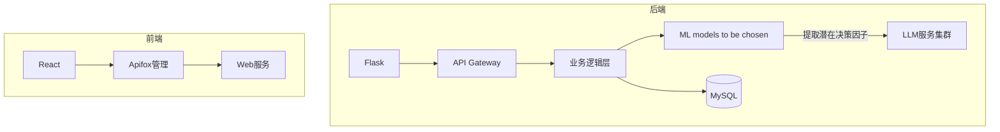

# 目录
1. [文档概述]( #1-文档概述 )  
   - [目的和对象]( #11-目的和对象 )  
   - [组织结构](#12-组织结构)  
   - [术语定义](#13-术语定义)  
   - [参考文献](#14-参考文献)  

2. [软件系统的一般性描述](#2-软件系统的一般性描述)  
   - [软件系统概述](#21-软件系统概述)  
   - [软件系统的边界和范围](#22-软件系统的边界和范围)  
   - [软件系统的用户特征](#23-软件系统的用户特征)  
   - [假设和依赖](#24-假设和依赖)  

3. [需求分析](#3-需求分析)  
   - [功能性需求](#31-功能性需求)  
   - [软件质量要求](#32-软件质量要求)  
   - [设计约束](#33-设计约束)  
   - [影响分析](#34-影响分析)  

# 1 文档概述
## 1.1 目的和对象
### **编写目的**
1. 定义智能投顾平台的核心需求，作为开发团队和用户之间的共识基础；
2. 提供系统功能、性能以及技术实现方案，指导开发和测试；
3. 作为项目验收和后续迭代的依据。

## 1.2 组织结构
涵盖智能投顾平台的数据处理流程、用户交互设计以及进阶的技术实现。

## 1.3 术语定义
| 术语/缩写                                          | 解释                                                                                                                                                                                                                                                                                                    |
| ---------------------------------------------- | ----------------------------------------------------------------------------------------------------------------------------------------------------------------------------------------------------------------------------------------------------------------------------------------------------- |
| LLM                                            | 大语言模型（Large Language Model）                                                                                                                                                                                                                                                                           |
| 多源异构数据                                         | <font style="color:rgb(17, 17, 17);">多源异构数据是指来自不同来源、格式和结构的数据。如多模态数据就属于异构数据。</font>                                                                                                                                                                                                                    |
| <font style="color:#000000;">大语言模型的提示学习</font> | <font style="color:rgb(77, 77, 77);">指的是通过设计或自动生成prompt，以引导预训练的LLM(如GPT-4)完成特定任务(如分类、推理、生成)</font><br/>**<font style="color:#C75C00;">具体怎么应用在决策中？</font>**<font style="color:rgb(77, 77, 77);">   </font><font style="color:rgb(77, 77, 77);">——可以把决策问题转化为自然语言描述(例如："基于用户风险偏好为中等，推荐资产配置方案:__")</font> |
| 符号化因子挖掘                                        | <font style="color:rgb(77, 77, 77);">从数据中提取可解释的符号化规则或关键因子(如"市盈率<10"或"用户年龄>35")，以便于大模型分析   </font>**<font style="color:#C75C00;">具体怎么应用在决策中？</font>**<font style="color:rgb(77, 77, 77);">   </font><font style="color:rgb(77, 77, 77);">——从历史交易数据中挖掘影响收益的符号化规则</font>                                 |
| GBDT                                           | <font style="color:rgb(77, 77, 77);">Gradient Boosting Decision Tree，全名叫梯度提升决策树，是一种迭代的决策树算法。它通过构造一组弱的学习器（树），并把多棵决策树的结果累加起来作为最终的预测输出。</font>                                                                                                                                                           |
| 逻辑回归                                           | <font style="color:rgb(77, 77, 77);">逻辑回归是一种广义的线性回归分析模型，属于机器学习中的监督学习，主要是用来解决二分类（或多分类问题）。</font>                                                                                                                                                                                                       |
| LSTM时序预测                                       | <font style="color:rgb(77, 77, 77);">全称为</font><font style="color:rgb(17, 17, 17);">Long Short-Term Memory，中文名为长短期记忆网络，是一种特殊的循环神经网络（RNN）,非常适合于处理和预测时间序列中的间隔和延迟较长的重要事件。</font>                                                                                                                         |
|                                                |                                                                                                                                                                                                                                                                                                       |


## 1.4 参考文献
1. tiangang2024. (2024). 高频风险因子挖掘：当深度学习遇上量化交易——因子挖掘. CSDN博客. https://blog.csdn.net/tiangang2024/article/details/145146442  
2. 知乎专栏. (2021). Toad：基于 Python 的标准化评分卡模型. 知乎. https://zhuanlan.zhihu.com/p/394994519  
3. 知乎专栏. (2021). 零基础一文读懂树模型：从决策树到LightGBM. 知乎. https://zhuanlan.zhihu.com/p/399549773  
4. 搜狐. (2024). 量化交易相关文章. 搜狐网. https://www.sohu.com/a/847884896_121798711  


# 2 软件系统的一般性描述
##  2.1 软件系统概述
智能投顾系统（SIAP, Smart Investment Advisory Platform）是一款基于人工智能和大数据分析的智能投资顾问平台。系统旨在为用户提供个性化投资策略、风险评估、资产管理以及数据分析等服务，以提升投资决策的科学性和精准度。通过整合用户画像、金融市场数据、风险管理模型及可视化界面，系统能够提供实时投资建议和市场趋势分析。


## 2.2 软件系统的边界和范围
SIAP 系统的主要功能包括用户管理、投资策略优化、数据处理与分析、以及用户界面交互。系统涉及的数据来源包括用户输入的个人投资偏好、市场行情数据、历史交易记录等，并通过机器学习和大数据分析进行计算和优化。

系统主要适用于个人投资者、金融机构、财富管理顾问等用户群体，支持 Web 端。主要交互方式包括用户填写风险承受能力评估、查看投资组合建议、分析市场数据及调整资产配置。

## 2.3 软件系统的用户特征
1. **普通投资者**：无专业金融背景，希望获取基于个性化风险评估的投资建议。
2. **高级投资者**：具备一定的金融投资知识，希望通过系统辅助决策，优化投资组合。
3. **金融机构/财富管理顾问**：利用系统分析客户投资偏好，提供专业的投资建议。
4. **研究人员/开发者**：关注金融科技和智能投顾模型，希望研究系统的算法和数据分析方法。

## 2.4 假设和依赖
1. 假设用户能够正确输入个人信息和投资偏好，以提高个性化建议的准确性。
2. 依赖高质量的市场数据来源，如证券交易所、金融数据提供商，以确保投资分析的可靠性。
3. 假设用户能够接受系统提供的投资建议，并理解投资风险。
4. 系统依赖云计算和大数据处理技术，以提供实时投资分析与计算能力。


# 3 需求分析
---


功能性需求编号规则：
`SIAP-模块缩写-序号` (SIAP,**S**mart **I**nvestment **A**dvisory **P**latform, 智能投顾系统)（示例： SIAP-DT-001 ，DT 代表“数据处理模块”）。
本系统模块分为：

| 模块名称 | 缩写  |
| ---- | --- |
| 数据处理 | DT  |
| 界面交互 | UI  |
| 隐私处理 | PR  |
| 用户管理 | UM  |

系统架构和数据流
---


## 3.1 功能性需求
---
### 模块 UM - 用户管理模块

| 功能性需求编号     | 需求说明   | 功能描述                                       |
| ----------- | ------ | ------------------------------------------ |
| SIAP-UM-001 | 用户信息维护 | 实现用户注册登录系统，即维护用户数据库的增、删、改、查。               |


### 模块 PR - 数据隐私与处理模块

| 功能性需求编号     | 需求说明 | 功能描述                             |     |
| ----------- | ---- | -------------------------------- | --- |
| SIAP-PR-001 | 用户画像 | 设计并引导用户填写风险承受能力测试，评估投资偏好，划分风险等级。 |     |


### 模块 DT - 数据处理

| 功能性需求编号     | 需求说明    | 功能描述                                            |
| ----------- | ------- | ----------------------------------------------- |
| SIAP-DT-001 | 一体化数据分析 | 基于大语言模型提示学习和符号化因子挖掘的智能决策研究，生成投资建议               |
| SIAP-DT-002 | 模型服务    | 基于异构数据学习的金融风控算法，生成适合大模型训练的数据。                   |
| SIAP-DT-003 | 个性化投资策略 | 大模型返回资产的组合管理与优化配置建议数据，本模块将其生成可读性良好的报告或具体的产品推送信息 |

### 模块 UI - 用户界面

| 功能性需求编号     | 需求说明 | 功能描述                  |
| ----------- | ---- | --------------------- |
| SIAP-UI-001 | 主页设计 | 提供简洁、直观的主页界面，展示核心功能入口 |
| SIAP-UI-002 | 仪表盘  | 以图表方式展示用户投资情况、收益曲线等信息 |
| SIAP-UI-003 | 交互优化 | 采用响应式布局，提升用户体验        |

### 3.1.1 用户信息维护
#### 用户注册
+ 用户填写用户名、邮箱/手机、密码。
+ 后端将用户注册信息保存至数据库。
+ 发送通知确认用户注册成功。

#### 用户登录
+ 用户输入用户名和密码。
+ 后端查询数据库，匹配用户名与密码。
+ 匹配成功，进入系统；匹配失败，提示用户名或密码错误。

#### 持久化存储
+ 采用数据库存储用户信息。
+ 保障数据安全性，支持数据备份与恢复。
+ 便于后续提供个性化投资建议和资产配置。


### 3.1.2 用户画像
#### 风险评估
设计风险承受能力问卷，包含基本信息、投资目标、风险态度等。再根据问卷的作答情况，为每个用户划分风险承受等级：保守型（低风险）、稳健性（较低风险）、平衡型（中等风险）、成长型（较高风险）、进取型（高风险）。

##### 基本信息
+ 年龄范围（如 18-25, 26-35, 36-45, 46-60, 60+）
+ 年收入水平（如 低于10万, 10-30万, 30-50万, 50万以上）
+ 投资经验（如 无经验, 1-3年, 3-5年, 5年以上）

##### 投资目标
+ 短期收益（1年内的高回报）
+ 长期增值（5年以上的财富增长）
+ 资产保值（主要是抗通胀）
+ 退休规划

##### 风险态度
+ 用户在面临投资亏损时的决策
+ 愿意承受多大投资亏损
+ 计划投资时间


### 3.1.3 投资策略
#### 3.1.3.1 相关功能列示
##### ① 个性化投资建议和资产配置：
+ 结合用户风险偏好及资产组合，利用机器学习等算法生成个性化投资建议。
+ 提供多种投资策略选项，满足不同用户需求。
+ 持续跟踪市场情况，优化投资建议。
+ **亮点：** 使用机器学习算法对异构数据进行清洗和预处理，使用大语言模型（如 `deepseek-V1, GPT-4`）进行处理，<font style="background-color:#FBDE28;">引入基于大语言模型提示学习和符号化因子挖掘的智能决策研究技术</font>，以生成个性化的投资建议和产品推广信息。

##### ② 资产组合管理：
+ 提供投资组合调整功能，用户可自行调整持仓。
+ 直观展示用户当前持仓情况。
+ 允许用户随时进行资产组合管理。

##### ③ 绩效评估：
对投资组合的表现进行分析和评估，帮助投资者了解自己的投资回报和风险。

#### 3.1.3.2 关于如何引入"基于大语言模型提示学习和符号化因子挖掘的智能决策研究技术"的进一步阐述
##### 引言
因为一般的智能投顾平台通常已经涉及自动化投资建议、资产配置、风险评估等功能，所以需要思考的是怎么利用"大语言模型提示学习"和"符号化因子挖掘"这两个方向来提升上述环节。

##### 智能投顾平台的整体架构设计
可以设计一个分层的模块化系统，从上到下依次是：

| 交互层 | 负责可解释性、可视化与用户反馈闭环 |
| --- | --- |
| 决策层 | 利用算法进行动态组合优化+风险控制 |
| **分析层** | • LLM提示学习模块：事件驱动因子生成<br/>• 符号化因子挖掘模块：逻辑规则与统计验证 |
| 数据层 | 多源异构数据整合 |


##### 核心功能模块设计思路
###### step1. LLM驱动的因子挖掘引擎
设计合适的prompt，引导LLM利用其自然语言处理能力从文本中(如财报、新闻等)挖掘潜在投资因子。具体来说，步骤大致如下：

**1.1 数据准备：**(略)

**1.2 设计prompt**：(给出基础示例prompt模板如下)
```
"
	作为资深股票分析师，请从以下文本中提取可能影响[行业]股票价格的三个因子： 
	文本：{input_text} 按JSON格式输出：
	{因子名称: 影响方向(+1/-1)}
"
```

---


**1.3 调用LLM**：

使用设计好的prompt调用LLM，获取模型的输出。输出格式可以是JSON，例如：
```json
[   
	{"因子名称": "因子1", "影响方向": "+1"},   
	{"因子名称": "因子2", "影响方向": "-1"},   
	{"因子名称": "因子3", "影响方向": "+1"} 
]
```

---


**1.4 结果验证与优化：**

<font style="color:rgb(6, 6, 7);">对LLM输出的结果进行验证，确保其准确性和相关性。根据验证结果调整prompt或模型参数，优化因子挖掘的效果。</font>

###### step2. 符号化规则生成器
将LLM输出的因子转化为可执行的符号规则(即if-then规则)，并与传统的量化因子(如PE、市场波动率)等相融合。大致流程设计如下：

**2.1 因子转换：**

<font style="color:rgb(6, 6, 7);">将LLM输出的因子转换为符号化规则（这个过程可能需要一些自然语言处理技术，将文本描述的因子转化为具体的规则）。例如，如果LLM输出“因子1”对股票价格有正向影响，可以转换为：</font>`IF 因子1 THEN 买入`

**2.2 规则融合：**

将符号化规则与传统的量化因子(如市盈率等)相融合。比如可以通过加权平均等方式将不同来源的因子整合到同一个决策模型中。

**2.3 规则验证与优化：**

可以通过回测历史数据、模拟交易等方式，验证所生成规则的效果，然后根据验证结果对规则进行优化，调整规则的参数或逻辑，最终确保其在实际投资决策中的有效性。

###### step3. 决策执行器
结合符号化规则与传统量化模型(如Black-Litterman模型)生成最终的投资建议。

### 3.1.4 基于异构数据学习的金融风控算法研究
#### 3.1.4.1多源异构数据整合
+ **数据采集和处理:**
    - 平台从多个数据源获得不同投资方式（股票、基金、债券等）的市场数据，并进行处理分析，使用户可以直观看到所持投资组合的走势和概况
    - **亮点：** 通过<font style="background-color:#FBDE28;">基于异构数据学习的金融风控算法研究技术</font>，包括结构化数据（如财务数据：股票价格、收益率、波动率、交易量等市场指标的表格数据）和一些简单的非结构化数据（如半结构化的json文件），在进行数据清洗、特征提取后交给**大模型（如 `deepseek`）来进行进一步学习，提供更好的投资建议和产品推广信息。
+ **数据预处理：**
    - 内置缺省值填充（如时间序列插值）、数据标准化（跨量纲指标归一化）和异常值检测（基于3σ原则自动过滤）。
    - 元数据管理：需记录数据来源、采集时间、版本，支持数据血缘追溯，以保证数据来源真实性。
+ **数据可视化**:
    - 将获得的投资组合和市场数据，以可视化形式，直观地展示给用户。

#### 3.1.4.2智能风控算法
+ **混合模型架构**
    - 传统模型：逻辑回归（快速风险评估）、GBDT（特征重要性排序）
    - 深度学习：LSTM时序预测（未来24小时波动率预警）
    - 联邦学习：（跨机构数据隐私保护场景）
    - 注释：在需求分析阶段，我们尚未确定具体使用的模型，这里仅供参考。
+ **可解释性输出**
+ 生成风险报告：包括风险因子和应对建议

## 3.2 软件质量要求
### **安全性**
+ 采用加密技术保护用户数据，如简单的哈希存储密码。
+ 设立权限管理机制，防止未授权访问。


### **可扩展性**
+ 采用微服务架构或模块化设计，以便于未来功能扩展。
+ 支持多种投资数据源（基金、股票）的接入，以适应市场变化。

### **用户体验**
+ 设计简洁直观的用户界面，优化交互流程。
+ 提供实时数据更新，提高用户体验。

## 3.3 设计约束
1. **技术约束**
   - 系统采用 Web 架构，支持基本的数据交互。
   - 机器学习模型的实现可选，但系统需提供基础的投资组合优化功能。
   - 采用基本的数据存储方式，保障用户数据的可访问性。
   
2. **性能约束**
   - 平均响应时间应尽可能低，保证用户体验。
 
   
3. **兼容性约束**
   - 系统需支持主流浏览器（Chrome、Firefox）。
   - 支持 PC 端访问。
   
4. **法规合规性**
   - 遵守基本的数据隐私保护原则，如不存储敏感个人信息。
## 3.4 影响分析
### 对用户体验的影响
#### 交互优化：
增加"风险溯源"按钮，点击能够查看决策依据（主要是大模型生成的理由）

#### 性能感知：
+ 复杂模型计算期间显示进度条，方便用户预估剩余时间


---
2025-04-02, revised by 杨惠文、欧阳慧婷、陈俊凯、朱晗
