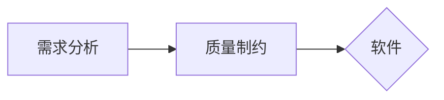

## 软件工程概述
### 基本概念
#### 软件

- **软件包含：程序、数据、文档**
    - **程序=数据结构+算法**
$$
\text{Program=Data Structure + Algorithm}
$$

- **软件=程序+软件构建**（程序+文档+数据）
- **软件公司=软件+商业模式**
- 软件工程的问题：
    - 开发维护成本高，花费时间长
    - 开发中不能排除所有错误
- 发展：程序-软件-软件产品
- 工作：源代码管理，质量保证（测试），维护
- 特点：
    - 复杂性
    - 不可见性
    - 易变性
    - 服从性
    - 非连续性
- 分类：
    - 功能：系统软件、引用软件、支撑软件（介于中间层）
    - 规模：微型、小型、中型、大型、甚大型、极大型
    - 软件开发：软件产品、软件项目

- **软件危机：**
- **定义：软件危机是指**在计算机软件的开发和维护过程中所遇到的一系列**严重问题**。软件危机的表现有：成本和进度的估计不准确，软件产品不能满足用户要求，软件系统的规模和复杂度高，软件可靠性低等
    - 开发进度难以预料
    - 成本难以控制
    - 用户对产品不满意
    - 质量无法保证
    - 难以维护
    - 缺少文档资料
        - 是由于不正确的开发方式造成的：认为软件开发=程序编写，轻视软件测试和维护
- **软件工程**
- **定义**：定义\[IEEE610.12-1990\]
	1) 应用**系统的、规范的、可量化**的方法来开发、运行和维护软件，即将工程应用到软件。
	2) 对1)中**各种方法的研究。**
#### 软件工程发展：
1.0：诞生（1968）工程化、规范化
 - **需求分析->设计->开发->测试->运维**
 - 瀑布模型.（Flow from here to there, step by step）

2.0：敏捷（2001，敏捷宣言） Dev/Ops，快迭代，轻量级

3.0：智能（2023，GPT-4 released）人机协作，极致敏捷
（Github Copilot, codeium...）
- 数字化
- AIGC
- 持续交付
- 人机交互智能：*软件研发过程就是人机交互过程*
- 以模型和数据为本 
大模型可以做：代码生成、测试用例生成、代码文档、代码翻译、bug 修复
#### 软件工程开发历程
- 过程
	- 软件需求
    - 软件设计
    - 软件构造
    - 软件测试
    - 软件维护


#### 计算机发展历程

- 第一代：电子管二进制汇编程序
- 第二代： 晶体管高级编程语言软件
- 第三代：集成电路摩尔定律
- 第四代：大规模集成电路
- 数据库成熟广泛使用、第三四代编程语言出现
- 第一代软件技术（结构化程序设计）
- 第二代（软件测试技术、方法、原理）
- 第三代（处理需求的技术）
- *第五代计算机
- 其应用程序将达到知识表达级，具有听觉、视觉甚至味觉功能，能够听懂人说话，自己也能说话，能认识不同的物体，看懂图形和文字。
- 人们不再需要为它编写程序指令，只需要口述命令，它自动推理并完成工作任务

# 1.2 软件工程是什么
## 框架
- 工程
- 软件
- 软件的特点
- 软件的类型
- 软件危机

## 工程
各行各业都有。
- 构想
- 分析
- 建设
- 交付
- 运行
All is enginnering.
For IT software: 横纵两条线
- 横向
	- 市场部、产品部、研发部、测试部...
- 纵向
	- 按照软件项目来组织，从各个部门抽调合适的人来进行。
## 软件
### 特点
- 复杂性：人类创造的最复杂的系统类型
- 不可见性：看不到源代码如何具体被执行
- 易变性：看上去很容易修改
- 服从性：系统中其他的组成、用户、行业系统
- 非连续性：输入很小的变化引起输出极大的变化
No Silver Bullet, or 大规模提高软件开发效率的快速办法，将来也没有

### 类型
- 按功能
	- 系统软件、应用软件、支撑软件 (develop)
- 按规模
	随着 KLOC（kilo Line of Code）上涨，coding 工作占比降低，而 debug, 编写文档的工作占比提升

《人月神话》（人月：衡量开发过程的单位）
不存在的**银弹**
以上二者都是软件工程的经典论著。

## 软件工程历史
### 软件开发历程
- 程序设计阶段
	- 1 st gen.（电子管）节省空间、编程技巧、无明确分工、无文档
	- 2 nd，3 rd. （晶体管）（集成电路）软件作坊、产品软件，软件概念建立. 瀑布模型. 
		- IBM
		- 个体作坊：依靠个人能力，缺乏合作，关注储存时空，程序规模小功能单一。
	- 4 th（大规模集成电路）

软件开发历程
- 进度难以控制
- 质量难以保证
- 软件维护困难


# 计算机软件的发展和开发计划
针对软件需求，综合考虑各种制约因素，探究软件实现的解决方案。
设计前提：**软件需求**、
- what you needto do
设计考虑：**制约因素**

> [!note] 
> 直接根据软件需求来编码可行吗？

一般认为不可行。
- 缺乏设计环节，会导致系统性风险
	- 架构缺失（未定义如何做，架构可能出现问题）
	- 技术债务：没有前期设计评审，后期重构成本可能增加 3-5 倍
- 需求理解的二义性
	- 自然语言陷阱：超 60%的软件缺陷来自于需求误解(from IEEE)
	- 可测试性破坏：未经过设计的代码往往难以进行单元测试
- 工程实践化的缺失
	- 未经设计的代码难以测试
## 问题定义与可行性研究
- 对于软件产品的开发，也应该明确该软件产品开发的任务以及完·成任务的价值，从而制定出完成任务的计划。
- **问题的定义和可行性研究**就是制定软件系统计划的第一步。在软件工程中，把这一步称为计划时期


- **目标：开发有用的软件**
	- 3W
	- Who：为谁设计，用户是谁？
	- What：要解决哪些问题？
	- Why：为什么要解决这些问题？

### 步骤
#### 现状调查和问题的定义
**目的**：弄清楚用户要求计算机解决什么问题
**任务**；编写系统目标和规范说明书

1. what，why（目的、目标是什么，要做什么）-初步的问题分析和设计
2. whether（是否可能成功），风险分析
3. how（步骤技术条件）、when（时间计划），who+which（人员职责），即问题的定义（软件）过程

#### 可行性研究和论证
分为
- 技术、经济两方面
- **目的**：用最小的代价在尽可能短的时间内确定该软件项目是否能够开发，是否值得开发。
其中 **技术** 是最难评估决断的，也是最关键的问题

1. 技术可行性研究包括：
	- 开发的风险：能否设计出系统，实现必需的功能和性能
	- 资源的有效性：包括硬件、软件资源，现有技术人员的技术水平与已有的工作基础
	- 技术：相关技术的发展是否能支持这个系统
2. 经济可行性
	- 进行 **成本** 效益分析，评估开发成本
3. 运行可行性
	1. 运行方案是否可行
	2. 不能与原来的任务相矛盾
4. 法律可行性
	1. 侵犯他人、集体或国家的利益要承担相应的法律责任
#### 开发方案的选择

- 一般将一个大而复杂的系统分解为若干个子 系统的办法来降低解的复杂性。可以采用折衷的方法，反复比较各个方案的 成本⁄效益，选择可行的方案。
- 因为**用户无法准确知道自身的需求**，所以必须由开发方理解用户的问题，并给出有效的 解决方案 。这是现代软件开发的重点。
- 好处：
- 求更容易明确，开发成本和维 护成本降低，质量提高，产品附加值提高，利 润增加。
- 方案会考虑用户的隐性需求，产品使用寿命延长，同时可能带来一系列的后续项目。

### 可行性论证报告
#### 内容
- **系统概述**：主要是对当前系统及其存在的问题的简单描述； 对新系统的开发目的、目标、业务对象和范围；新系统和它各 个子系统的功能与特性等。
- **可行性分析**：这是报告的主体。包括新系统在经济上、技术 上、运行上、法律上的可行性及对新系统主客观条件的分析。
- **拟定开发计划**：包括工程进度、人员配备情况、资源配备情 况，估计出每个阶段的成本、约束条件。
- **结论意见**：综合上述分析，说明新系统是否可行，结论可区分为三类：立即进行、推迟进行、不能或不值得进行。
#### 工具
- **系统流程图**：*是用来描述系统*物理模型的一种传统工具
- 

- **系统结构图**：系统工程师用**结构模板开发的系统模型**
- 
## 个人软件流程和团队软件流程 PSP&TSP

为了提高软件系统开发的效率、可靠性和可维护性，软件工程包括若干技术和过程，通常是在“软件开发流程”的管理下。
- **Personal Software Process**
- **Team Software Process**

### PSP
**事实**：绝大多数软件模块都是个人开发和维护的
- 个人贡献者：**Individual Contributor (IC)**


PSP 衡量下面的核心数据:
- 任务的大小 – 例如，有多少行代码 Line of code (LOC)
- 需要多少努力 – 花了多少时间（分钟）
- 质量 – 产品中有多少问题
- 日程 – 是否按时交付
#### PSP 的弱点
- 小型团队很难找到高质量的需求分析文档
- 依赖与数据
	- 开发人员手动记录所有记录，如何处理丢失数据或不准确？
	- 利益冲突？是否如实记录花了很多时间解决的简单问题？
- 记录工作大小？
	- 代码行数是唯一的衡量？
- 衡量最终的结果吗？
	- 目前衡量了工程师如何有效地实现软件需求
	- 但是没有衡量用户是否对产品满意。


## 软件生命周期

- 软件生命周期是软件的产生直到报废的生命周期
- 项目运行过程中需要维护，当你发现维护成本比较高，用户来 的需求已经没有办法在原系统上修改的时候，就是你放弃这个 版本的时候，由此开始下一个软件的生命周期
- 瀑布模型、增量模型、原型模型、迭代式模型、螺旋模型

### 瀑布模型 Waterfall Model
- 每一步的结果都是可验证的减少风险
- 将软件生命周期分为计划时期、开发时期、运行时期
- 计划时期
	- 问题定义
	- 可行性研究
- 开发时期
	- 需求分析
	- 概要设计
	- 详细设计
	- 编码
		- **任务：** 编写程序代码并进行单元测试和调试
		- **关注点：** 如何最终做出这个东西? (How，Code)
	- 测试（集成测试、确认测试）
		- 集成测试
			- **任务**：组装软件模块进行测试，以发现问题
			- **关注点**：集成后软件中的缺陷
			- 产出数据、文档、代码类的软件制品
		- 确认测试
			- **任务**：测试软件是否满足用户需求
			- **关注点**：软件在满足用户需求方面是否存在缺陷
			- **产出**：经过确认测试、修复缺陷后的代码，软件测试报告，产生数据、文档、代码类的软件制品。
- 运行时期
	- 软件的维护和重构
**优点**：

1. **流程清晰**：需求、设计、开发、测试等阶段明确，便于项目管理和计划。
    
2. **文档完备**：每个阶段产生详细文档，便于追踪和维护。
**缺点**：
3. 只**适合于需求易于定义、不易变动的软件系统**
	- 需求确定，过于理想化
	- 缺乏变通，难应对变化
*为解决这个问题，可以改进模型为 **带反馈和回溯**的瀑布模型*
- 这又引入了新的问题：软件开发处于动荡之中
### 增量模型 Incremental Model

优点：
- 渐进快速交付、并行开发、提高效率
不足：
- **软件需求可确定且不易于变化的用增量模型不错**，因为需求是确定的，才可以一步步迭代，渐进交付
- 否则就难为其任。
### 迭代模型 Iterative Model


- 每次迭代完成部分可确定的软件需求
- **小步快跑**的开发理念
- **适合**需求难导出，**不易确定且持续变动的软件**

不足：
- 迭代多少次不确定
- 管理较为复杂
- **和增量模型的区别**

增量模型是从设计阶段进行**增量**，需求是相对确定的
迭代模型则是每次对需求进行迭代，再重复流程，进行从需求到设计再到编码、**测试的迭代**


### 螺旋模型
螺旋模型是一种软件开发模型，由巴里·勃姆（Barry Boehm）于1986年提出，结合了**瀑布模型和原型模型**的特点，强调风险评估和逐步迭代开发。该模型以螺旋式上升的形式，逐步推进软件开发过程。


#### 核心特点

1. **迭代开发**：每个螺旋环代表一个开发迭代，包含需求分析、设计、实现和测试等步骤。
    
2. **风险驱动**：每个迭代周期开始时进行风险分析，识别和解决潜在问题，降低开发风险。
    
3. **用户反馈**：在每个迭代结束时，产品原型或部分功能交付用户，获取反馈，用于指导后续开发。
    

#### 螺旋模型的四个象限

1. **目标设定与规划**：确定目标、需求和限制条件。
    
2. **风险评估与解决**：分析技术和管理风险，并设计解决方案。
    
3. **开发与验证**：执行软件设计、编码和测试。
    
4. **评估与计划下一步**：用户评价当前迭代的成果，制定下一阶段计划。
    

#### 适用场景

- 项目规模较大且需求复杂。
    
- 需要高度灵活性和频繁用户反馈。
    
- 对风险管理有较高要求。
    

#### 优缺点

- **优点**：风险控制良好，灵活应对需求变更，适合大规模复杂项目。
    
- **缺点**：管理复杂，成本较高，对风险分析能力要求较高。
    

螺旋模型适用于需要在开发过程中不断探索和改进的大型软件项目。

### 敏捷模型 Agile Model
#必考 
**敏捷方法**
- 是一种 **轻量级** 的软件开发方法
- 主张软件开发要以代码为中心，快速、轻巧和主动应对需求变化，持续，及时交付可运行的软件系统
	- 轻便，轻巧
- 提供了一组思想和策略，指导快速响应用户需求的变化，快速交付可运行的软件制品

- **极限编程**：**把好的方法发挥到极致**
敏捷开发方法是一大类方法的统称

- **特点**
	- 小和少
		- 生成少量文档，规模小
		- 每次迭代实现的功能数量和规模小，迭代周期小
	- 简
		- 技术、工具每次迭代解决的问题尽量简单
		- 只关注当前欲实现的功能需求，而不要考虑将来的问题
	- 快
		- 快速响应变化、从用户处获得反馈，给用户提交有价值的软件，对软件产品进行迭代和更新
	- 变
		- 允许需求动态变化，以变应变，开发团队是自组织的
#### 极限编程（eXtreme Programming, XP）

- 计划：从创建**用户故事**开始，用户故事是描述用户需求和价值的简短语句。**敏捷团队评估每个故事并分配成本，将故事分组为可交付的增量，确定交付日期，并根据第一个增量的“项目速度”来定义后续增量的交付日期。**
- 设计：遵循保持简单（KIS）的原则，鼓励使用CRC卡（类-责任-协作卡），用于描述对象之间的关系。对于难以设计的问题，建议创建“尖峰解决方案”——一种设计原型。鼓励“重构”——对内部程序设计进行迭代改进。
- 编码：建议在编码开始之前为每个故事构建一个单元测试。**鼓励“结对编程”，即两个程序员共同完成一个任务。**
- **认为面对面交流**大于文档
- 测试：每天执行所有单元测试。“验收测试”由客户定义，并用于评估客户可见的功能。

**四条核心思想**
- 交流，强调基于口头（而非文档，计划）的交流
- 反馈，通过持续、明确反馈来获得软件状态
- 简单，用最简单的技术来解决问题
- 勇气，快速开发并在必要时具有重新进行开发的信心
#### 测试驱动开发 (Test Driven Development, TDD)
- 根据测试来编写代码
- 编写测试的目的不仅是为了测试程序代码能否正常工作，**而且被用于定义程序代码的内涵**
- 确保任何程序代码都是可测试的
- **编码完成后即完工**
- 易于维护、质量保证

#### Scrum


- Scrum思想是一种敏捷软件开发的管理方法，用于迭代式增量软件开发过程。Scrum是一个包括了一系列实践和预定义角色的过程骨架，旨在帮助团队在面对复杂适应性问题时，高效创造出最有价值的产品²。Scrum的主要角色包括：
	- Scrum Master，负责确保团队遵循Scrum的原则和实践，并帮助团队解决障碍；
	- 产品负责人，负责确定产品的方向和愿景，定义用户需求和优先级；开发团队，负责实现产品功能，并保证质量和可交付性。
- Scrum的核心价值观包括：承诺、专注、开放、尊重和勇气
- 每个迭代开始时选择一些**优先级最高的条目**，形成迭代任务，在迭代结束时会得到一个**可运行的交付版本**


### V 模型

### DevOps
- 传统方法将软件开发和运维分离开
- DevOps 是 `Development` 和 `Operations` 两个单词缩写链接而成。
- DevOps 方法：
	- 将敏捷的理念和思想从软件开发阶段延伸到软件运维阶段
	- DevOps 是一种特殊的敏捷开发方法


- 基本概念
	- 工厂里的装配线以快速、自动化、可重复的方式从原材料生产出消费品。同样，软件交付管道以快速、自动化和可重复的方式从源代码生成发布版本。如何完成这项工作的总体设计称为“持续交付”（CD）。启动装配线的过程称为“持续集成”（CI）。确保质量的过程称为“持续测试”，将最终产品提供给用户的过程称为“持续部署”。一些专家让这一切简单、顺畅、高效地运行，这些人被称为 _运维开发([DevOps](https://zhida.zhihu.com/search?content_id=8459043&content_type=Article&match_order=1&q=DevOps&zhida_source=entity))_践行者。
- **特点**
	- **持续集成**（Continuous Integration, **CI**）
		- 经常集成他们的工作成果，将团队个人研发的部分代码向团队软件整体部分交付
	- **持续交付**（Continuous Delivery, **CD**）
		- 在持续集成的基础上，通过自动化测试，将集成后的代码交付到更贴近真实运行的环境之中。为持续部署奠定基础
	- **持续部署**(Continuous Deployment, **CD**)
		- 当交付的代码通过评审之后，自动部署到软件系统的实际和真实运行环境中
- **工具**
	- 持续集成 CASE
		- Jenkins, GItlab CI, Travis CI, Circle CI, Maven
		- 和版本控制工具 Gitlab, Github, Bitbucket 集成使用
	- 持续交付和持续部署工具
		- Ansible, Puppet, Chef
	- 监控工具
		- Nagios, Zabbix, Prometheus
### 软件体系结构
- 软件体系结构(Software Architecture)包括构成系统的设计元素的描述、设计元素之间的交互、设计元素的组合模式以及在这些模式中的约束。
- 五大组成部分;
- 一是构件，是一组基本的构成要素；
    - 具有某种功能的可复用的软件结构单元，封装的实体
- 二是连接件，是这些要素之间的连接关系；
    - 机制、协议：调用，中断，io，api，参数种类，数目，格式，进程等等
- 三是约束，是作用于这些要素或连接关系上的限制条件；
- 四是质量，是系统的质量属性，如性能、可扩展性、可修改 性、可重用性、安全性等
- 五是物理分布，是这些要素连接之后形成的拓扑结构，描述了从软件到硬件的映射


# 软件需求分析

## 需求的基本概念
### 定义
- 所谓软件需求，就是用户对系统提出的要求

### 需求的分类
- 功能性需求
	- 能够完成的 **功能**
- 质量方面的需求
	- 外部质量属性，如运行性能、可靠性
	- 内部质量属性，如可拓展性，可维护性，可理解性
- 开发约束性需求 Constraint Requirement
	- 开发成本、交付进度、技术选型、遵循标准

### 任务
- 需求获取
- 需求优选
- **撰写需求规格说明书**

### 过程

- 确定项目的大背景
- 了解项目的领域、客户对项目的期望值
- 对于企业项目，在确定项目目标后，还要进一步了解客户的企业框 架、当前项目在企业框架中位置、第三方接口定义等
- 核心需求的定义和确定
- 核心功能
    - 找出当前需要实现的关键功能，并对高风险、技术风险大的功能或者 关键功能中相互冲突的功能进行前期取舍
    - 确定关键功能是一个不停递归的过程
- 关键质量
    - 根据项目的愿景，进行关键质量的筛选
- 相关约束
    - 业务级约束：项目的组织结构和人员信息来源于企业人事系统
    - 用户级约束：使用客户的一部分是残障人士，或包含藏语用户
    - 开发级约束：开发人员的技术水平等
- 项目详细需求分析
- 对项目核心功能进行数据流需求调研分析、业务逻辑分析
- 在此基础上编写用户用例、数据流转图、业务逻辑图等

### 目的

- 在综合分析用户对系统提出的一组需求（基于功能、性能、 数据等方面）的基础上，构造一个从抽象到具体的**逻辑模型**来表达软件将要实现的需求
- 以“**软件需求规格说明书**”的形式作为本阶段工作的结果，为下一阶段的软件设计提供基础

- 功能需求：功能需求规定开发人员**必须在产品中实现的软件功能**，用户利用这些功能来完成任务，满足业务需求。
    


- NABCD：**需求、做法、好处、竞争、交付**
	- **Need**
	- **Approach**
	- **Benefit**
	- **Competitor**
	- **Delivery**
## 需求刻画
- 如何刻画和描述软件需求？
	- 采取自然语言，或结构化自然语言
		- 存在描述不直观、二义性和模糊性等问题
	- 图形化的 **需求建模语言**
		- 直观、容易理解
		- **数据流图，UML 图**


## 需求分析的基本思想
- 抽象：透过现象看本质
- 划分：分而治之
- 投影：从不同视角看问题
- 建模：规格严格，功夫到家

## 结构化需求分析
- 功能体现为对数据的加工和处理
- **绘制数据流图**来描述软件的功能
- 通过 **逐步分解** 来细化软件的功能
- 
- **图**
	- 矩形代表数据源点或终点，**外部实体**
	- **圆/椭圆**代表数据的**加工、转换**
### 数据流图
**数据流图**（Data Flow Diagram, DFD）


- 精化：
- 采用自顶向下，逐步求精的策略，对数据流图进行精化和分析
	- 基于用户的文字性需求描述，逐个分析
	- 如果某个转换的功能粒度大，就需要对其进行**精化**，产生针对该转换的下一级数据流图
	- 形成一组 **层次化的数据流图**，它们共同构成了基于数据流的软件需求模型。
- TIPS
- **数据流、外部实体、数据存储要用名词或名词短语**来描述
- 转换要用动词或动名词来描述
- 确保父图和子图的平衡
- 精化适可而止
## 面向对象需求分析
#### concept
- 对象就是一个包含**数据**以及与这些数据有关的**操作**的集合。 每个**实体**都是对象。
- 类是一组具有**相同数据结构和相同操作**的对象集合。
- **类是对象的抽象，而对象是类的具体实例。**
- OOA面向对象分析、OOD面向对象设计、OOP面向对象编程
- **实体类、边界类、控制类**
- **继承**：实在一个已存在的类的基础上，建立一个新的类。
- **消息**：对象之间的信息传递
- 实例变量：定义在实例中的变量，只作用于当前实例
- 类变量：类变量是所有实例公有的变量。定义在类中，在方法体之外。
- 类方法：类方法是将类本身作为对象进行操作的方法。

#### 视角

- **功能视角**
	- 具有哪些功能，功能间的关系，功能与利益相关方的关系
	- UML 图提供了**用例图**来分析和描述
	- **本质**：关注系统“做什么”
- **行为视角**
	- 用例是如何通过业务领域中一组对象以及它们间的交互来达成的
	- UML 图提供了 **交互图**、**状态图**来描述行为视角的软件需求模型
	- **本质**：关注系统“如何响应”
- **结构视角**
	- 业务领域有哪些重要的领域概念，以及它们之间具有什么样的关系
	- UML 图提供了 **类图** 来描述和分析业务领域的概念模型
	- **本质**：关注系统“由什么组成”

- **UML 图说明表格**
- 静态模型：类图、对象图、构件图...
- 动态模型：顺序图、协作图、用例图、活动图...


##### **三种视角的本质区别总结**

| 维度  | 焦点      | 描述方式        | 工具/模型       | 抽象层级      |
| --- | ------- | ----------- | ----------- | --------- |
| 功能  | 系统提供的服务 | 做什么（目标导向）   | 用例图、用户故事    | 用户可见的高层   |
| 行为  | 动态交互逻辑  | 如何响应（事件驱动）  | 状态图，活动图，序列图 | 中间层       |
| 结构  | 静态组成元素  | 由什么构成（实体关系） | 类图，ER 图，组件图 | 系统设计的底层基础 |
**关键差异点**

- 功能 vs 行为：功能是目标（如"支付"），行为是实现目标的流程（如"输入卡号→验证→扣款→生成凭证"）。
- 行为 vs 结构：行为描述**动态时序**（如"订单状态从待支付变为已发货"），结构定义状态的**静态属性**（如"订单类包含状态字段"）。
- 功能 vs 结构：功能是黑盒视角（不关心内部），结构是白盒视角（揭示内部组成）。

### 交互图（顺序图，通信图）
- 刻画信息
- 分为
	- 顺序图 sequence diagram
	- 通信图 communication diagram


- **顺序图和通信图**语义上等价

### 类图和对象图
#### 类图
- 描述系统的类构成。刻画系统的 **静态组成结构**
- 图的构成
	- node：类（或接口）及其属性和操作
	- edge：类之间的关系
- **特殊的类**-接口 Interface
- 一种不包含操作实现部分的特殊类，接口的形式
	- 供给接口: 对外提供的接口
	- 需求接口: 需要使用的接口
	- 
- **类间的关系** 聚合与组合
	- **聚合关系** Aggregation——弱“整体-部分”
		- **部分**类是多个整体**类**对象的组成
			- 比如 University v.s. Professor
	- **组合关系** Composition
		- **部分**类只能位于一个整体类对象
		- 一旦整体类对象消亡，部分类也无法苟活。（Car  和 Engine）
	- 
#### 对象图
- **功效**
	- 系统中的对象在运行过程中的瞬时快照
	- 结点表示对象，边表示对象间的链接
- 是类图在系统的运行过程中某个时刻点上或某一时间段内的**实例化样本**
- 对象图是一种静态瞬时快照，**归于静态视图范畴**
- 
### 状态图
- **功效**
	- 描述实体（对象、系统）在事件刺激下的反应式动态行为和其导致的**状态变化**
	- 刻画了实体的可能状态，每个状态下可响应的事件，响应动作、状态迁移
- 图的构成
	- **节点**：状态
	- edge：迁移。
		- 迁移表示为状态节点间的有向边
		- 自迁移是指源状态与目标状态相同的特殊外部迁移


### 用例图（功能-用例分析）
- 任务
	- 分析和描述用例是如何通过一组 **对象** 之间的交互来完成的
- 步骤
	- 分析和确定用例涉及的**对象及类**
	- 分析和确定对象之间的**消息传递**
	- 绘制用例的**交互图**
- 软件需求用例的处理常设计三种不同的类对象
	- **边界类**
	- **控制类**
	- **实体类**
- 以上统称为 **分析类**（分析阶段识别并产生）

关于用例的详细介绍：[[#用例- use case]]
#### 边界类
- 每个用例或者由外部执行者触发，或者需要与外部执行者进行某种信息交互，因而用例的业务逻辑处理需要有一个类对象来负责目标软件系统与外部执行者之间的交互
- 由于这些类对象处于**系统的边界**，需与系统外的执行者进行交互，因而将这些对象所对应的类称之为**边界类**
- **作用**
	- 交互控制
	- 外部接口


- 边界类，**总是位于最边界**，靠近 User 的一侧

#### 控制类 (Controller)
- 控制类对象作为完成用例任务的主要协调者
	- 负责处理边界类对象发来的任务请求，对任务进行适当的分解，并与系统中的其他对象进行协同，以控制他们共同完成用例规定的任务或行为
- 一般而言，控制类并不负责处理具体的任务细节，而是负责分解任务，并通过消息传递将任务分派给其他对象类来完成，协调这些对象之间的信息交互

#### 实体类
- 用例所对应业**务流程中的所有具体功能**最终要交由具体的类对象来完成，这些类称之为实体类
	- 一般地，实体类对象负责保存目标软件系统中具有持久意义的信息项，对这些信息进行相关的处理（**如查询、修改、保存等）**，并向其他类提供信息访问的服务
	- 实体类的职责是要**落实目标软件系统中的用例功能**，提供相应的业务服务

### 活动图
[[#描述详细设计的 UML 图#活动图]]
# 软件设计
- 详细设计的目的: 为软件结构图 (SC) 中的每一个模块确定采用的算法和模块内 数据结构，用某种选定的表达工具给出清 晰的描述。
- **软件设计规范**
- 抽象、求精、模块、隐藏、多视点、分离
	- 何为抽象?
	- 在认识事物、分析和解决问题的过程中，忽略那些与当前研究目标不相关的部分, 以便将注意力集中于与当前目标相关的方面
	- 抽象是管理和控制复杂性的基本策略，如在架构设计时不考虑实现细节
## 关于内聚和耦合
- **模块化、高内聚度和低耦合度原则**
	- 整体结构分解模块
		- **模块**：包、子系统、构件、类、方法等等
		- **分而治之**
	- 如何达成模块化？
		- 模块内部 **强内聚**
		- 模块之间 **低耦合**
- 何为模块的**内聚度**?  
	- 指该模块内各成分间彼此结合的紧密程度，越高越好（高内聚）
	- **内聚类型**
		- 偶然性内聚：联系不大，但是可能重复使用的模块
		- 逻辑性内聚：将两种逻辑上相似的模块放在一个模块中。比如一个流程中重复的逻辑部分
		- **信息性内聚**：这种模块能完成多个功能，各个功能都在同一数据结构上操作，每一个功能有一个唯一的入口点
		- **功能性内聚**：如果一个模块内所有成分都完成一个功能，**则称为功能性内聚**（最高）
- 何为模块间的**耦合度**? 
	- 模块间的相关程度，越低越好（低耦合）
	- 耦合类型
		- **非直接耦合**
		- **数据耦合**：模块之间通过参数交换信息，但交换的信息仅仅是数据
		- **特征耦合**：**一组模块通过参数表**传递记录信息
		- **控制耦合**：模块通过传递开关、标志、名字等控制信息，明显地控制、选择另一个模块的功能
		- **外部耦合**：**允许一组模块访问同一个全局变量**
		- **公共耦合**：允许一组模块访问同一个全局性的数据结构。（很强的连接模式！）
		- **内容耦合**：一组模块可以直接调用另一个模块中的数据，或者允许一个模块直接转移到另一个模块中。

## 结构化设计方法 Structured Design Methodology
结构化软件设计方法学（Structured Design Methodology）产生于二十世纪七十年代，代表
性成果是**面向数据流的软件设计方法学**
- 基本思想
	- 基于 **结构化需求分析结果**（如数据流图），将其设计为以功能模块为核心的软件设计模型
	- 最后交由结构化程序设计语言（如 C）加以实现


将数据流图映射为 **软件体系结构图**

- 形式
	- 变换流&事务流
	- 


- **变换流**
	- 可以划定输入流界和输出流界，将数据流图划分为三个部分
	- 输入流、输出流、变换流
	- 

- **事务型的数据流图实例**
- 
 - 可分为是三个部分
	 - **事务中心**
	 - **接收路径**
	 - **动作路径集合**

如上面的 mini-12306
- 分析登录信息的合法性 - 接受路径
- 提取用户类别也是一种接受路径
- 分析用户类别 - 是一个事务中心，分配事务到其他路径集合
- 查询售票员库、查询旅客库、则是不同的路径集合了


**结构化软件设计方法的特点**
- 以数据流作为输入，以层次化的软件体系作为输出
- **转换** 、 **映射** used
## 面向对象设计方法
### 面向对象软件设计过程


这里提到一些 **包图** 、 **顺序图**，其中 uml 顺序图在前面提到了[[#交互图（顺序图，通信图）]]

- **包图**

- **顺序图**
	- 用于表示对象之间的交互时序及内容


**关于面向对象设计的好处**
- **高层抽象和自然过渡**
	- 概念贴近现实世界，利于直观理解
	- 采取相同的一组抽象和概念进行描述和分析，基于模型的精化手段来实现软件设计，极大简化软件设计工作
	- 面向对象模型更易于被人们所接受
- **多种形式和粗粒度的软件重用**
	- 提供了多种方式来支持软件重用，进而有助于提高软件开发的效率和质量
- **系统化的软件设计**
	- 系统地支持软件设计阶段的所有工作
- **支持软件的扩展和变更**
	- 提供了 *接口、抽象类、继承、实现* 等多种机制，可以设计出易于拓展而后变更的软件设计模型。


### 类和对象
类 Class，类图（class diagram）展现一个类的 **静态结构**
- 属性（数据）
- 方法（对数据的操作）

$$
类\to实例化\to对象
$$
### 用例- use case

- 简明地描述了产品系统之外的角色（actor）和系统要做的事情（use-cases）
- 系统内部的细节忽略
- actor 代表系统之外的人、设别、或者其他系统
- 一个场景（scenario）描述了为实现某个功能需求而发生的一连串系统和角色的交互

- **用例写法**
	- **function**：actor 做什么事情
	- **input/output/process：**
		- actor 从系统获得什么信息，产生什么信息，改变什么信息
	- **change**
		- actor 要告诉系统外界的变化吗？什么变化？
	- **excpet**
		- 如果出现意外情况，actor 希望听见报告吗？

- **用例图（UCD）**
	- 泛化
	- 关联
	- 包含
	- 扩展

# 详细设计
## 工具


### 程序流程图


- **优点**
	- 对控制流程的描述很直观，适合初学者掌握
- **不足**
	- 不是逐步求精的好工具：
		- 程序员过早考虑程序的具体控制流程，忽略了 **全局结构**
	- 用箭头代表控制流，使得程序员不受任何约束，可以完全不顾结构程序设计的精神、随意转移控制；
	- **在表示数据结构方面存在不足**

### N-S 图
**N-S: Nassi and Shneideman**


**流程图中去掉流程线**

- 从上到下设计, 待处理的问题分解成小程序
- 没有 Goto 指令- **符合结构化编程**不适用 Goto 指令的理念
- 几乎是流程图的同构. 只有 Goto 或者 break 及 continue 等指令不支持
- **抽象层次**接近结构化的代码。程序重写，NS 图也需要重新绘制。

### PAD 图

**Problem Analysis Diagram**
PAD 图表示 5 种基本控制结构
- 顺序型、选择型、多分支选择型、WHILE 重复型和 UNTIL 重复型


- 克服了传统的流程图不能清晰表现程序结构的缺点
- 又不像 N-S 图将全部程序限制在一个方框里
- **PAD**图的主要优点
	- 结构化控制结构的 PAD 符号所设计出来的程序必然是结构化程序
	- 程序结构清晰（竖线的总数，就是总层次数）
	- 容易懂
	- 容易转化高级语言源代码
	- 既可以用于表示程序逻辑，也可以描绘数据结构
	- **支持逐步求精**

### PDL
***P*rogram *D*esign *L*anguage**
- 过程设计语言（PDL）也称为结构化的语言和伪码
- PDL 是一种用于描述功能模块的算法设计和加工细节的语言。称为设计程序用语言。它是一种**伪代码(Pseudo code)**
比如
```
Enter a vector
Set Maximum to the value of the first element in the vector
DO for each second one to the last
	IF value of THEN element is greater than the Maximum value
		Set Maximum to value of the element
ENDDO
Print the Maximum value
```

**优缺点**
- **优点**
	- PDL 描述可直接作为注释插在源程序，保持文档和程序的一致性
	- PDL 写成的程序，可抽象，可具体，容易实现自顶向下逐步求精的设计原则
	- 同自然语言很接近，容易理解
	- PDL 描述和程序结构相似，可自动由 PDL 生成程序的代码
- **缺点：不如图形描述形象直观**

## 基于 UML 的分析和设计过程

- 用例图的主要元素，之前提到了
	- 考虑参与者（Actor）和用例（Use case）和关联（Association）
		- **关联**：用例图中用例和参与者之间的交互关系。
- **场景**（Scenario）是用例的实例


### 描述详细设计的 UML 图


#### 活动图
- **活动点**：表示计算过程
- **决策点**：根据条件进行活动决策
- **边**：表示 **控制流** 或 **信息流**
	- 控制流：表示一个操作完成后对其后续操作的触发
	-  信息流：刻画操作间的信息交换
- **并发控制**
	- 控制流经次节点后分叉 Fork ，多条并行的控制流，或者多条并行控制流经此节点同步合并（Join）**为单条控制流**
- **泳道**
	- 将活动图用类似 **泳道** 一样的方法，分割为数个 **活动分区**，每个区域由一个对象或一个控制线程控制


## 用例设计


## 类设计
- **任务**：
	- 对界面类、关键设计类、设计类等进行设计优化和精化
	- 明确设计类的内部实现细节
- **设计和建模**
	- 明确类的 *可见范围、类的操作和属性、类之间的关系*
	- 对类设计进行建模
- **结果**
	- 类图、状态图、活动图

- **承上启下**
## 数据设计

设计需要持久保存的数据及这些数据之间的关系
- 数据组织方式？
	- 表？关键字？
- 为提高数据存储、操作性能而设计持久存储机制优化设施

- **任务**
- 
- **确定持久数据条目**
	- 确定设计模型中，**需要**持久存储的 **类的对象及其属性**
	- 类对应 table
	- 对象对应记录 record
	- 属性属于字段，filed
**永久数据的操作**
- 增删改查
- +验证正确性

## 总结
- 详细设计给出可指导编码的 **详细设计方案**
- **任务**
	- 用例设计、子系统设计、构建设计、数据设计、类设计
- **描述和输出**
	- UML 的顺序图、类图、状态图、活动图、构建图
	- 软件设计规格说明书
- **软件设计的整合、验证和评审**
	- 形成系统的软件设计方案
	- 发现和修改方案中存在的问题
# 界面设计
- **人机交互的关键**
	- 用户的满意度
	- **方便输入**
	- **直观输入**
- **用户界面设计分析**
	- **用户特性分析**
		- 用户类型？用户技能？
		- 用户会做出什么反应？
	- **用户工作分析**
		- 任务分析。自顶向下功能分解
		- 工具：**数据流图，数据词典**
- **用户界面元素及实现方式**
	- 静态元素
		- 与运行状态无关
		- text, icon, pic
	- 动态元素
		- 与业务逻辑相关，不允许用户修改
		- **不可编辑文本**，表格，图标，图形
	- 用户输入元素
		- 编辑文本、单选按钮、多选框
	- 用户命令元素
		- 点击后激活业务处理/刷新
		- 按钮、菜单、超链接


## 用 UML 图表示 UI 的跳转关系
**工具**
- **交互图**
	- 表示特定场景下的跳转以及跳转发生的消息传递
	- （顺序图，活动图）
- **类图**
	- 表示界面间所有可能发生的跳转以及跳转的原因


## 界面设计六大注意事项
1. **尽快提供可感触的反馈**
	1. 系统状态有反馈，等待时间合适
	2. 多维度反馈（视觉、听觉、触觉）
2. **系统界面符合用户的现实惯例**
	1. 软件系统用用户语言，而不是开发者语言来和用户沟通
	2. 实际的生活体验
	3. 软件反馈避免带给用户惊奇
3. **用户有自主控制权**
	1. 操作失误可回退
	2. 方便推出
	3. 定制显示信息多少
4. **一致性**、**标准化**
	1. 对同类事物和同类操作标尺一致
5. **适合各种类型的用户**
6. **帮助用户识别诊断并修复错误**
## UI 设计原则
- **直观性**
- **易操作性**
- **一致性**
- **容错性**
- **人性化**

### UI 设计工具
- Photoshop
- illustrator
- Flash
- 3ds MAX
- Xara Xtreme
- Axialis Icon Workshop

# 程序编码

## 程序设计语言基本概念

- **三要素**
	- 语法
	- 语义
	- 语用
- **基本成分**
	- 数据成分
	- 运算成分
	- 控制成分
		- 支持的控制结构
		- 顺序、条件选择、重复
	- 传输成分
		- 数据传输方式。
		- `printf, scanf`
- **发展**
	- 1GL 机器语⾔
	- 2GL 汇编语⾔
	- 3GL Fortran(科学计算), Cobol（商业）, Basic（符号指令）,Pascal（体现结构化编程思想）, C/C++, VB, Java, C#......
	-  4GL 针对特定⽬的、⾯向问题和系统⼯程
	- 5GL 关注约束条件和逻辑、解决⼈⼯智能领域的问题
- **分类**
	- 转换方式：
		- 编译方式
		- 解释方式
	- 机器语言
	- 汇编语言
	- 结构化程序设计语言
		- C， Pascal
	- 面向对象程序设计语言
	- 描述性程序设计语言
## 风格规范

编码产生的源程序应该正确可靠、简明清晰而且具有较高的效率


**程序员的任务**
- **编码**
- **单元测试**
- **调试**

软件缺陷、错误和失效：
- **缺陷**是指软件制品中不正确的描述和实现，缺陷的内在表现是程序运行产生不正确或者不期望的运行状态（错误），导致程序无法为用户提供所需的功能和行为（失效）
- **调试目的是**要发现缺陷原因、定位缺陷位置，促进缺陷的修复


# 测试

- **测试依据**
	- 设计文档
	- 根据设计文档编写程序代码
	- 根据设计信息来设计 **测试用例**
- **测试对象**
	- 模块代码
- **测试方法**
	- 根据测试用例对代码测试

## 测试用例
**是一个四元组**
- 输入数据
- 前置条件
- 测试步骤
- 预期输出
## 白盒测试技术
- **设计测试用例思想**
	- 基于程序内部的执行流程来设计测试用例
- **发现缺陷**
	- 运行。检验程序是否按内部工作流程来运行
- **特点**
	- **必须了解程序的内部工作流程**
- **设计测试用例**
	- 内部执行流程
	- 测试数据
- 设计多少？
	- **覆盖原则**
		- **语句覆盖**
			- 很弱，每个语句至少执行一次
		- **分支覆盖**
			- 执行足够的测试用例，程序中的每个分支至少都通过一次
		- **路径覆盖**
		- **基本路径覆盖**
- 
- **注意**
	- 条件覆盖并不包含分支覆盖（即判定覆盖）
		- 比如 `IF (A AND B) THEN S`
		- `A=True,B=False + A=False B=True`
		- 虽然覆盖了条件，但是不一定覆盖了分支。
	- **条件组合覆盖**：所有组合都执行一次

### **基本路径测试**
- **基本路径定义**
	- 至少 *引入一个新语句或者新判断的* 程序通道
- **前提**
	- 软件模块的逻辑结构（流程图）
- **工具**
	- 流图、流程图
	- 
	- **流图**只关心控制结构，**类似于二叉树剪枝+路径压缩**

## 黑盒测试技术
- 基于程序的外在功能和接口来设计测试用例
- **错误**
	- 是否有不正确、遗漏功能？
	- 数据结构错误？外部信息访问错误？
	- 性能？
	- 初始化、终止性错误？
- **用例设计**
	- 等价分类法
		- 根据不同的属性划分有效等价类和无效等价类，然后不断设计用例直到覆盖所有
		- 

	- 边界值分析法
	- 决策表法
		- 通过对问题设计一个决策表来设计
		- 

	- 因果图法
		- 
		- 

- 黑盒测试用例的开发可以与软件实现并行进行， 能够缩短软件开发周期


## 基于大模型生成测试用例

## 测试体系


- 单元测试
	- 层次测试第一步
- 集成测试
- 确认测试

### 集成测试
- **目的**：将单元测试的模块逐步组装成具有良好一致性的完整程序
- **任务**
	- 制定策略：
		- 自顶向下
		- 自底向上
		- 综合两头逼近
	- 确定步骤，设计用例
	- 测试。
		- 在通过单元测试基础上，逐一添加模块。并入一个模块，就进行新的测试项目（**回归测试**）
- **测试对象**
	- 接口
	- 过程调用、函数调用、信息传递、远程过程调用
- **测试技术**
	- 黑盒测试技术

---
- **自顶向下**
	- 以软件主控模块作为测试驱动模块，把对主控进行单元测试引入的所有**桩模块**用实际模块替代
	- 集成策略（DFS，BFS），每次只替代一个桩模块
	- **不断进行回归测试**


- **自底向上**
	- 把低层模块集成起来形成实现某个子功能的模块群(cluster)
	- 开发一个**测试驱动模块**，控制测试数据的输入和测试结果的输出
		- 对每个**模块群**进行测试
		- 删除测试使用的驱动模块，用实际开发的**高层模块**代替并形成能完成更大功能的新模块群
	- 从步骤（1）开始循环执行上述各步骤，直至整个程序集成完毕
- **高频集成**
	- 敏捷开发中的持续集成，**CI**


### 确认测试
- **测试对象**
	- 功能和性能
	- 目标软件系统是否满足需求
- **依据和标准**
	- 软件需求规格说明书
- **测试技术**
	- 黑盒

### 系统测试
目的是检查把确认测试合格的软件安装到系统中以后，能否与系统的其余部分协调运行，并且完成需求规格说明对它的要求。系统测试由**用户单位实施。**


## 面向对象测试
面向对象软件是基于类/对象，而传统测试则基于模块。
- **最小可测试单元是封装起来的** 类和对象
- **集成测试**
	- 基于线程。
	- 基于使用。

**类测试**
- **需要开发测试驱动程序**
- **类方法的测试**
	- 白盒测试

## 敏捷测试

- 敏捷测试是遵循敏捷宣言的一种测试实践。
- 敏捷宣言，也叫做敏捷软件开发宣言，正式宣布了四种核心价值，可以指导迭代的、以人为中心的软件开发方法。
	- 个体和交互高于流程和工具；
	- 可用的软件高于详尽的文档；
	- 客户合作高于合同谈判；
	- 响应变化高于遵循计划。